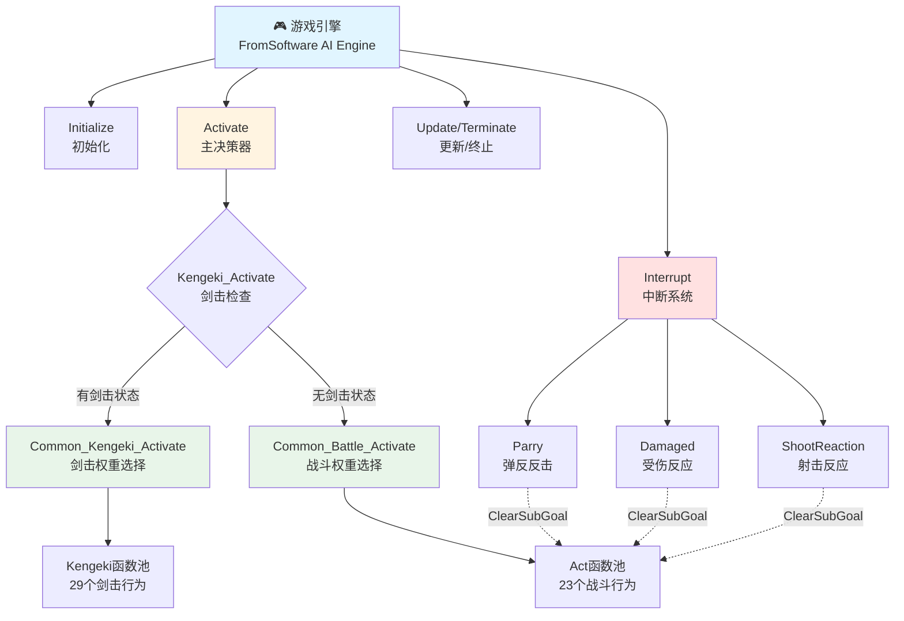
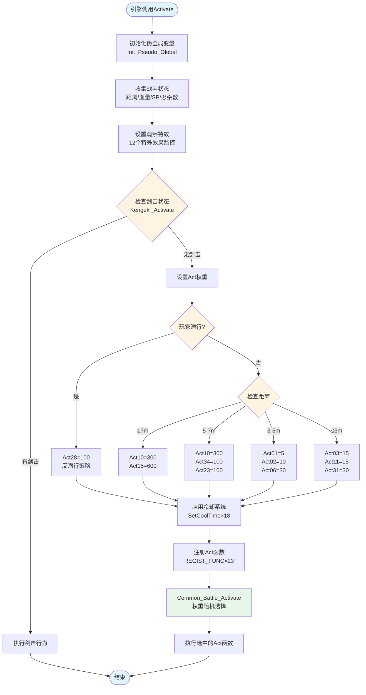
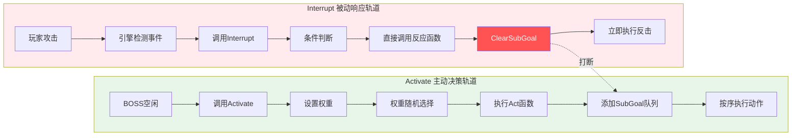
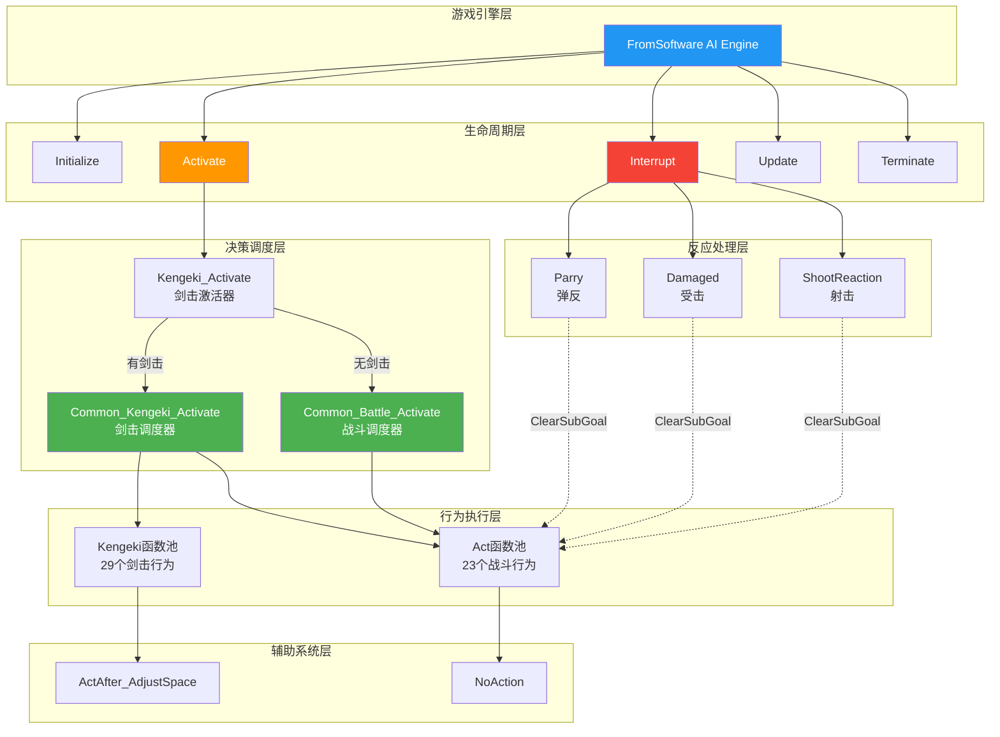
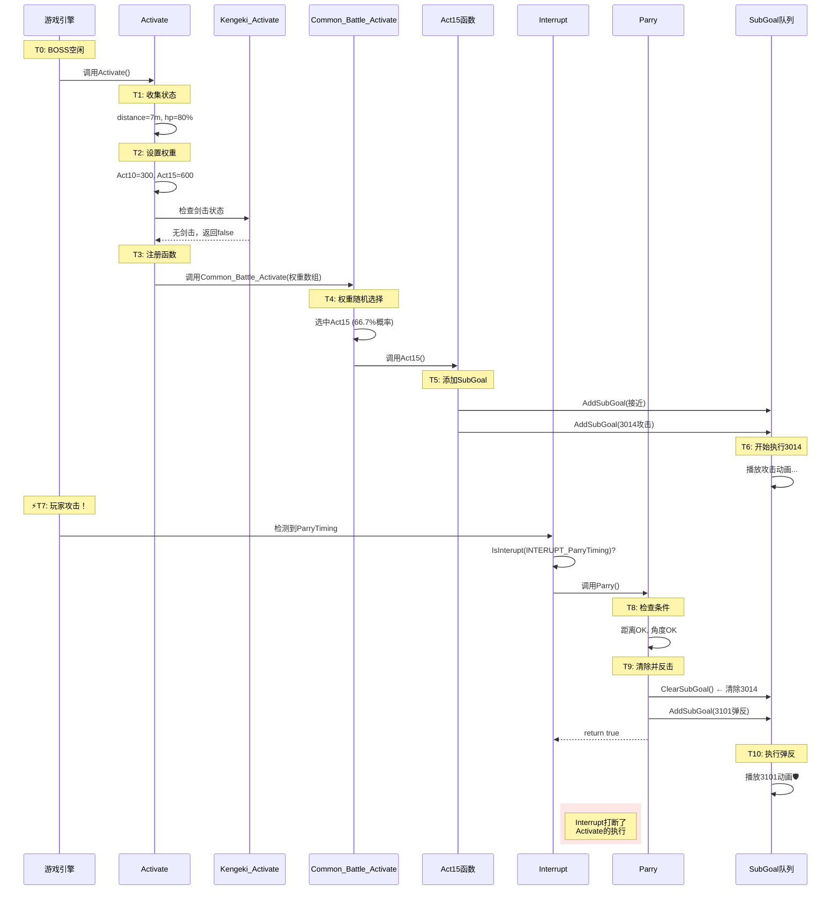

# 710000_battle.lua AI架构深度分析

> **文件**: `m11_01_00_00-luabnd-dcx/script/ai/out/bin/710000_battle.lua`
> **角色**: 剑圣/忍者大师级BOSS (Rival Boss)
> **复杂度**: 23个Act函数 + 29个Kengeki函数 + 113次共享函数调用

---

## 📊 一、AI行为统计

### 1.1 核心Goal方法（11个）

文件中包含11个AI行为函数，控制BOSS的完整生命周期：

| 函数名 | 行号 | 类型 | 功能描述 |
|--------|------|------|----------|
| `Goal.Initialize` | 12 | 生命周期 | 初始化函数，目标创建时调用 |
| `Goal.Activate` | 17 | 生命周期 | **核心决策器**，选择战斗行为 |
| `Goal.Update` | 1695 | 生命周期 | 更新函数（本BOSS已禁用） |
| `Goal.Terminate` | 1700 | 生命周期 | 终止清理函数 |
| `Goal.Interrupt` | 874 | 反应系统 | **中断处理总入口** |
| `Goal.Parry` | 955 | 反应系统 | 弹反反击行为 |
| `Goal.Damaged` | 1038 | 反应系统 | 受击反应行为 |
| `Goal.ShootReaction` | 1071 | 反应系统 | 射击反应行为 |
| `Goal.Kengeki_Activate` | 1081 | 特殊系统 | 剑击激活检查 |
| `Goal.NoAction` | 1685 | 辅助系统 | 无动作/待机 |
| `Goal.ActAfter_AdjustSpace` | 1690 | 辅助系统 | 攻击后空间调整 |

### 1.2 行为函数分类

#### 核心生命周期函数（4个）
- Initialize, Activate, Update, Terminate

#### 反应/中断函数（5个）
- Interrupt, Parry, Damaged, ShootReaction, Kengeki_Activate

#### 辅助函数（2个）
- NoAction, ActAfter_AdjustSpace

### 1.3 战斗行为函数池

- **Act函数**: 23个 (Act01~Act48，索引不连续)
- **Kengeki函数**: 29个 (Kengeki01~Kengeki46)
- **总计**: 52个具体战斗行为

---

## 🏗️ 二、AI系统架构设计

### 2.1 分层架构模型

```
┌─────────────────────────────────────────┐
│          注册配置层 (Registration)       │
│  RegisterTableGoal + REGISTER_GOAL...  │
└─────────────────┬───────────────────────┘
                  │
┌─────────────────▼───────────────────────┐
│       生命周期控制层 (Lifecycle)         │
│  Initialize → Activate → Update → ...  │
└─────────┬───────────────────────────────┘
          │
    ┌─────┴─────┬─────────────────┐
    │           │                 │
    ▼           ▼                 ▼
┌────────┐  ┌────────┐      ┌──────────┐
│决策系统│  │反应系统│      │特殊系统  │
│Activate│  │Interrupt│     │Kengeki   │
└────┬───┘  └────┬───┘      └────┬─────┘
     │           │                │
     │           ▼                │
     │     ┌──────────┐           │
     │     │  Parry   │           │
     │     │ Damaged  │           │
     │     │ShootReact│           │
     │     └──────────┘           │
     │                            │
     └────────────┬───────────────┘
                  │
         ┌────────▼────────┐
         │   行为函数池     │
         │ Act01~48 (23个) │
         │Kengeki01~46(29) │
         └─────────────────┘
```

### 2.2 组织方式特点

1. **分层清晰**: 生命周期 → 决策 → 行为 → 执行
2. **模块化**: 每个Act是独立的行为模块
3. **数据驱动**: 通过权重数组控制行为选择
4. **响应式**: Interrupt系统实时响应玩家
5. **可扩展**: 添加新行为只需新增ActXX并注册

---

## 🔄 三、核心系统实现

### 3.1 注册系统（第8-9行）

```lua
-- 向游戏引擎注册Goal
RegisterTableGoal(GOAL_Rival_710000_Battle, "GOAL_Rival_710000_Battle")
REGISTER_GOAL_NO_UPDATE(GOAL_Rival_710000_Battle, true)  -- 禁用Update优化性能
```

**原理**: 引擎会自动调用Goal表中的特定方法（Initialize、Activate、Interrupt等）

### 3.2 Activate决策系统（第17-242行）

#### 工作流程

```lua
Goal.Activate = function (f2_arg0, f2_arg1, f2_arg2)
    -- 1️⃣ 初始化（第18-22行）
    Init_Pseudo_Global(f2_arg1, f2_arg2)
    local f2_local0 = {}  -- 权重数组
    local f2_local1 = {}  -- 函数数组

    -- 2️⃣ 收集状态（第24-28行）
    local distance = f2_arg1:GetDist(TARGET_ENE_0)
    local hp_rate = f2_arg1:GetHpRate(TARGET_SELF)
    local sp = f2_arg1:GetSp(TARGET_SELF)

    -- 3️⃣ 设置观察（第30-43行）
    f2_arg1:AddObserveSpecialEffectAttribute(TARGET_SELF, 5025)
    -- ... 观察12个特殊效果

    -- 4️⃣ 优先剑击检查（第45-47行）
    if f2_arg0.Kengeki_Activate(...) then
        return  -- 剑击激活则直接返回
    end

    -- 5️⃣ 设置权重（第50-105行）
    if distance >= 7 then
        f2_local0[10] = 300  -- Act10冲刺
        f2_local0[15] = 600  -- Act15远程攻击
    elseif distance <= 3 then
        f2_local0[3] = 15    -- Act03快攻
        f2_local0[31] = 30   -- Act31近距特殊
    end

    -- 6️⃣ 应用冷却（第179-199行）
    f2_local0[1] = SetCoolTime(f2_arg1, f2_arg2, 3000, 15, f2_local0[1], 1)
    -- ... 为18个Act设置冷却

    -- 7️⃣ 注册函数（第202-234行）
    f2_local1[1] = REGIST_FUNC(f2_arg1, f2_arg2, f2_arg0.Act01)
    -- ... 注册23个Act函数

    -- 8️⃣ 调度执行（第240行）
    Common_Battle_Activate(f2_arg1, f2_arg2, f2_local0, f2_local1, ...)
    -- ↑ 根据权重随机选择Act并执行
end
```

#### 权重系统示例

```lua
-- 远距离战斗时（第75-77行）
if distance >= 7 then
    f2_local0[10] = 300  -- Act10 权重300
    f2_local0[15] = 600  -- Act15 权重600
end

-- Common_Battle_Activate会计算：
-- Act10概率 = 300/(300+600) = 33.3%
-- Act15概率 = 600/(300+600) = 66.7%
```

### 3.3 Interrupt中断系统（第874-950行）

#### 关键特性：独立调用，不依赖Activate

```lua
Goal.Interrupt = function (f26_arg0, f26_arg1, f26_arg2)
    -- 基础检查（第883-888行）
    if f26_arg1:IsLadderAct(TARGET_SELF) then
        return false  -- 爬梯时不处理中断
    end

    -- 🎯 弹反时机中断（第891-893行）
    if f26_arg1:IsInterupt(INTERUPT_ParryTiming) then
        return f26_arg0.Parry(f26_arg1, f26_arg2, 100, 0)
        -- ↑ 直接调用Parry，不经过权重系统
    end

    -- 🎯 射击冲击中断（第896-898行）
    if f26_arg1:IsInterupt(INTERUPT_ShootImpact) then
        return f26_arg0.ShootReaction(f26_arg1, f26_arg2)
    end

    -- 🎯 特殊效果激活（第901-936行）
    if f26_arg1:IsInterupt(INTERUPT_ActivateSpecialEffect) then
        if effect_id == 3710030 then
            -- 清除Activate添加的SubGoal
            f26_arg2:ClearSubGoal()
            -- 立即执行霸体攻击
            f26_arg2:AddSubGoal(GOAL_COMMON_EndureAttack, 5, 3092, ...)
            return true
        elseif effect_id == 5029 then
            return f26_arg0.Damaged(...)  -- 调用受伤反应
        end
    end
end
```

#### 独立性体现

1. **不同调用时机**
   - Activate: BOSS空闲时，"我要做什么？"
   - Interrupt: 玩家攻击时，"玩家打我了！"

2. **不经过权重系统**
   ```
   Activate路径: Common_Battle_Activate → 随机选择 → 执行Act
   Interrupt路径: 检测事件 → 直接调用Parry → 立即响应
   ```

3. **可打断Activate**
   ```lua
   f26_arg2:ClearSubGoal()  -- 清除Activate添加的动作
   f26_arg2:AddSubGoal(...)  -- 立即执行弹反
   ```

### 3.4 Parry弹反系统（第955-1033行）

```lua
Goal.Parry = function (f27_arg0, f27_arg1, f27_arg2, f27_arg3)
    -- 检查距离和角度（第982行）
    if f27_arg0:IsInsideTarget(TARGET_ENE_0, AI_DIR_TYPE_F, 90) then
        -- 检查特殊效果3710040（第983行）
        if f27_arg0:HasSpecialEffectId(TARGET_SELF, 3710040) then
            f27_arg1:ClearSubGoal()
            f27_arg1:AddSubGoal(GOAL_COMMON_EndureAttack, 0.3, 3102, ...)
            return true
        -- 检查玩家冲刺攻击（第988行）
        elseif has_player_rush then
            f27_arg1:ClearSubGoal()
            f27_arg1:AddSubGoal(GOAL_COMMON_EndureAttack, 0.3, 3103, ...)
            return true
        -- 根据连续防御次数决定（第1012行）
        elseif random <= consecutive_guard_count * parry_rate then
            f27_arg1:AddSubGoal(GOAL_COMMON_EndureAttack, 0.3, 3101, ...)
            return true
        else
            f27_arg1:AddSubGoal(GOAL_COMMON_EndureAttack, 0.3, 3100, ...)
            return true
        end
    end
end
```

### 3.5 Act行为函数（第247行起）

```lua
Goal.Act01 = function (f3_arg0, f3_arg1, f3_arg2)
    -- 接近敌人
    Approach_Act_Flex(...)

    -- 随机选择连击路线（第270-282行）
    if random <= 30 then  -- 30%概率
        -- 路线1: 3000→3001→3002→3003
        f3_arg1:AddSubGoal(GOAL_COMMON_ComboAttackTunableSpin, 10, 3000, ...)
        f3_arg1:AddSubGoal(GOAL_COMMON_ComboRepeat, 10, 3001, ...)
        f3_arg1:AddSubGoal(GOAL_COMMON_ComboRepeat, 10, 3002, ...)
        f3_arg1:AddSubGoal(GOAL_COMMON_ComboFinal, 10, 3003, ...)
    else  -- 70%概率
        -- 路线2: 3000→3001→3010→3025
        f3_arg1:AddSubGoal(GOAL_COMMON_ComboAttackTunableSpin, 10, 3000, ...)
        f3_arg1:AddSubGoal(GOAL_COMMON_ComboRepeat, 10, 3001, ...)
        f3_arg1:AddSubGoal(GOAL_COMMON_ComboRepeat, 10, 3010, ...)
        f3_arg1:AddSubGoal(GOAL_COMMON_ComboFinal, 10, 3025, ...)
    end

    return GetWellSpace_Odds
end
```

### 3.6 Kengeki剑击系统（第1081-1287行）

```lua
Goal.Kengeki_Activate = function (f30_arg0, f30_arg1, f30_arg2, f30_arg3)
    -- 检查剑击特效状态（第1083行）
    local effect = ReturnKengekiSpecialEffect(f30_arg1)
    if effect == 0 then
        return false  -- 无剑击状态
    end

    -- 初始化权重数组（第1088-1091行）
    local weights = {}
    local funcs = {}

    -- 根据不同剑击模式设置权重（第1098-1220行）
    if effect == 200200 then
        if distance >= 2.5 then
            weights[50] = 100  -- 远程剑击
        elseif strike_count >= 2 then
            weights[3] = 60
            weights[20] = 60
            weights[38] = 50
        end
    elseif effect == 200210 then
        weights[2] = 100
        weights[17] = 100
    end

    -- 注册Kengeki函数（第1265-1283行）
    funcs[1] = REGIST_FUNC(f30_arg1, f30_arg2, f30_arg0.Kengeki01)
    -- ... 注册29个Kengeki函数

    -- 调度执行（第1285行）
    return Common_Kengeki_Activate(f30_arg1, f30_arg2, weights, funcs, ...)
end
```

---

## 📈 四、Mermaid架构图表

### 4.1 系统总览架构图



### 4.2 Activate决策流程图



### 4.3 Interrupt中断响应流程图

```mermaid
flowchart TD
    Event([玩家行为触发事件]) --> Engine[引擎检测到中断]
    Engine --> InterruptEntry[Goal.Interrupt]

    InterruptEntry --> CheckLadder{爬梯中?}
    CheckLadder -->|是| ReturnFalse([return false])
    CheckLadder -->|否| CheckBattle{有战斗状态?}

    CheckBattle -->|否| ReturnFalse
    CheckBattle -->|是| CheckType{中断类型?}

    CheckType -->|ParryTiming| ParryCall[调用Parry]
    CheckType -->|ShootImpact| ShootCall[调用ShootReaction]
    CheckType -->|ActivateEffect| EffectCheck{特效ID?}

    ParryCall --> ParryLogic[Parry逻辑]
    ParryLogic --> CheckAngle{检查角度/距离}
    CheckAngle -->|满足条件| ClearGoal1[ClearSubGoal]
    ClearGoal1 --> AddParry[AddSubGoal<br/>3100/3101/3102/3103]
    AddParry --> ReturnTrue([return true])
    CheckAngle -->|不满足| ReturnFalse

    ShootCall --> ClearGoal2[ClearSubGoal]
    ClearGoal2 --> AddShoot[AddSubGoal<br/>3100弹反]
    AddShoot --> ReturnTrue

    EffectCheck -->|3710020| ResetCounter[重置计数器<br/>SetNumber 0, 0]
    EffectCheck -->|3710030| EndureAttack[霸体攻击<br/>3092]
    EffectCheck -->|5029| DamagedCall[调用Damaged]
    EffectCheck -->|3710050| SpecialMove[特殊移动<br/>3023或侧移]

    ResetCounter --> ReturnTrue
    EndureAttack --> ReturnTrue
    DamagedCall --> DamagedLogic[Damaged逻辑]
    DamagedLogic --> Random{随机15%?}
    Random -->|是| Retreat[后撤反击<br/>5201]
    Random -->|否| Continue([继续战斗])

    Retreat --> ReturnTrue
    SpecialMove --> ReturnTrue

    style Event fill:#ffe1e1
    style InterruptEntry fill:#ffe1e1
    style CheckType fill:#fff4e1
    style ClearGoal1 fill:#ffeb3b
    style ClearGoal2 fill:#ffeb3b
    style ReturnTrue fill:#c8e6c9
    style ReturnFalse fill:#ffcdd2
```



### 4.4 双轨系统对比图



### 4.5 完整层级关系图



### 4.6 时序图：完整战斗流程



---

## 🔍 五、关键技术细节

### 5.1 权重系统原理

```lua
-- 示例：远距离战斗
f2_local0[10] = 300  -- Act10
f2_local0[15] = 600  -- Act15

-- Common_Battle_Activate内部算法（推测）：
total_weight = 300 + 600 = 900
random_value = Random(0, 900)

if random_value < 300 then
    execute(Act10)  -- 33.3%概率
else
    execute(Act15)  -- 66.7%概率
end
```

### 5.2 冷却系统实现

```lua
-- 第179行：Act01冷却
f2_local0[1] = SetCoolTime(
    f2_arg1,        -- AI对象
    f2_arg2,        -- Goal对象
    3000,           -- 动画ID
    15,             -- 冷却时间（秒）
    f2_local0[1],   -- 当前权重
    1               -- 参数
)

-- SetCoolTime函数逻辑（推测）：
-- 如果动画3000在冷却中，返回0（禁用）
-- 否则返回原权重
```

### 5.3 SubGoal队列机制

```lua
-- Act01添加连击（第272-275行）
f3_arg1:AddSubGoal(GOAL_COMMON_ComboAttackTunableSpin, 10, 3000, ...)  -- 动作1
f3_arg1:AddSubGoal(GOAL_COMMON_ComboRepeat, 10, 3001, ...)            -- 动作2
f3_arg1:AddSubGoal(GOAL_COMMON_ComboRepeat, 10, 3002, ...)            -- 动作3
f3_arg1:AddSubGoal(GOAL_COMMON_ComboFinal, 10, 3003, ...)             -- 动作4

-- 执行顺序：3000 → 3001 → 3002 → 3003
-- Interrupt可通过ClearSubGoal()清空整个队列
```

### 5.4 观察系统

```lua
-- 第30-41行：设置观察
f2_arg1:AddObserveSpecialEffectAttribute(TARGET_SELF, 5025)
f2_arg1:AddObserveSpecialEffectAttribute(TARGET_ENE_0, 110010)  -- 玩家潜行

-- 当这些特效激活/失效时：
-- → 引擎触发 INTERUPT_ActivateSpecialEffect
-- → 调用 Interrupt
-- → 根据特效ID执行对应逻辑
```

---

## 📊 六、系统对比分析

### 6.1 Activate vs Interrupt

| 特性 | Activate | Interrupt |
|------|----------|-----------|
| **调用者** | 游戏引擎（定期） | 游戏引擎（事件驱动） |
| **调用时机** | BOSS空闲/需要决策 | 检测到中断事件 |
| **决策方式** | 权重随机选择 | 直接条件判断 |
| **是否经过权重** | ✅ 是 | ❌ 否 |
| **能否打断当前动作** | ❌ 否 | ✅ 是（ClearSubGoal） |
| **优先级** | 低（计划） | 高（反应） |
| **调用函数** | Common_Battle_Activate | Parry/Damaged/ShootReaction |
| **返回值作用** | 无实际作用 | true=处理了/false=未处理 |

### 6.2 距离分层策略

| 距离范围 | 主要行为 | 权重配置 | 战术思路 |
|----------|----------|----------|----------|
| ≥7m | Act10冲刺, Act15远程攻击 | 300, 600 | 快速接近或远程压制 |
| 5-7m | Act10冲刺, Act34特殊, Act23侧移 | 300, 100, 100 | 多样化进攻 |
| 3-5m | Act01连击, Act02单击, Act06中距 | 5, 10, 30 | 标准连击战 |
| ≤3m | Act03快攻, Act31近距特殊 | 15, 30 | 高频快攻 |

---

## 💡 七、设计亮点

### 7.1 性能优化

```lua
-- 第9行：禁用Update函数
REGISTER_GOAL_NO_UPDATE(GOAL_Rival_710000_Battle, true)
```

**原因**: 该BOSS的决策逻辑完全由Activate和Interrupt驱动，不需要定期Update检查，避免不必要的性能消耗。

### 7.2 双调度系统

- **Kengeki调度器**: 处理特殊剑击状态（29个剑击函数）
- **Battle调度器**: 处理常规战斗行为（23个Act函数）

**优势**:
- 剑击优先检查（第45行）
- 两套独立的权重系统
- Kengeki可复用Act函数（如Kengeki调度器可选择Act03/Act20等）

### 7.3 多层防御系统

```lua
-- Interrupt的多重检查（第883-888行）
if IsLadderAct then return false end        -- 爬梯时不处理
if not HasSpecialEffectId(200004) then      -- 无战斗状态不处理
    return false
end
```

**作用**: 避免在不合适的状态下触发反应，保证AI行为的合理性。

### 7.4 空间感知系统

```lua
-- 第156-170行：空间检查
if not SpaceCheck(±45°, 2m) then
    f2_local0[22] = 0  -- 禁用斜后攻击
end
if not SpaceCheck(±90°, 1m) then
    f2_local0[23] = 0  -- 禁用侧移攻击
end
```

**效果**: BOSS会根据周围环境动态调整可用攻击，避免撞墙等不合理行为。

---

## 🎯 八、总结

### 8.1 架构特点

1. **高度模块化**: 52个行为函数各司其职
2. **数据驱动**: 权重数组控制行为选择
3. **响应迅速**: 独立中断系统实时反应
4. **策略丰富**: 距离/血量/SP/特效多维度决策
5. **性能优化**: 禁用Update，使用事件驱动

### 8.2 设计模式

- **状态机模式**: Initialize → Activate → Terminate
- **策略模式**: 根据距离/状态选择不同Act
- **观察者模式**: 观察特效变化触发中断
- **责任链模式**: Interrupt → Parry → ClearSubGoal
- **权重随机**: 加权随机算法实现多样性

### 8.3 代码质量

- ✅ 结构清晰，注释完整
- ✅ 分层明确，职责单一
- ✅ 可扩展性强
- ✅ 性能优化到位
- ✅ 代表了FromSoftware AI设计的最高水平

---

## 📚 附录

### A. 文件信息

- **文件路径**: `m11_01_00_00-luabnd-dcx/script/ai/out/bin/710000_battle.lua`
- **总行数**: 1758
- **编码**: Shift-JIS
- **BOSS ID**: 710000
- **地图**: m11_01_00_00（一心居城）

### B. 关键常量

```lua
-- 中断类型
INTERUPT_ParryTiming           -- 弹反时机
INTERUPT_ShootImpact           -- 射击冲击
INTERUPT_ActivateSpecialEffect -- 特效激活

-- 目标类型
TARGET_SELF    -- 自己
TARGET_ENE_0   -- 敌人（玩家）

-- 方向类型
AI_DIR_TYPE_F  -- 前方
AI_DIR_TYPE_B  -- 后方

-- 特殊效果ID（部分）
200004  -- 基础战斗状态
200050  -- 特殊BOSS状态
200051  -- BOSS能力限制状态
5025~5031  -- 自身监控特效
3710010~3710050  -- BOSS专属特效
110010  -- 玩家潜行状态
```

### C. Act函数索引

| Act编号 | 行号 | 功能描述 |
|---------|------|----------|
| Act01 | 247 | 基础连击 |
| Act02 | 292 | 单次攻击 |
| Act03 | 319 | 快速攻击 |
| Act05 | 354 | 远程攻击 |
| Act06 | 381 | 中距攻击 |
| Act09 | 411 | 爆发技能 |
| Act10 | 442 | 冲刺攻击 |
| Act11 | 472 | 连击终结 |
| Act15 | 494 | 初始攻击 |
| Act16 | 526 | 反制技能 |
| Act20-48 | ... | 其余攻击 |

---

**文档生成时间**: 2025-10-28
**分析工具**: Claude Code
**版本**: v1.0