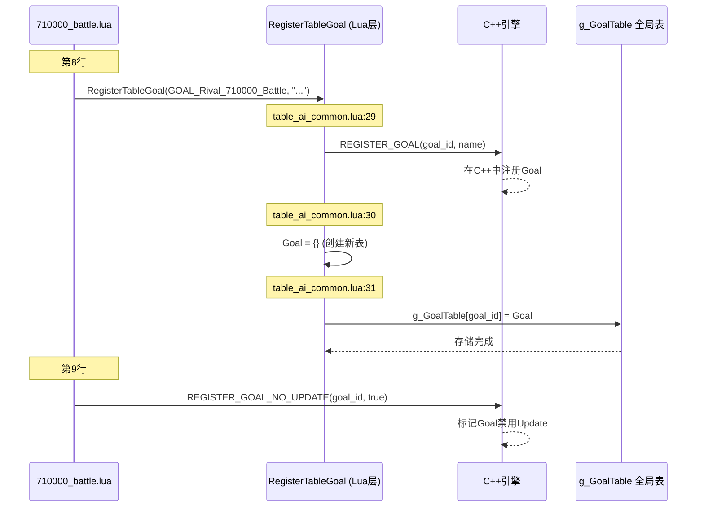

# 只狼AI Goal注册系统深度解析

> **核心文件**: `aicommon-luabnd-dcx/script/ai/out/bin/table_ai_common.lua`
> **分析目标**: `RegisterTableGoal` 和 `REGISTER_GOAL_NO_UPDATE` 的作用和实现机制

---

## 📚 一、两个函数概述

### 1.1 RegisterTableGoal

**定义位置**: `table_ai_common.lua:28`

```lua
function RegisterTableGoal(f2_arg0, f2_arg1)
    REGISTER_GOAL(f2_arg0, f2_arg1)  -- 调用C++引擎函数
    Goal = {}                         -- 创建新的Goal对象
    g_GoalTable[f2_arg0] = Goal      -- 存储到全局表
end
```

**作用**:
1. **桥接层**: 连接Lua脚本层和C++引擎层
2. **对象创建**: 创建Goal表对象
3. **全局注册**: 将Goal存储到全局表`g_GoalTable`中

### 1.2 REGISTER_GOAL_NO_UPDATE

**性质**: C++引擎提供的底层函数（未在Lua中定义）

**作用**:
- 通知引擎**禁用**此Goal的`Update`函数
- 性能优化：避免每帧调用Update

---

## 🏗️ 二、在整体架构中的作用

### 2.1 注册流程图



### 2.2 层级关系

```
┌─────────────────────────────────────────────┐
│          Lua脚本层 (Script Layer)            │
│  710000_battle.lua, 710000_logic.lua        │
│                                             │
│  RegisterTableGoal(GOAL_Rival_710000, ...) │
│  REGISTER_GOAL_NO_UPDATE(GOAL_Rival_710000)│
└──────────────────┬──────────────────────────┘
                   │
┌──────────────────▼──────────────────────────┐
│      Lua通用层 (Lua Common Layer)           │
│      table_ai_common.lua                    │
│                                             │
│  function RegisterTableGoal(id, name)       │
│    ├─ REGISTER_GOAL(id, name) ←─────┐     │
│    ├─ Goal = {}                      │     │
│    └─ g_GoalTable[id] = Goal         │     │
└──────────────────────────────────────┼─────┘
                                       │
┌──────────────────────────────────────▼─────┐
│         C++引擎层 (C++ Engine Layer)        │
│                                             │
│  REGISTER_GOAL(goal_id, name)              │
│    └─ 在引擎内部注册Goal                    │
│                                             │
│  REGISTER_GOAL_NO_UPDATE(goal_id, bool)    │
│    └─ 设置Goal的Update标志位                │
└─────────────────────────────────────────────┘
```

---

## 🔍 三、详细实现分析

### 3.1 RegisterTableGoal 完整实现

```lua
-- 文件: table_ai_common.lua:24-33
-- ■ 表格目标注册函数
-- 描述：注册基于表格的AI目标系统
-- 参数：f2_arg0 - 目标ID标识符, f2_arg1 - 目标名称字符串
-- 功能：创建目标函数映射，建立目标对象与全局表的关联
function RegisterTableGoal(f2_arg0, f2_arg1)
    REGISTER_GOAL(f2_arg0, f2_arg1)  -- 注册目标到AI系统
    Goal = {}                         -- 创建新的目标对象
    g_GoalTable[f2_arg0] = Goal      -- 将目标对象存储到全局表中
end
```

#### 参数说明

| 参数 | 含义 | 示例 |
|------|------|------|
| `f2_arg0` | Goal ID | `GOAL_Rival_710000_Battle` |
| `f2_arg1` | Goal名称 | `"GOAL_Rival_710000_Battle"` |

#### 执行步骤

1. **调用C++函数**: `REGISTER_GOAL(f2_arg0, f2_arg1)`
   - 在C++引擎中注册此Goal
   - 建立ID到名称的映射

2. **创建Lua表**: `Goal = {}`
   - 创建一个空的Lua表
   - 后续代码会向这个表添加方法（Initialize, Activate等）

3. **全局存储**: `g_GoalTable[f2_arg0] = Goal`
   - 将Goal存储到全局表中
   - 方便引擎通过ID查找和调用

### 3.2 g_GoalTable 全局表

```lua
-- 文件: table_ai_common.lua:6-10
-- ■ 全局数据表定义
g_LogicTable = {}  -- 全局逻辑表：存储所有注册的AI逻辑函数
g_GoalTable = {}   -- 全局目标表：存储所有注册的AI目标函数 ← 这里
Logic = nil        -- 当前逻辑对象引用
Goal = nil         -- 当前目标对象引用
```

**作用**:
- 存储所有已注册的Goal对象
- 通过Goal ID快速检索

**示例**:
```lua
g_GoalTable[GOAL_Rival_710000_Battle] = {
    Initialize = function(...) end,
    Activate = function(...) end,
    Interrupt = function(...) end,
    Parry = function(...) end,
    -- ... 其他方法
}
```

### 3.3 引擎如何调用Goal方法

```lua
-- 文件: table_ai_common.lua:101-112
function ActivateTableGoal(f8_arg0, f8_arg1, f8_arg2)
    local f8_local0 = false
    local f8_local1 = g_GoalTable[f8_arg2]  -- ← 从全局表获取Goal
    if f8_local1 ~= nil then
        local f8_local2 = f8_local1.Activate  -- ← 获取Activate方法
        if f8_local2 ~= nil then
            f8_local0 = f8_local2(f8_local1, f8_arg0, f8_arg1)  -- ← 调用
        end
    end
    return f8_local0
end
```

**调用流程**:
1. C++引擎调用 `ActivateTableGoal(ai, goal_mgr, goal_id)`
2. Lua从`g_GoalTable[goal_id]`中获取Goal对象
3. 调用`Goal.Activate(...)`方法
4. 返回结果给引擎

### 3.4 REGISTER_GOAL_NO_UPDATE 的作用

#### 使用示例

```lua
-- 710000_battle.lua:8-9
RegisterTableGoal(GOAL_Rival_710000_Battle, "GOAL_Rival_710000_Battle")
REGISTER_GOAL_NO_UPDATE(GOAL_Rival_710000_Battle, true)  -- ← 禁用Update
```

#### 效果对比

| 配置 | Update调用频率 | 适用场景 |
|------|----------------|----------|
| **未调用REGISTER_GOAL_NO_UPDATE** | 每帧调用 | 需要定期检查状态的AI |
| **REGISTER_GOAL_NO_UPDATE(id, true)** | 不调用 | 完全事件驱动的AI |
| **REGISTER_GOAL_NO_UPDATE(id, false)** | 每帧调用 | 同未调用 |

#### 为什么710000要禁用Update？

从 `710000_battle.lua:1695-1697` 可以看到：

```lua
Goal.Update = function (f62_arg0, f62_arg1, f62_arg2)
    return Update_Default_NoSubGoal(f62_arg0, f62_arg1, f62_arg2)
end
```

**原因**:
1. **AI逻辑由事件驱动**: 完全依赖Activate和Interrupt
2. **性能优化**: 避免每帧检查（60fps情况下避免60次/秒调用）
3. **Update实现为空**: 只调用默认函数，无实际逻辑

---

## 💡 四、实际使用案例

### 4.1 典型注册模式

#### 战斗AI文件 (battle.lua)

```lua
-- 710000_battle.lua:8-9
RegisterTableGoal(GOAL_Rival_710000_Battle, "GOAL_Rival_710000_Battle")
REGISTER_GOAL_NO_UPDATE(GOAL_Rival_710000_Battle, true)

-- 然后定义方法
Goal.Initialize = function(...) end
Goal.Activate = function(...) end
Goal.Interrupt = function(...) end
Goal.Parry = function(...) end
-- ...
```

#### 逻辑AI文件 (logic.lua)

```lua
-- 710000_logic.lua:11
RegisterTableLogic(710000)  -- 注意：这里是Logic不是Goal

-- 然后定义方法
Logic.Main = function(...) end
Logic.Interrupt = function(...) end
```

### 4.2 引擎调用时序

```
游戏启动
  ↓
引擎加载 710000_battle.lua
  ↓
执行 RegisterTableGoal(GOAL_Rival_710000_Battle, "...")
  ├─ C++: REGISTER_GOAL() 注册到引擎
  ├─ Lua: Goal = {} 创建表
  └─ Lua: g_GoalTable[id] = Goal 存储
  ↓
执行 REGISTER_GOAL_NO_UPDATE(GOAL_Rival_710000_Battle, true)
  └─ C++: 设置标志位禁用Update
  ↓
继续执行脚本
  ├─ Goal.Initialize = function(...) end
  ├─ Goal.Activate = function(...) end
  └─ Goal.Interrupt = function(...) end
  ↓
脚本加载完成
  ↓
═══════════════════════════════════════
游戏运行时
  ↓
BOSS激活
  ↓
C++引擎调用: InitializeTableGoal(ai, goal_mgr, goal_id)
  ├─ Lua: goal = g_GoalTable[goal_id]
  └─ Lua: goal.Initialize(...)
  ↓
BOSS需要决策
  ↓
C++引擎调用: ActivateTableGoal(ai, goal_mgr, goal_id)
  ├─ Lua: goal = g_GoalTable[goal_id]
  └─ Lua: goal.Activate(...)
  ↓
玩家攻击
  ↓
C++引擎调用: InterruptTableGoal(ai, goal_mgr, goal_id, interrupt_type)
  ├─ Lua: goal = g_GoalTable[goal_id]
  └─ Lua: goal.Interrupt(...)
  ↓
每帧循环
  ↓
C++引擎检查: 是否需要调用Update?
  └─ NO (因为REGISTER_GOAL_NO_UPDATE=true)
```

---

## 🔧 五、核心函数清单

### 5.1 引擎提供的底层函数 (C++)

| 函数名 | 定义位置 | 作用 |
|--------|----------|------|
| `REGISTER_GOAL` | C++引擎 | 注册Goal到引擎 |
| `REGISTER_GOAL_NO_UPDATE` | C++引擎 | 禁用Goal的Update |
| `REGISTER_LOGIC_FUNC` | C++引擎 | 注册Logic函数 |

### 5.2 Lua层桥接函数

| 函数名 | 定义位置 | 作用 |
|--------|----------|------|
| `RegisterTableGoal` | table_ai_common.lua:28 | Lua层Goal注册 |
| `RegisterTableLogic` | table_ai_common.lua:16 | Lua层Logic注册 |
| `InitializeTableGoal` | table_ai_common.lua:87 | 调用Goal.Initialize |
| `ActivateTableGoal` | table_ai_common.lua:101 | 调用Goal.Activate |
| `UpdateTableGoal` | table_ai_common.lua:114 | 调用Goal.Update |
| `TerminateTableGoal` | table_ai_common.lua:127 | 调用Goal.Terminate |
| `InterruptTableGoal` | table_ai_common.lua:335 | 调用Goal.Interrupt |
| `InterruptTableGoal_Common` | table_ai_common.lua:345 | 通用中断处理 |

### 5.3 引擎调用流程

```
C++引擎需要调用Goal.Activate
  ↓
调用 ActivateTableGoal(ai, goal_mgr, goal_id)
  ↓
Lua函数执行:
  goal = g_GoalTable[goal_id]
  if goal and goal.Activate then
      goal.Activate(goal, ai, goal_mgr)
  ↓
返回结果给C++引擎
```

---

## 📊 六、与其他系统的对比

### 6.1 Goal vs Logic

| 特性 | Goal | Logic |
|------|------|-------|
| **注册函数** | RegisterTableGoal | RegisterTableLogic |
| **存储位置** | g_GoalTable | g_LogicTable |
| **主要用途** | 具体战斗行为 | 高层状态管理 |
| **文件类型** | *_battle.lua | *_logic.lua |
| **核心方法** | Initialize, Activate, Interrupt, Parry等 | Main, Interrupt |
| **调用频率** | 按需调用 | 持续运行 |

### 6.2 710000的两个文件

| 文件 | 注册方式 | ID/常量 | 作用 |
|------|----------|---------|------|
| `710000_battle.lua` | RegisterTableGoal | GOAL_Rival_710000_Battle | 战斗行为 |
| `710000_logic.lua` | RegisterTableLogic | 710000 (数字) | 状态管理 |

---

## 🎯 七、常见问题解答

### Q1: 为什么需要两层注册？

**答**:
- **C++层注册** (REGISTER_GOAL): 引擎需要知道这个Goal存在
- **Lua层注册** (g_GoalTable): Lua需要存储Goal对象供后续调用

这是典型的**桥接模式**：Lua脚本通过表存储对象，C++引擎通过回调函数访问。

### Q2: 如果不调用REGISTER_GOAL_NO_UPDATE会怎样？

**答**:
- 引擎会每帧调用`Goal.Update`
- 对于事件驱动的AI，这是不必要的性能开销
- 以60fps计算：每秒会额外调用60次Update

### Q3: Goal对象什么时候被创建？

**答**:
```lua
RegisterTableGoal(...)  -- 此时创建 Goal = {}
Goal.Initialize = ...   -- 然后添加方法
Goal.Activate = ...
```

### Q4: 引擎如何知道调用哪个Goal？

**答**:
- AI实体配置文件中指定了Goal ID
- 引擎通过Goal ID查找`g_GoalTable[goal_id]`
- 从表中获取对应方法并调用

### Q5: 为什么有的Goal使用REGISTER_GOAL_NO_UPDATE，有的不用？

**答**:

**使用NO_UPDATE的情况**（见grep结果）:
- `GOAL_Rival_710000_Battle` - 事件驱动的BOSS
- `GOAL_COMMON_ApproachTarget` - 简单接近行为
- `GOAL_COMMON_Landing` - 落地检测
- `GOAL_COMMON_UseItem` - 使用道具

**不使用的情况**（需要Update）:
- 需要定期检查状态变化的AI
- 需要平滑过渡的行为（如移动）
- 需要计时器更新的逻辑

---

## 📝 八、完整示例代码

### 示例：创建一个简单的Goal

```lua
-- ========== 1. 注册Goal ==========
RegisterTableGoal(GOAL_MyCustom_12345_Battle, "MyCustomBattle")
REGISTER_GOAL_NO_UPDATE(GOAL_MyCustom_12345_Battle, true)

-- ========== 2. 定义Initialize方法 ==========
Goal.Initialize = function (self, ai, goal_mgr, param)
    print("Goal初始化")
end

-- ========== 3. 定义Activate方法 ==========
Goal.Activate = function (self, ai, goal_mgr)
    print("Goal激活，开始决策")

    -- 初始化权重和函数数组
    local weights = {}
    local acts = {}
    local subgoals = {}
    Common_Clear_Param(weights, acts, subgoals)

    -- 获取战斗信息
    local distance = ai:GetDist(TARGET_ENE_0)

    -- 根据距离设置权重
    if distance > 5 then
        weights[1] = 100  -- Act01: 远程攻击
    else
        weights[2] = 100  -- Act02: 近距攻击
    end

    -- 注册Act函数
    acts[1] = REGIST_FUNC(ai, goal_mgr, self.Act01)
    acts[2] = REGIST_FUNC(ai, goal_mgr, self.Act02)

    -- 调度执行
    Common_Battle_Activate(ai, goal_mgr, weights, acts, nil, subgoals)
end

-- ========== 4. 定义Act函数 ==========
Goal.Act01 = function (self, ai, goal_mgr)
    print("执行Act01 - 远程攻击")
    -- 接近
    Approach_Act_Flex(ai, goal_mgr, 5, 7, 10, 100, 0, 2.5, 3)
    -- 攻击
    goal_mgr:AddSubGoal(GOAL_COMMON_AttackTunableSpin, 10, 3000, TARGET_ENE_0, 9999, 0, 0, 0, 0)
    return 100
end

Goal.Act02 = function (self, ai, goal_mgr)
    print("执行Act02 - 近距攻击")
    goal_mgr:AddSubGoal(GOAL_COMMON_ComboAttackTunableSpin, 10, 3001, TARGET_ENE_0, 3, 0, 0, 0, 0)
    goal_mgr:AddSubGoal(GOAL_COMMON_ComboFinal, 10, 3002, TARGET_ENE_0, 9999, 0, 0)
    return 100
end

-- ========== 5. 定义Interrupt方法 ==========
Goal.Interrupt = function (self, ai, goal_mgr)
    -- 检测弹反时机
    if ai:IsInterupt(INTERUPT_ParryTiming) then
        print("检测到弹反时机！")
        goal_mgr:ClearSubGoal()  -- 清除当前动作
        goal_mgr:AddSubGoal(GOAL_COMMON_EndureAttack, 0.3, 3100, TARGET_ENE_0, 9999, 0)
        return true
    end

    -- 检测受击
    if ai:IsInterupt(INTERUPT_Damaged) then
        print("受到伤害！")
        return self.Damaged(self, ai, goal_mgr)
    end

    return false
end

-- ========== 6. 定义Damaged方法 ==========
Goal.Damaged = function (self, ai, goal_mgr)
    local random = ai:GetRandam_Int(1, 100)
    if random <= 30 then  -- 30%概率后撤
        goal_mgr:ClearSubGoal()
        goal_mgr:AddSubGoal(GOAL_COMMON_SpinStep, 1, 5201, TARGET_ENE_0, 0, AI_DIR_TYPE_B, 0)
        return true
    end
    return false
end

-- ========== 7. 定义Terminate方法 ==========
Goal.Terminate = function (self, ai, goal_mgr)
    print("Goal终止，清理资源")
end

-- ========== 8. 定义辅助方法 ==========
Goal.ActAfter_AdjustSpace = function (self, ai, goal_mgr)
    -- 攻击后调整位置
end
```

---

## 🔬 九、深入分析：中断系统的实现

### 9.1 中断类型表创建

```lua
-- table_ai_common.lua:379-902
function _CreateInterruptTypeInfoTable(f17_arg0)
    return {
        [INTERUPT_ParryTiming] = {
            func = function (f42_arg0, f42_arg1, f42_arg2)
                if _GetInterruptFunc(f42_arg2.Interrupt_ParryTiming)(f42_arg2, f42_arg0, f42_arg1) then
                    return true
                end
                if f42_arg1:IsInterruptSubGoalChanged() then
                    return true
                end
                return false
            end,
            bEmpty = not (f17_arg0.Interrupt_ParryTiming ~= nil)
        },
        -- ... 其他中断类型
    }
end
```

**原理**:
- 为每种中断类型创建一个映射表
- `func`: 中断处理函数
- `bEmpty`: 该Goal是否实现了此中断

### 9.2 SetupScriptGoalInfo 的作用

```lua
-- table_ai_common.lua:49-63
function SetupScriptGoalInfo(f4_arg0, f4_arg1)
    local f4_local0 = g_GoalTable[f4_arg0]
    if f4_local0 ~= nil then
        local f4_local1 = _CreateInterruptTypeInfoTable(f4_local0)
        local f4_local2 = not (f4_local0.Update == nil)       -- 是否有Update
        local f4_local3 = not (f4_local0.Terminate == nil)    -- 是否有Terminate
        local f4_local4 = _IsInterruptFuncExist(f4_local1, f4_local0)  -- 是否有中断
        local f4_local5 = not (f4_local0.Initialize == nil)   -- 是否有Initialize
        f4_local0.InterruptInfoTable = f4_local1
        f4_arg1:SetTableGoal(f4_local2, f4_local3, f4_local4, f4_local5)
    else
        f4_arg1:SetNormalGoal()
    end
end
```

**作用**:
- 分析Goal包含哪些方法
- 将信息传递给C++引擎
- 引擎据此决定调用哪些方法

---

## 🗺️ 十、完整调用地图

```mermaid
graph TD
    A[游戏启动] --> B[加载710000_battle.lua]
    B --> C[RegisterTableGoal]
    C --> D[REGISTER_GOAL - C++]
    C --> E[Goal = {} - Lua]
    C --> F[g_GoalTable存储 - Lua]

    B --> G[REGISTER_GOAL_NO_UPDATE - C++]

    B --> H[定义Goal方法]
    H --> H1[Goal.Initialize]
    H --> H2[Goal.Activate]
    H --> H3[Goal.Interrupt]
    H --> H4[Goal.Parry]

    I[游戏运行] --> J[BOSS激活]
    J --> K[C++: InitializeTableGoal]
    K --> L[Lua: 从g_GoalTable获取]
    L --> M[调用Goal.Initialize]

    N[BOSS决策] --> O[C++: ActivateTableGoal]
    O --> P[Lua: 从g_GoalTable获取]
    P --> Q[调用Goal.Activate]
    Q --> R[Common_Battle_Activate]
    R --> S[选择Act函数]

    T[玩家攻击] --> U[C++: InterruptTableGoal]
    U --> V[Lua: 从g_GoalTable获取]
    V --> W[调用Goal.Interrupt]
    W --> X{中断类型?}
    X -->|ParryTiming| Y[调用Goal.Parry]
    X -->|Damaged| Z[调用Goal.Damaged]

    AA[每帧] --> AB{Update启用?}
    AB -->|是| AC[C++: UpdateTableGoal]
    AB -->|否| AD[跳过Update]
```

---

## 🔗 十一、相关文件索引

| 文件路径 | 作用 | 关键内容 |
|----------|------|----------|
| `aicommon-luabnd-dcx/script/ai/out/bin/table_ai_common.lua` | Goal注册系统核心 | RegisterTableGoal, g_GoalTable |
| `m11_01_00_00-luabnd-dcx/script/ai/out/bin/710000_battle.lua` | BOSS战斗Goal | Goal.Activate, Goal.Interrupt, Goal.Parry |
| `m11_01_00_00-luabnd-dcx/script/ai/out/bin/710000_logic.lua` | BOSS逻辑Logic | Logic.Main, Logic.Interrupt |

---

## 📚 十二、总结

### 12.1 RegisterTableGoal 的三大作用

1. **引擎注册**: 通过`REGISTER_GOAL`在C++引擎中注册
2. **对象创建**: 创建Lua表对象`Goal = {}`
3. **全局存储**: 存储到`g_GoalTable`供引擎查找调用

### 12.2 REGISTER_GOAL_NO_UPDATE 的作用

1. **性能优化**: 禁用每帧Update调用
2. **适用于事件驱动AI**: Activate+Interrupt已足够
3. **减少CPU开销**: 对于复杂BOSS尤为重要

### 12.3 整体设计理念

```
C++引擎层 (Engine Layer)
    ↕ (通过函数调用)
Lua通用层 (Common Layer - table_ai_common.lua)
    ↕ (通过RegisterTableGoal)
Lua脚本层 (Script Layer - 710000_battle.lua)
```

这种分层设计实现了：
- **解耦**: C++和Lua分离，互不依赖
- **灵活**: 纯Lua编写AI逻辑，无需重新编译
- **高效**: 通过表查找快速调用方法
- **扩展**: 轻松添加新Goal，只需编写Lua脚本

### 12.4 关键设计模式

1. **桥接模式**: Lua和C++通过函数调用桥接
2. **注册表模式**: `g_GoalTable`作为中央注册表
3. **策略模式**: Goal方法作为可替换策略
4. **观察者模式**: 中断系统监听游戏事件

---

**文档版本**: v1.0
**生成时间**: 2025-10-28
**分析工具**: Claude Code
**分析对象**: 只狼AI系统 Goal注册机制
