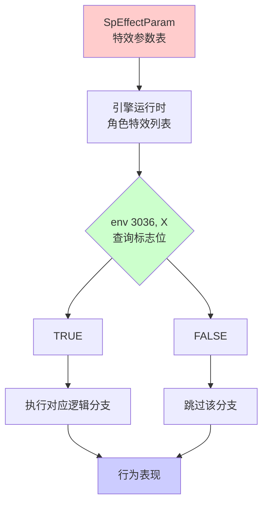
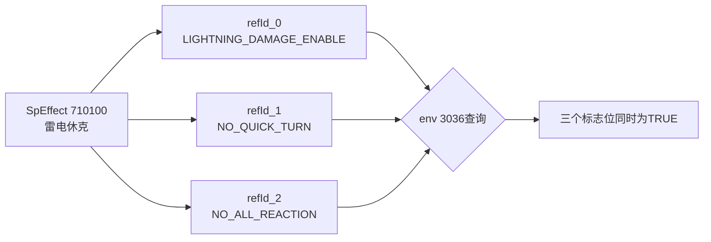
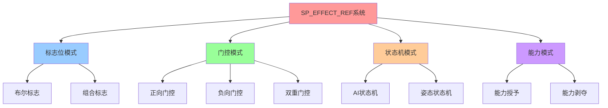

# SP_EFFECT_REF_* 系统完整分析
## 从数据配置到最终表现的标志位系统深度解析

---

## 目录
1. [系统概述](#系统概述)
2. [架构设计](#架构设计)
3. [功能分类详解](#功能分类详解)
4. [数据配置层](#数据配置层)
5. [逻辑处理层](#逻辑处理层)
6. [表现反馈层](#表现反馈层)
7. [设计模式分析](#设计模式分析)
8. [完整案例](#完整案例)

---

## 系统概述

### 什么是 SP_EFFECT_REF_* ?

`SP_EFFECT_REF_*` 是只狼引擎中的**特效引用常量系统**，充当着 **"能力标志位 (Capability Flags)"** 的角色。它们是连接**数据层（SpEffectParam）**和**逻辑层（Lua脚本）**的关键桥梁。

### 核心特点

| 特性 | 说明 |
|------|------|
| **命名规范** | 以 `SP_EFFECT_REF_` 开头，后跟功能描述 |
| **数据类型** | 整数常量（1000000-1500000范围） |
| **查询接口** | `env(3036, SP_EFFECT_REF_*)` |
| **返回值** | TRUE/FALSE（布尔值） |
| **作用范围** | 实时状态查询、能力检测、门控逻辑 |

### 设计哲学

```
传统方式：
角色数据 → 硬编码能力检测 → 行为逻辑
          ↑ 修改困难，需要重新编译

只狼方式：
SpEffectParam → SP_EFFECT_REF标志位 → env(3036)查询 → 行为逻辑
    ↑ 数据驱动，灵活配置，支持热更新
```

**核心优势**：
1. **数据驱动**：通过修改 SpEffectParam 就能改变角色能力，无需修改代码
2. **组合灵活**：一个角色可以同时拥有多个特效，每个特效激活不同的标志位
3. **逻辑清晰**：标志位命名直观，代码可读性高
4. **性能优化**：整数查询比字符串匹配快，支持位运算优化

---

## 架构设计

### 整体数据流



### 三层架构模型

```
┌─────────────────────────────────────────────────┐
│  数据配置层（SpEffectParam）                    │
├─────────────────────────────────────────────────┤
│  [SpEffect ID: 710000]                          │
│  └─ refId = 1000003  → SP_EFFECT_REF_AI_BATTLE │
│                                                 │
│  [Character at Runtime]                         │
│  └─ 身上的SpEffect列表: [710000, 710050, ...]  │
└─────────────────────────────────────────────────┘
              ↓
┌─────────────────────────────────────────────────┐
│  逻辑处理层（Lua脚本 - c9997.dec.lua）          │
├─────────────────────────────────────────────────┤
│  if env(3036, SP_EFFECT_REF_AI_BATTLE) == TRUE  │
│      → 角色处于战斗AI状态                       │
│      → 可以触发投技反应                         │
│  end                                            │
└─────────────────────────────────────────────────┘
              ↓
┌─────────────────────────────────────────────────┐
│  表现反馈层（动画/特效/音效）                   │
├─────────────────────────────────────────────────┤
│  • 播放战斗姿态动画                             │
│  • 眼睛发红光特效                               │
│  • BGM切换至战斗音乐                            │
└─────────────────────────────────────────────────┘
```

---

## 功能分类详解

根据 `c9997.dec.lua:570-660` 的定义，共90+个标志位，可分为10大类：

### 1. AI状态类（AI State Flags）

**用途**：控制角色的AI行为模式

| 常量名 | 值 | 功能说明 |
|--------|-----|---------|
| `SP_EFFECT_REF_AI_DEFAULT` | 1000000 | 默认AI状态（巡逻/待机） |
| `SP_EFFECT_REF_AI_CAUTION_NO_BATTLE` | 1000001 | 警戒状态（未进入战斗） |
| `SP_EFFECT_REF_AI_CAUTION_BATTLE` | 1000002 | 警戒战斗状态 |
| `SP_EFFECT_REF_AI_BATTLE` | 1000003 | 战斗状态（激活） |

**代码示例**（c9997.dec.lua:977-985）：
```lua
function UpdateAIState()
    if env(3036, SP_EFFECT_REF_AI_DEFAULT) == TRUE then
        SetVariable("IndexAiState", AI_STATE_DEFAULT)
    elseif env(3036, SP_EFFECT_REF_AI_CAUTION_NO_BATTLE) == TRUE then
        SetVariable("IndexAiState", AI_STATE_CAUTION_NO_BATTLE)
    elseif env(3036, SP_EFFECT_REF_AI_CAUTION_BATTLE) == TRUE then
        SetVariable("IndexAiState", AI_STATE_CAUTION_BATTLE)
    elseif env(3036, SP_EFFECT_REF_AI_BATTLE) == TRUE then
        SetVariable("IndexAiState", AI_STATE_BATTLE)
    end
end
```

**逻辑作用**：
- 驱动Havok Behavior状态机变量 `IndexAiState`
- 影响动画选择（战斗姿态 vs 巡逻姿态）
- 影响移动速度和追踪行为

---

### 2. 姿态状态类（Posture State Flags）

**用途**：定义角色的运动姿态

| 常量名 | 值 | 功能说明 |
|--------|-----|---------|
| `SP_EFFECT_REF_STAND` | 1000010 | 站立姿态 |
| `SP_EFFECT_REF_CROUCH` | 1000011 | 蹲伏姿态 |
| `SP_EFFECT_REF_FLIGHT` | 1000012 | 飞行姿态（仙峰寺跳跃敌人） |

**代码示例**（c9997.dec.lua:1946-1952）：
```lua
local sp_state = MOVE_STAND
local ai_state = GetVariable("IndexAiState")

if env(3036, SP_EFFECT_REF_CROUCH) == TRUE then
    sp_state = MOVE_CROUCH
elseif env(3036, SP_EFFECT_REF_FLIGHT) == TRUE then
    sp_state = MOVE_FLIGHT
end
```

**表现影响**：
- **动画层级**：蹲伏时使用下半身骨骼的专用动画
- **移动速度**：蹲伏状态下移动速度 × 0.7
- **碰撞体积**：蹲伏时胶囊体高度减半
- **转向事件**：`Fire("W_Turn" .. "Crouch")` vs `Fire("W_TurnDefault")`

---

### 3. 武器装备类（Weapon State Flags）

**用途**：标识当前装备的武器或道具

| 常量名 | 值 | 功能说明 |
|--------|-----|---------|
| `SP_EFFECT_REF_WEAPON_0` | 1000020 | 武器槽位0（主武器） |
| `SP_EFFECT_REF_WEAPON_1` | 1000021 | 武器槽位1（副武器） |
| `SP_EFFECT_REF_WEAPON_2` | 1000022 | 武器槽位2 |
| `SP_EFFECT_REF_WEAPON_3` | 1000023 | 武器槽位3 |
| `SP_EFFECT_REF_WEAPON_4` | 1000024 | 武器槽位4 |

**应用场景**：
- 判断是否装备特定武器类型（刀/矛/拳套）
- 根据武器类型选择不同的攻击动画
- 某些敌人会根据玩家武器类型调整AI策略

**推测逻辑**：
```lua
-- 伪代码：弦一郎AI决策
if env(3036, SP_EFFECT_REF_WEAPON_2) == TRUE then
    -- 玩家装备了长武器（如长枪）
    IncreaseActionWeight("SideStep")  -- 增加侧闪权重
else
    -- 玩家使用标准刀剑
    IncreaseActionWeight("Parry")  -- 增加弹反权重
end
```

---

### 4. 特殊伤害使能类（Special Damage Enable Flags）

**用途**：控制角色是否可以受到特定类型的特殊伤害

| 常量名 | 值 | 功能说明 |
|--------|-----|---------|
| `SP_EFFECT_REF_FIRE_ACTION_ENABLE` | 1000040 | 启用火焰伤害反应 |
| `SP_EFFECT_REF_LIGHTNING_DAMAGE_ENABLE` | 1000041 | 启用雷电伤害反应 |
| `SP_EFFECT_REF_HIDE_ACTION` | 1000042 | 启用隐藏动作（幻影消失） |
| `SP_EFFECT_REF_BACK_REALITY` | 1000043 | 启用返回现实（幻影破除） |

**代码示例**（c9997.dec.lua:1120-1124）：
```lua
-- 火焰伤害判定
if env(285) == DAMAGE_ELEMENT_FIRE and
   env(3036, SP_EFFECT_REF_FIRE_ACTION_ENABLE) == TRUE and
   env(3036, SP_EFFECT_REF_NO_FIRE_FIAR_REACTION) == FALSE then
    ret = SP_DAMAGE_FIRE
end

-- 雷电伤害判定（双重检测）
if (env(285) == DAMAGE_ELEMENT_LIGHTNING or
    env(3036, SP_EFFECT_REF_LIGHTNING_DAMAGE) == TRUE) and
   env(3036, SP_EFFECT_REF_LIGHTNING_DAMAGE_ENABLE) == TRUE and
   env(3036, SP_EFFECT_REF_NO_LIGHTNING_DAMAGE) == FALSE then
    ret = SP_DAMAGE_LIGHTNING
end
```

**门控逻辑分析**：
```
火焰特殊伤害触发需要满足：
  ✓ 攻击元素类型 = FIRE
  AND
  ✓ 受击者启用火焰反应（ENABLE标志）
  AND
  ✗ 受击者未禁用火焰反应（NO_*标志）
```

**设计意图**：
- **赤鬼**：`FIRE_ACTION_ENABLE = TRUE` → 被火攻击会长时间硬直并拍打身体
- **无头**：`FIRE_ACTION_ENABLE = FALSE` → 完全免疫火焰伤害
- **幻影敌人**：`BACK_REALITY = TRUE` → 被攻击后会消失返回现实世界

---

### 5. 反应禁用类（Reaction Disable Flags）

**用途**：禁用特定的特殊伤害反应（负面标志）

| 常量名 | 值 | 功能说明 |
|--------|-----|---------|
| `SP_EFFECT_REF_NO_ALL_REACTION` | 1000230 | **禁用所有特殊反应** |
| `SP_EFFECT_REF_NO_FIRE_REACTION` | 1000030 | 禁用火焰燃烧反应 |
| `SP_EFFECT_REF_NO_FIRE_FIAR_REACTION` | 1000240 | 禁用火焰恐惧反应 |
| `SP_EFFECT_REF_NO_BURST_REACTION` | 1000044 | 禁用破坏力攻击反应 |
| `SP_EFFECT_REF_NO_ASH_BAG_REACTION` | 1000045 | 禁用灰袋攻击反应 |
| `SP_EFFECT_REF_NO_LIGHTNING_DAMAGE` | 1000260 | 禁用雷电伤害 |
| `SP_EFFECT_REF_NO_FINGER_WHISTLE_REACTION` | 1000036 | 禁用指哨反应 |

**代码示例**（c9997.dec.lua:1101）：
```lua
function GetSpDamage()
    local ret = SP_DAMAGE_NONE

    -- 钩锁伤害（优先级最高，不受NO_ALL_REACTION限制）
    if env(3036, SP_EFFECT_REF_WIRE_ATTACK) == TRUE and ... then
        ret = SP_DAMAGE_WIRE
    end

    -- 所有其他特殊伤害都需要通过这个门控
    if env(3036, SP_EFFECT_REF_NO_ALL_REACTION) == FALSE then
        -- 投技反应
        if ... then ret = SP_DAMAGE_THROW_NEAR_REACTION end
        -- 火焰反应
        if ... then ret = SP_DAMAGE_FIRE end
        -- 雷电反应
        if ... then ret = SP_DAMAGE_LIGHTNING end
        -- ...其他13种特殊伤害...
    end

    return ret
end
```

**重要发现**：`NO_ALL_REACTION` 是**主开关**，但钩锁伤害例外！

**应用场景**：
```lua
-- BOSS霸体状态下的配置
[SpEffect ID: 750000]  -- 巴之雷蓄力状态
├─ refId = SP_EFFECT_REF_NO_ALL_REACTION
├─ effectEndurance = 2.0  -- 持续2秒
└─ motionInterval = 0  -- 不会被打断

-- 效果：弦一郎蓄力跳劈时
→ 玩家攻击无法打断动作
→ 火焰/雷电/忍具均无法触发特殊反应
→ 但钩锁仍可伤害（平衡性设计）
```

---

### 6. 钩锁伤害类（Wire Damage Flags）

**用途**：控制忍义手钩锁攻击的伤害等级

| 常量名 | 值 | 功能说明 |
|--------|-----|---------|
| `SP_EFFECT_REF_WIRE_ATTACK` | 1000410 | 钩锁攻击标识 |
| `SP_EFFECT_REF_ENABLE_WIRE_DAMAGE0` | 1000400 | 钩锁伤害等级0 |
| `SP_EFFECT_REF_ENABLE_WIRE_DAMAGE1` | 1000401 | 钩锁伤害等级1 |
| `SP_EFFECT_REF_ENABLE_WIRE_DAMAGE2` | 1000402 | 钩锁伤害等级2 |
| `SP_EFFECT_REF_ENABLE_WIRE_DAMAGE3` | 1000403 | 钩锁伤害等级3 |
| `SP_EFFECT_REF_ENABLE_WIRE_DAMAGE4` | 1000404 | 钩锁伤害等级4 |

**代码示例**（c9997.dec.lua:1098-1100）：
```lua
-- 钩锁伤害判定（最高优先级）
if env(3036, SP_EFFECT_REF_WIRE_ATTACK) == TRUE and
   (env(3036, SP_EFFECT_REF_ENABLE_WIRE_DAMAGE0) == TRUE or
    env(3036, SP_EFFECT_REF_ENABLE_WIRE_DAMAGE1) == TRUE or
    env(3036, SP_EFFECT_REF_ENABLE_WIRE_DAMAGE2) == TRUE or
    env(3036, SP_EFFECT_REF_ENABLE_WIRE_DAMAGE3) == TRUE or
    env(3036, SP_EFFECT_REF_ENABLE_WIRE_DAMAGE4) == TRUE) then
    ret = SP_DAMAGE_WIRE
end
```

**分级机制解析**：

```
等级0：普通敌人 → 拉近距离 + 轻微伤害
等级1：中型敌人 → 拉近距离 + 中等伤害
等级2：精英敌人 → 无法拉近 + 轻微伤害
等级3：BOSS → 无法拉近 + 无伤害（用于接近战）
等级4：超大型BOSS → 完全免疫钩锁
```

**配置示例**：
```
[狮子猿 - 第一阶段]
└─ SP_EFFECT_REF_ENABLE_WIRE_DAMAGE2
   → 钩锁可造成伤害但无法拉近（体型巨大）

[狮子猿 - 第二阶段（无头）]
└─ SP_EFFECT_REF_ENABLE_WIRE_DAMAGE1
   → 失去头部后稳定性降低，钩锁效果增强

[怨恨之鬼]
└─ 无任何 ENABLE_WIRE_DAMAGE 标志
   → 完全免疫钩锁伤害
```

---

### 7. 翻滚控制类（Rolling Control Flags）

**用途**：控制翻滚行为的启用/禁用

| 常量名 | 值 | 功能说明 |
|--------|-----|---------|
| `SP_EFFECT_REF_ENABLE_ROLLING` | 1000420 | 启用翻滚能力 |
| `SP_EFFECT_REF_DISABLE_ROLLING` | 1000421 | 禁用翻滚能力 |

**代码示例**（c9997.dec.lua:1108-1110）：
```lua
-- 翻滚推击伤害判定
if env(334, BEH_IDENTIFIER_ROLLING) == TRUE and
   env(3036, SP_EFFECT_REF_ENABLE_ROLLING) == TRUE and
   env(3036, SP_EFFECT_REF_DISABLE_ROLLING) == FALSE then
    ret = SP_DAMAGE_PUSH
end
```

**双重门控机制**：
- 必须 **启用翻滚**（ENABLE = TRUE）
- 且 **未禁用翻滚**（DISABLE = FALSE）
- 两个条件同时满足才能触发推击

**应用场景**：
```lua
-- 场景1：玩家在水中
AddSpEffect(player, SP_EFFECT_UNDERWATER)
  └─ refId = SP_EFFECT_REF_DISABLE_ROLLING
  → 无法翻滚躲避攻击

-- 场景2：玩家使用"金刚铁"糖
AddSpEffect(player, SP_EFFECT_DIAMOND_ARMOR)
  └─ refId1 = SP_EFFECT_REF_DISABLE_ROLLING
  └─ refId2 = SP_EFFECT_REF_NO_ALL_REACTION
  → 霸体状态，无法翻滚但免疫硬直
```

---

### 8. 复活/死亡类（Resurrection & Death Flags）

**用途**：控制角色的复活机制和特殊死亡动画

| 常量名 | 值 | 功能说明 |
|--------|-----|---------|
| `SP_EFFECT_REF_NO_DEAD` | 1000110 | 禁止死亡（血锁1HP） |
| `SP_EFFECT_REF_NOT_TO_DEATH_ANIME` | 1000111 | 不播放死亡动画 |
| `SP_EFFECT_REF_RESURRECTION` | 1000120 | 启用复活能力 |
| `SP_EFFECT_REF_RESURRECTION_ZOMBIE` | 1000122 | 僵尸复活 |
| `SP_EFFECT_REF_RESURRECTION_START` | 1000125 | 复活开始标志 |
| `SP_EFFECT_REF_NOT_RESURRECTION` | 1000126 | 禁止复活 |

**代码示例**（c9997.dec.lua:1239-1241）：
```lua
function IsInvalidDeath(hp)
    -- HP为0但存活检测
    if hp <= 0 and env(305, SP_EFFECT_NO_DEAD) == TRUE then
        return TRUE  -- 无效死亡，继续存活
    end

    -- HP为1但禁止死亡动画
    if hp <= 1 and
       env(305, SP_EFFECT_NO_DEAD) == TRUE and
       env(3036, SP_EFFECT_REF_NOT_TO_DEATH_ANIME) == FALSE then
        return TRUE
    end

    return FALSE
end
```

**特殊死亡事件系列**（c9997.dec.lua:2284-2309）：
```lua
-- 支持8个自定义死亡事件
if env(3036, SP_EFFECT_REF_TO_DEATH_EVENT20000) == TRUE then
    anim_id = ANIME_ID_ONE_SHOT_EVENT_BEGIN
    event = "W_Event20000"
elseif env(3036, SP_EFFECT_REF_TO_DEATH_EVENT20000 + 1) == TRUE then
    anim_id = ANIME_ID_ONE_SHOT_EVENT_BEGIN + 1
    event = "W_Event20001"
-- ...依次类推到 +7
end
```

**应用案例**：
```
[樱龙] - SP_EFFECT_REF_TO_DEATH_EVENT20000
└─ 死亡时触发过场动画，镜头拉远

[破戒僧] - SP_EFFECT_REF_RESURRECTION_ZOMBIE
└─ 第一次死亡后爬起复活，进入第二阶段

[玩家] - SP_EFFECT_REF_RESURRECTION
└─ 回生能力，死亡后原地复活
```

---

### 9. 环境状态类（Environment State Flags）

**用途**：标识角色所处的环境状态

| 常量名 | 值 | 功能说明 |
|--------|-----|---------|
| `SP_EFFECT_REF_HEADWATER` | 1000140 | 头部接触水面 |
| `SP_EFFECT_REF_UNDERWATER` | 1000141 | 完全潜入水中 |
| `SP_EFFECT_REF_BOTTOMWATER` | 1000142 | 位于水底 |
| `SP_EFFECT_REF_AERIAL_DAMAGE` | 1000060 | 空中受击状态 |
| `SP_EFFECT_REF_AERIAL_DAMAGE_TO_DIRECT_LOOP` | 1000065 | 空中受击转循环 |

**水环境逻辑推测**：
```lua
-- 伪代码：水中行为限制
function UpdateWaterState()
    if env(3036, SP_EFFECT_REF_HEADWATER) == TRUE then
        -- 头部接触水面
        EnableAction("Swim")
        DisableAction("Jump")
        MultiplyStamina(1.5)  -- 精力消耗增加
    end

    if env(3036, SP_EFFECT_REF_UNDERWATER) == TRUE then
        -- 完全潜水
        EnableAction("Dive")
        DisableAction("Attack")  -- 水下无法攻击
        AddSpEffect(self, SP_EFFECT_REF_DISABLE_ROLLING)
        StartOxygenTimer()  -- 开始计算氧气
    end

    if env(3036, SP_EFFECT_REF_BOTTOMWATER) == TRUE then
        -- 水底探索
        EnableAction("GroundMove")
        ApplyGravity(0.3)  -- 重力减弱
    end
end
```

**空中状态应用**（c9997.dec.lua:924、2272）：
```lua
-- 空中受击判定
function IsDamagedAerial()
    if env(3036, SP_EFFECT_REF_AERIAL_DAMAGE) == TRUE or
       env(201) == FALSE then  -- env(201) = 地面接触
        return TRUE
    end
    return FALSE
end

-- 空中死亡动画选择
if env(3036, SP_EFFECT_REF_AERIAL_DAMAGE) == TRUE or
   env(200) == TRUE then
    if damage_level >= DAMAGE_LEVEL_BLOW then
        -- 播放空中击飞死亡
        anim_id = ANIME_ID_DEATH_AERIAL_BLOW
    end
end
```

---

### 10. 运动控制类（Movement Control Flags）

**用途**：控制角色的移动和转向行为

| 常量名 | 值 | 功能说明 |
|--------|-----|---------|
| `SP_EFFECT_REF_NO_SPIN` | 1000071 | 禁止旋转攻击 |
| `SP_EFFECT_REF_NO_QUICK_TURN` | 1000072 | 禁止快速转身 |
| `SP_EFFECT_REF_NOT_FACE_ATTACKER` | 1000080 | 禁止面向攻击者 |
| `SP_EFFECT_REF_BREAK_FACE_FRONT` | 1000081 | 打断面向前方 |
| `SP_EFFECT_REF_ENABLE_NOMAL_BACK_AND_SIDE_WALK` | 1000300 | 启用后退和侧移 |
| `SP_EFFECT_REF_5080_NO_BACK_MOVE` | 1508000 | 禁止后退移动 |

**代码示例**（c9997.dec.lua:1295-1297, 1802-1804）：
```lua
-- 禁止面向攻击者
function FaceAttacker(rad)
    if env(3036, SP_EFFECT_REF_NOT_FACE_ATTACKER) ~= TRUE then
        act(159, rad)  -- 执行面向攻击者的动作
    end
end

-- 禁止快速转身
function ExecQuickTurn()
    if env(3036, SP_EFFECT_REF_NO_QUICK_TURN) == TRUE then
        return FALSE  -- 跳过快速转身
    end
    -- ...执行转身逻辑...
end

-- 禁止后退移动（特定敌人）
if env(3036, SP_EFFECT_REF_5080_NO_BACK_MOVE) == TRUE then
    if move_speed_level > 0.75 and sp_state == MOVE_STAND then
        return MOVE_TYPE_RUN_FRONT  -- 强制向前移动
    end
end
```

**应用场景**：
```
[义父（枭）] - 激怒状态
├─ SP_EFFECT_REF_NO_QUICK_TURN = TRUE
└─ 设计意图：激怒后攻击更具威胁性，无法通过绕背轻松攻击

[巨型怨灵] - 体型限制
├─ SP_EFFECT_REF_NOT_FACE_ATTACKER = TRUE
└─ 设计意图：体型巨大，转身缓慢，不会快速锁定玩家

[冲刺型敌人] - 武士冲刺
├─ SP_EFFECT_REF_5080_NO_BACK_MOVE = TRUE
└─ 设计意图：只能向前冲锋，无法后退防御
```

---

### 11. 特殊角色属性类（Character Attribute Flags）

**用途**：定义角色的特殊属性和弱点

| 常量名 | 值 | 功能说明 |
|--------|-----|---------|
| `SP_EFFECT_REF_WOMAN` | 1000220 | 女性角色标识 |
| `SP_EFFECT_REF_WOMAN_POISON` | 1000032 | 女性毒素特效 |
| `SP_EFFECT_REF_SPECIAL_POISON` | 1000031 | 特殊毒素状态 |

**代码示例**（c9997.dec.lua:1135-1137）：
```lua
-- 女性角色专属毒素反应
if env(3041, STATUS_SPECIAL_POISON) == TRUE and
   env(3036, SP_EFFECT_REF_WOMAN) == TRUE and
   env(3036, SP_EFFECT_REF_WOMAN_POISON) == TRUE then
    ret = SP_DAMAGE_POISON_REACTION
end
```

**设计解析**：
```
[蝴蝶夫人] - 女性BOSS
├─ SP_EFFECT_REF_WOMAN = TRUE
└─ SP_EFFECT_REF_WOMAN_POISON = TRUE
   → 受到特殊毒素攻击时会触发专属反应
   → 可能是巴之毒雾的特殊交互

[破戒僧] - 女性幻影
├─ SP_EFFECT_REF_WOMAN = TRUE
└─ SP_EFFECT_REF_BACK_REALITY = TRUE
   → 女性标识 + 幻影消失能力
```

**特殊毒素 vs 普通毒素**：
- **普通毒素**：通过 `registPoison` 累积，达到阈值触发中毒
- **特殊毒素**：直接施加 `STATUS_SPECIAL_POISON` 状态，仅对特定角色生效

---

### 12. 其他特殊标志（Miscellaneous Flags）

| 常量名 | 值 | 功能说明 |
|--------|-----|---------|
| `SP_EFFECT_REF_ASSASSINATION_BLOOD` | 1000500 | 刺杀血液效果 |
| `SP_EFFECT_REF_EXPLOSION` | 1000121 | 爆炸死亡 |
| `SP_EFFECT_REF_BURNING` | 1000130 | 燃烧状态 |
| `SP_EFFECT_REF_REACTION_SAFE_TIME` | 1000250 | 反应安全时间 |
| `SP_EFFECT_REF_DELAY_BGM_REQUEST` | 1000350 | 延迟BGM切换 |
| `SP_EFFECT_REF_LANDING_DECISION` | 1000070 | 着陆判定 |
| `SP_EFFECT_REF_NO_FALL_PREVENTION_ASSIST` | 1000150 | 禁用防摔辅助 |

---

## 数据配置层

### SpEffectParam 表的结构

```
[SpEffectParam Row ID: 710100]  // 雷电休克特效
├─ effectName: "Thunder Shock"
├─ effectEndurance: 5.0             // 持续5秒
├─ refId_0: SP_EFFECT_REF_LIGHTNING_DAMAGE_ENABLE  (激活雷电伤害)
├─ refId_1: SP_EFFECT_REF_NO_QUICK_TURN           (禁止快速转身)
├─ refId_2: SP_EFFECT_REF_NO_ALL_REACTION         (禁止所有反应)
├─ motionInterval: -1               // 强制硬直
├─ staminaAttackRate: 1.5           // 架势伤害+50%
├─ vfxId: 9050                      // 雷电缠身特效
└─ cycleOccurrenceSpEffectId: 710101// 每秒触发子特效(电击伤害)

[SpEffectParam Row ID: 750000]  // 赤鬼的火焰恐惧
├─ effectName: "Red Eye Fire Fear"
├─ effectEndurance: 0.0             // 被动特效
├─ refId_0: SP_EFFECT_REF_FIRE_ACTION_ENABLE
└─ refId_1: SP_EFFECT_REF_AI_BATTLE

[SpEffectParam Row ID: 800000]  // 玩家回生能力
├─ effectName: "Resurrection Power"
├─ effectEndurance: -1              // 永久生效
├─ refId_0: SP_EFFECT_REF_RESURRECTION
├─ refId_1: SP_EFFECT_REF_NOT_TO_DEATH_ANIME
└─ maxHpRate: 0.5                   // 回生后血量减半
```

### 多重引用机制

**一个 SpEffect 可以激活多个 SP_EFFECT_REF_* 标志**：



**一个角色可以同时拥有多个 SpEffect**：

```lua
-- 玩家在雷电中使用金刚铁糖
Player.SpEffects = {
    710100,  -- 雷电休克
    800200,  -- 金刚铁
    160014,  -- 攻击力14
    200050   -- 夜叉戮糖
}

-- 同时激活的标志位：
env(3036, SP_EFFECT_REF_LIGHTNING_DAMAGE_ENABLE) == TRUE  -- 来自710100
env(3036, SP_EFFECT_REF_NO_ALL_REACTION) == TRUE          -- 来自710100和800200
env(3036, SP_EFFECT_REF_DISABLE_ROLLING) == TRUE          -- 来自800200
-- ...同时还有攻击力加成等数值型效果
```

---

## 逻辑处理层

### env(3036, X) 查询机制

**底层实现推测**：

```cpp
// C++引擎层伪代码
bool QuerySpEffectRef(CharacterID chr, int refId) {
    Character* character = GetCharacter(chr);

    // 遍历角色身上的所有SpEffect
    for (auto& effect : character->activeSpEffects) {
        SpEffectParam* param = SpEffectDB[effect.id];

        // 检查该SpEffect的所有refId字段
        if (param->refId_0 == refId) return true;
        if (param->refId_1 == refId) return true;
        if (param->refId_2 == refId) return true;
        // ...最多可能有8个refId字段
    }

    return false;  // 未找到该标志位
}
```

**Lua调用**：
```lua
local result = env(3036, SP_EFFECT_REF_AI_BATTLE)
-- result: TRUE(1) 或 FALSE(0)
```

### 常见逻辑模式

#### 1. 单条件判定

```lua
-- 简单布尔检测
if env(3036, SP_EFFECT_REF_CROUCH) == TRUE then
    Fire("W_IdleDefault")
end
```

#### 2. 多条件组合（AND逻辑）

```lua
-- 所有条件必须同时满足
if env(3036, SP_EFFECT_REF_FIRE_ACTION_ENABLE) == TRUE and
   env(3036, SP_EFFECT_REF_NO_FIRE_FIAR_REACTION) == FALSE and
   env(285) == DAMAGE_ELEMENT_FIRE then
    TriggerFireFear()
end
```

#### 3. 多条件组合（OR逻辑）

```lua
-- 任一条件满足即可
if env(3036, SP_EFFECT_REF_ENABLE_WIRE_DAMAGE0) == TRUE or
   env(3036, SP_EFFECT_REF_ENABLE_WIRE_DAMAGE1) == TRUE or
   env(3036, SP_EFFECT_REF_ENABLE_WIRE_DAMAGE2) == TRUE then
    ret = SP_DAMAGE_WIRE
end
```

#### 4. 互斥状态（XOR逻辑）

```lua
-- 状态互斥，只能选其一
if env(3036, SP_EFFECT_REF_AI_DEFAULT) == TRUE then
    SetVariable("IndexAiState", AI_STATE_DEFAULT)
elseif env(3036, SP_EFFECT_REF_AI_BATTLE) == TRUE then
    SetVariable("IndexAiState", AI_STATE_BATTLE)
end
```

#### 5. 双重门控（Enable + Disable）

```lua
-- 必须启用且未禁用
if env(3036, SP_EFFECT_REF_ENABLE_ROLLING) == TRUE and
   env(3036, SP_EFFECT_REF_DISABLE_ROLLING) == FALSE then
    AllowRolling()
end
```

#### 6. 负面标志优先（Blacklist Pattern）

```lua
-- 先检查禁用标志，再检查启用标志
if env(3036, SP_EFFECT_REF_NO_ALL_REACTION) == FALSE then
    if env(3036, SP_EFFECT_REF_FIRE_ACTION_ENABLE) == TRUE then
        -- 执行火焰反应
    end
end
```

---

## 表现反馈层

### 1. 动画系统驱动

**AI状态 → 动画选择**：
```lua
function SelectIdleAnimation()
    local aiState = GetVariable("IndexAiState")  -- 由SP_EFFECT_REF_AI_*更新

    if aiState == AI_STATE_DEFAULT then
        return "Idle_Patrol"
    elseif aiState == AI_STATE_CAUTION_BATTLE then
        return "Idle_Alert"
    elseif aiState == AI_STATE_BATTLE then
        return "Idle_Combat"
    end
end
```

**姿态状态 → 动画变体**：
```lua
function GetMoveAnimation(moveType)
    local posture = MOVE_STAND

    if env(3036, SP_EFFECT_REF_CROUCH) == TRUE then
        posture = MOVE_CROUCH
        return "Walk_Crouch_Forward"
    elseif env(3036, SP_EFFECT_REF_FLIGHT) == TRUE then
        posture = MOVE_FLIGHT
        return "Fly_Forward"
    end

    return "Walk_Stand_Forward"
end
```

### 2. 特效系统触发

**火焰恐惧特效**：
```lua
if spDamageType == SP_DAMAGE_FIRE_FEAR then
    -- 由 SP_EFFECT_REF_FIRE_ACTION_ENABLE 启用
    PlayVFX("Fire_Fear_Panic", character)
    PlayAnimation("Fear_PutOutFire", 5.0)  -- 持续5秒拍火动画
    PlaySFX("Enemy_PanicScream")

    -- 强制中断当前动作
    CancelCurrentAction()

    -- 临时禁用AI攻击
    AddSpEffect(character, SP_EFFECT_AI_DISABLED, 5.0)
end
```

**雷电缠身特效**：
```lua
if env(3036, SP_EFFECT_REF_LIGHTNING_DAMAGE_ENABLE) == TRUE and
   env(3036, SP_EFFECT_REF_LIGHTNING_DAMAGE) == TRUE then
    -- 持续播放电弧特效
    LoopVFX("Lightning_Body_Arc", character.skeleton)

    -- 每秒触发一次电击伤害（cycleOccurrence）
    SetTimer("LightningDamageTick", 1.0, function()
        DealDamage(character, 10)  -- 每秒扣10HP
        PlayVFX("Lightning_Spark_Small")
    end)
end
```

### 3. 音效系统控制

**BGM延迟切换**：
```lua
function OnEnterCombat()
    if env(3036, SP_EFFECT_REF_DELAY_BGM_REQUEST) == TRUE then
        -- 延迟3秒再切换BGM（剧情需要）
        Timer.Delayed(3.0, function()
            RequestBGM("Boss_Combat_Theme")
        end)
    else
        -- 立即切换
        RequestBGM("Boss_Combat_Theme")
    end
end
```

### 4. UI系统更新

**状态图标显示**：
```lua
function UpdateStatusIcons()
    if env(3036, SP_EFFECT_REF_BURNING) == TRUE then
        ShowIcon("Status_Burning")
    end

    if env(3036, SP_EFFECT_REF_SPECIAL_POISON) == TRUE and
       env(3036, SP_EFFECT_REF_WOMAN) == TRUE then
        ShowIcon("Status_SpecialPoison")
    end

    if env(3036, SP_EFFECT_REF_RESURRECTION) == TRUE then
        ShowIcon("Resurrection_Available")
        UpdateResurrectionCount(GetResurrectionCharges())
    end
end
```

---

## 设计模式分析

### 1. 标志位（Flag Pattern）

**传统硬编码方式**：
```cpp
// C++代码，修改困难
class Character {
    bool isInCombat;
    bool canRoll;
    bool isBurning;
    // ...数百个布尔变量
};
```

**只狼的标志位系统**：
```lua
-- 数据驱动，灵活配置
if env(3036, SP_EFFECT_REF_AI_BATTLE) == TRUE then ... end
if env(3036, SP_EFFECT_REF_ENABLE_ROLLING) == TRUE then ... end
if env(3036, SP_EFFECT_REF_BURNING) == TRUE then ... end
```

**优势**：
- 通过SpEffectParam配置，无需修改代码
- 支持运行时动态添加/移除
- 可组合多个标志位实现复杂状态

### 2. 门控模式（Gating Pattern）

**正向门控（Whitelist）**：
```lua
-- 必须显式启用才能执行
if env(3036, SP_EFFECT_REF_FIRE_ACTION_ENABLE) == TRUE then
    ExecuteFireReaction()
end
```

**负向门控（Blacklist）**：
```lua
-- 必须未禁用才能执行
if env(3036, SP_EFFECT_REF_NO_ALL_REACTION) == FALSE then
    ExecuteSpecialReaction()
end
```

**双重门控（Double Gate）**：
```lua
-- 必须启用且未禁用
if env(3036, SP_EFFECT_REF_ENABLE_ROLLING) == TRUE and
   env(3036, SP_EFFECT_REF_DISABLE_ROLLING) == FALSE then
    ExecuteRoll()
end
```

**主从门控（Master-Slave Gate）**：
```lua
-- 主开关控制多个子开关
if env(3036, SP_EFFECT_REF_NO_ALL_REACTION) == FALSE then
    if env(3036, SP_EFFECT_REF_FIRE_ACTION_ENABLE) == TRUE then ... end
    if env(3036, SP_EFFECT_REF_LIGHTNING_DAMAGE_ENABLE) == TRUE then ... end
    -- NO_ALL_REACTION是主开关，控制所有特殊反应
end
```

### 3. 状态机模式（State Machine Pattern）

**AI状态机**：
```lua
-- SP_EFFECT_REF_AI_* 驱动AI状态转换
function UpdateAIState()
    if env(3036, SP_EFFECT_REF_AI_DEFAULT) == TRUE then
        TransitionTo(AI_STATE_DEFAULT)
    elseif env(3036, SP_EFFECT_REF_AI_BATTLE) == TRUE then
        TransitionTo(AI_STATE_BATTLE)
    end
end
```

**姿态状态机**：
```lua
-- SP_EFFECT_REF_STAND/CROUCH/FLIGHT 驱动姿态转换
function UpdatePosture()
    if env(3036, SP_EFFECT_REF_CROUCH) == TRUE then
        TransitionTo(MOVE_CROUCH)
    else
        TransitionTo(MOVE_STAND)
    end
end
```

### 4. 能力系统模式（Capability Pattern）

**能力授予**：
```lua
-- 通过SpEffect授予新能力
AddSpEffect(player, SP_EFFECT_RESURRECTION)
  → env(3036, SP_EFFECT_REF_RESURRECTION) 变为 TRUE
  → 玩家获得回生能力
```

**能力剥夺**：
```lua
-- 移除SpEffect剥夺能力
RemoveSpEffect(player, SP_EFFECT_UNDERWATER)
  → env(3036, SP_EFFECT_REF_UNDERWATER) 变为 FALSE
  → 玩家恢复正常移动
```

### 5. 优先级模式（Priority Pattern）

**钩锁伤害的优先级**：
```lua
function GetSpDamage()
    -- 钩锁伤害不受NO_ALL_REACTION限制
    if env(3036, SP_EFFECT_REF_WIRE_ATTACK) == TRUE then
        return SP_DAMAGE_WIRE  -- 立即返回
    end

    -- 其他特殊伤害受限制
    if env(3036, SP_EFFECT_REF_NO_ALL_REACTION) == FALSE then
        -- ...检测其他伤害类型...
    end
end
```

---

## 完整案例：赤鬼的火焰恐惧机制

### 场景描述
玩家使用火吹箭攻击赤鬼（红眼敌人）

### 数据配置层

```
[赤鬼 SpEffect - ID: 750100]
├─ effectName: "Red Eye Base"
├─ effectEndurance: -1  // 永久生效
├─ refId_0: SP_EFFECT_REF_FIRE_ACTION_ENABLE  // 启用火焰反应
├─ refId_1: SP_EFFECT_REF_AI_BATTLE           // 战斗AI状态
└─ maxHpRate: 1.5  // HP比普通敌人高50%

[火吹箭 AtkParam - ID: 8050]
├─ atkPhys: 30
├─ spAttribute: DAMAGE_ELEMENT_FIRE
├─ atkFire: 50
└─ spEffectId0: 750200  // 燃烧累积

[燃烧累积 SpEffect - ID: 750200]
├─ effectEndurance: 0.5
├─ registBurning: 100  // 累积100点燃烧值
└─ cycleOccurrenceSpEffectId: 750201  // 触发燃烧状态
```

### 逻辑处理层

```lua
-- 第一步：命中检测
OnHit(redOgre, fireArrow)
    ↓
-- 第二步：特殊伤害判定 (c9997.dec.lua:1126-1128)
function GetSpDamage()
    if env(334, BEH_IDENTIFIER_FIRE_FEAR) == TRUE and
       env(3036, SP_EFFECT_REF_NO_FIRE_FIAR_REACTION) == FALSE and
       env(3036, SP_EFFECT_REF_FIRE_ACTION_ENABLE) == TRUE then
        return SP_DAMAGE_FIRE_FEAR  -- 确认为火焰恐惧
    end
end
    ↓
-- 第三步：执行特殊反应
function ExecSpReaction()
    if spDamageType == SP_DAMAGE_FIRE_FEAR then
        -- 强制中断当前动作
        CancelCurrentAction()

        -- 播放恐惧动画（持续5秒）
        PlayAnimation("Fear_PutOutFire_Long", 5.0)

        -- 临时移除战斗AI
        RemoveSpEffect(redOgre, 750100)  -- 移除AI_BATTLE
        AddSpEffect(redOgre, 750300, 5.0)  -- 添加恐惧状态

        return TRUE  -- 中断伤害处理链
    end
end
```

### 表现反馈层

```lua
-- 视觉特效
PlayVFX("Fire_Body_Spread", redOgre.body)  -- 全身火焰蔓延
PlayVFX("Fire_Fear_Panic_Aura", redOgre.position)  -- 慌乱气场
LoopVFX("Fire_Burning_Loop", redOgre, 5.0)  -- 持续燃烧5秒

-- 音效分层
PlaySFX("Ogre_Fear_Scream_Panic")  -- 恐惧尖叫
LoopSFX("Fire_Crackle", 5.0)  -- 火焰燃烧声
PlaySFX("Body_Slapping_Fast")  -- 拍打身体声

-- 动画控制
ForcePlayAnimation(redOgre, "Fear_PutOutFire_Long", {
    duration = 5.0,
    canCancel = false,  -- 不可取消
    disableAI = true,   -- 禁用AI
    invincible = false  -- 可以被攻击
})

-- 摄像机效果
CameraShake(intensity = 0.3, duration = 0.5)
PlayCameraAnimation("FocusOnEnemy", redOgre)

-- UI反馈
ShowFloatingText(redOgre, "火焰恐惧！", color = "orange")
UpdateEnemyHealthBar(redOgre)  -- 显示大量伤害
```

### 时间轴分解

```
T = 0.0s:  火吹箭命中赤鬼
           └→ AtkParam[8050] 读取
           └→ env(285) 返回 DAMAGE_ELEMENT_FIRE

T = 0.05s: GetSpDamage() 判定
           └→ env(3036, FIRE_ACTION_ENABLE) = TRUE
           └→ env(3036, NO_FIRE_FIAR_REACTION) = FALSE
           └→ 返回 SP_DAMAGE_FIRE_FEAR

T = 0.1s:  ExecSpReaction() 执行
           └→ CancelCurrentAction()
           └→ RemoveSpEffect(750100)  // 移除战斗AI
           └→ AddSpEffect(750300, 5.0)  // 添加恐惧状态

T = 0.15s: 动画开始
           └→ Play "Fear_PutOutFire_Long"
           └→ AI被禁用，无法攻击或防御

T = 0.2s:  特效和音效开始
           └→ VFX: 全身火焰
           └→ SFX: 恐惧尖叫 + 火焰燃烧

T = 1.0s:  第一次燃烧伤害（cycleOccurrence）
           └→ DealDamage(20)
           └→ PlayVFX("Fire_Damage_Tick")

T = 2.0s:  第二次燃烧伤害
T = 3.0s:  第三次燃烧伤害
T = 4.0s:  第四次燃烧伤害
T = 5.0s:  第五次燃烧伤害

T = 5.0s:  恐惧状态结束
           └→ RemoveSpEffect(750300)
           └→ AddSpEffect(750100)  // 恢复战斗AI
           └→ TransitionTo("Idle_Combat")
           └→ 赤鬼恢复正常，但HP已损失大量
```

### 平衡性设计

**为什么赤鬼怕火？**

1. **体型优势的代价**：
   - 赤鬼HP高、攻击力强、体型大
   - 但有明显弱点（火焰），鼓励玩家使用策略

2. **资源管理**：
   - 火吹箭消耗忍义手充能
   - 玩家需要在伤害和资源之间平衡

3. **风险收益**：
   - 恐惧动画持续5秒，玩家可以输出大量伤害
   - 但需要先命中火吹箭（投射物有飞行时间）

4. **教学设计**：
   - 通过赤鬼教会玩家"元素克制"机制
   - 为后续BOSS战（如怨恨之鬼）铺垫

---

## 总结

### SP_EFFECT_REF_* 系统的核心价值

| 维度 | 作用 | 优势 |
|------|------|------|
| **数据配置** | 通过SpEffectParam定义能力和状态 | 数据驱动，易于调整平衡性 |
| **逻辑处理** | 通过env(3036)查询实现门控逻辑 | 代码清晰，逻辑可读性高 |
| **表现反馈** | 驱动动画、特效、音效系统 | 统一接口，解耦良好 |

### 设计模式总结



### 从数据到表现的完整链路

```
[配置层]
SpEffectParam定义
  ├─ refId_0: SP_EFFECT_REF_FIRE_ACTION_ENABLE
  └─ effectEndurance: -1

[角色加载]
Character初始化
  └─ AddSpEffect(750100)  // 赤鬼基础特效

[运行时查询]
env(3036, SP_EFFECT_REF_FIRE_ACTION_ENABLE)
  └─ 返回 TRUE（因为角色身上有750100）

[逻辑判定]
GetSpDamage() 检测火焰攻击
  └─ FIRE_ACTION_ENABLE = TRUE
  └─ 返回 SP_DAMAGE_FIRE_FEAR

[伤害处理]
ExecSpReaction() 执行特殊反应
  └─ 播放恐惧动画
  └─ 施加燃烧伤害

[表现层]
  ├─ 动画：Fear_PutOutFire_Long (5秒)
  ├─ 特效：Fire_Body_Spread + Fire_Burning_Loop
  ├─ 音效：Fear_Scream + Fire_Crackle
  └─ UI：显示伤害数字 + 状态图标
```

### 对Mod开发的启示

1. **修改敌人AI行为**：
   ```lua
   -- 让所有敌人永久处于战斗状态
   SpEffectParam[999999].refId_0 = SP_EFFECT_REF_AI_BATTLE
   SpEffectParam[999999].effectEndurance = -1
   ```

2. **创造新的特殊反应**：
   ```lua
   -- 添加新的标志位
   SP_EFFECT_REF_CUSTOM_FREEZE = 2000000

   -- 在GetSpDamage()中添加判定
   if env(3036, SP_EFFECT_REF_CUSTOM_FREEZE) == TRUE then
       return SP_DAMAGE_CUSTOM_FREEZE
   end
   ```

3. **调整难度**：
   ```lua
   -- 禁用玩家的所有特殊反应（苦难模式）
   AddSpEffect(player, SP_EFFECT_NO_ALL_REACTION, -1)

   -- 启用玩家的超级霸体（简单模式）
   AddSpEffect(player, SP_EFFECT_SUPER_ARMOR, -1)
   ```

---

**文档版本**：v1.0
**创建时间**：2026-01-13
**分析代码**：c9997.dec.lua (570-660行定义，全文使用)
**核心发现**：SP_EFFECT_REF_* 系统是只狼战斗系统的"神经网络"，通过90+个标志位实现了极其灵活的能力管理和状态控制
