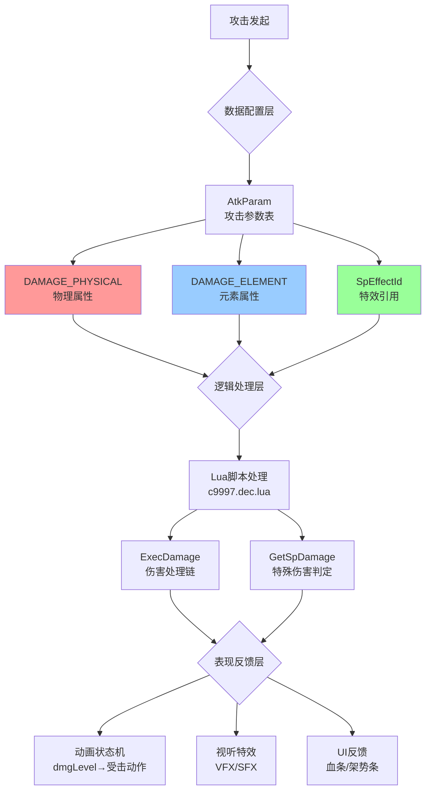
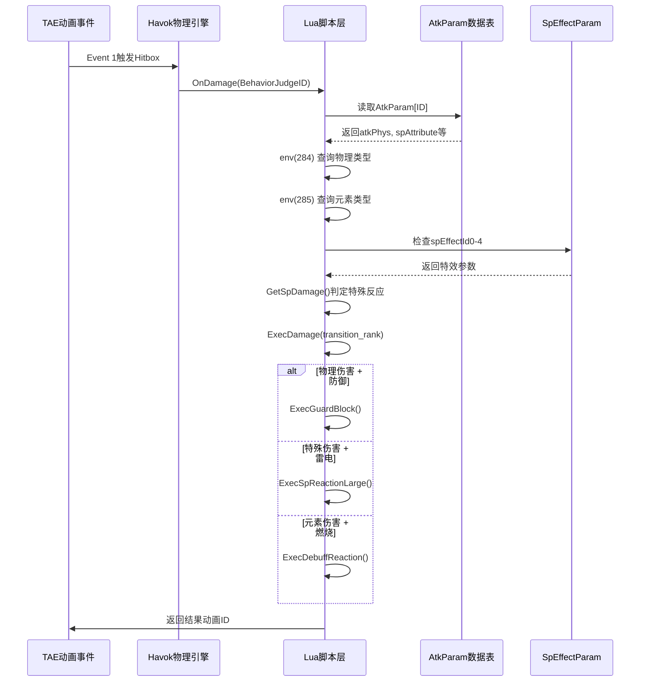
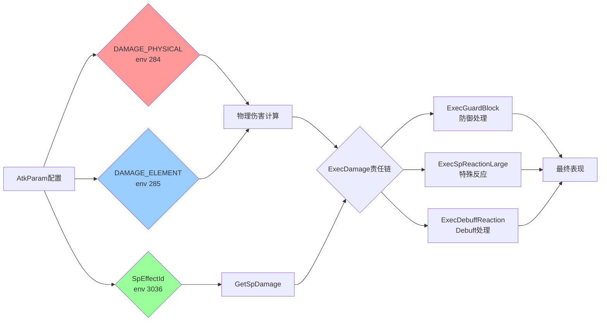

# 只狼伤害系统完整流程分析
## DAMAGE_PHYSICAL_* / DAMAGE_ELEMENT_* / SP_DAMAGE_* 从数据配置到最终表现的全链路解析

---

## 目录
1. [架构总览](#架构总览)
2. [数据配置层](#数据配置层)
3. [逻辑处理层](#逻辑处理层)
4. [表现反馈层](#表现反馈层)
5. [完整案例分析](#完整案例分析)
6. [代码映射关系](#代码映射关系)

---

## 架构总览

只狼的伤害系统采用**三维度分离设计**，三种伤害类型在系统中扮演不同角色：



### 核心理念

| 维度 | 作用域 | 数据源 | Lua查询接口 |
|------|--------|--------|-------------|
| **DAMAGE_PHYSICAL** | 物理碰撞属性 | AtkParam.atkAttribute | `env(284)` |
| **DAMAGE_ELEMENT** | 能量属性 | AtkParam.spAttribute | `env(285)` |
| **SP_DAMAGE** | 特殊逻辑 | SpEffectParam | `env(3036, SP_EFFECT_REF_*)` |

---

## 数据配置层

### 1. DAMAGE_PHYSICAL：物理维度的参数化定义

#### 1.1 AtkParam中的核心字段

```
[AtkParam Row ID: 5000]
├─ atkAttribute (u8)          → DAMAGE_PHYSICAL类型枚举
│  ├─ 1: Slash (斩击)         → 触发弹刀音效、刀光特效
│  ├─ 2: Strike (打击)        → 对重甲单位削韧倍率+50%
│  └─ 3: Thrust (突刺)        → 激活"看破"判定窗口
│
├─ atkPhys (u16)              → 基础物理伤害 = 80
├─ atkStam (u16)              → 架势伤害 = 150
├─ dmgLevel (u8)              → 冲击力等级 = 2 (中等硬直)
├─ guardCutCancelRate (s8)   → 防御穿透率 = 0% (完全可防御)
└─ guardAtkRate (u16)         → 崩防能力 = 200
```

#### 1.2 物理属性的逻辑分支

在Lua脚本中，物理类型决定了不同的处理流程：

```lua
-- c9997.dec.lua 伪代码逻辑
function ProcessPhysicalDamage()
    local physType = env(284)  -- 读取DAMAGE_PHYSICAL类型

    if physType == DAMAGE_PHYSICAL_SLASH then
        -- 斩击逻辑
        if IsDefending() and IsInDeflectWindow() then
            PlaySFX("Metal_Clang_HighPitch")  -- 清脆打铁声
            SpawnVFX("Deflect_Spark_Large")   -- 巨大橙色火花
            AddPosture(Attacker, 50)          -- 反弹架势伤害
        end
    elseif physType == DAMAGE_PHYSICAL_THRUST then
        -- 突刺逻辑
        if DefenderHasMikiriReady() then
            TriggerMikiriCounter()  -- 触发看破
        else
            ApplyThustPenalty(1.5)  -- 突刺未防御时硬直+50%
        end
    end
end
```

**关键发现**：`env(284)` 查询的不仅是数值，更是**行为开关**。不同的物理类型会激活完全不同的代码路径。

---

### 2. DAMAGE_ELEMENT：元素维度的叠加机制

#### 2.1 AtkParam中的元素定义

```
[AtkParam Row ID: 5001]
├─ spAttribute (u8)           → DAMAGE_ELEMENT类型枚举
│  ├─ DAMAGE_ELEMENT_FIRE     → 值 = 1
│  ├─ DAMAGE_ELEMENT_LIGHTNING→ 值 = 2
│  └─ DAMAGE_ELEMENT_MAGIC    → 值 = 3 (灵属性)
│
├─ atkFire (u16)              → 火属性伤害基数 = 50
├─ atkThunder (u16)           → 雷属性伤害基数 = 0
└─ atkMag (u16)               → 灵属性伤害基数 = 0
```

#### 2.2 混合伤害计算公式

文档揭示的核心公式：

```
最终总伤害 = (物理基数 × 物理修正) + (火基数 × 火修正) + (雷基数 × 雷修正)
```

**Lua脚本实现**（推测）：

```lua
function CalculateFinalDamage(atkParam, defender)
    local physDmg = atkParam.atkPhys * GetPhysCorrection(defender)
    local fireDmg = atkParam.atkFire * (1 - defender.fireResistance)
    local thnDmg = atkParam.atkThunder * (1 - defender.lightningResistance)

    -- 元素伤害的特殊性：可穿透防御
    if IsDefending() then
        physDmg = physDmg * (1 - guardCutCancelRate)  -- 可能为0
        -- 但元素伤害仍然生效！
    end

    return physDmg + fireDmg + thnDmg
end
```

#### 2.3 元素属性触发的特殊逻辑

在 `c9997.dec.lua:1043-1047` 的代码片段：

```lua
-- 火焰伤害检测
if env(285) == DAMAGE_ELEMENT_FIRE and
   env(3036, SP_EFFECT_REF_FIRE_ACTION_ENABLE) == TRUE and
   env(3036, SP_EFFECT_REF_NO_FIRE_FIAR_REACTION) == FALSE then
    ret = SP_DAMAGE_FIRE
end

-- 雷电伤害检测
if (env(285) == DAMAGE_ELEMENT_LIGHTNING or
    env(3036, SP_EFFECT_REF_LIGHTNING_DAMAGE) == TRUE) and
   env(3036, SP_EFFECT_REF_LIGHTNING_DAMAGE_ENABLE) == TRUE and
   env(3036, SP_EFFECT_REF_NO_LIGHTNING_DAMAGE) == FALSE then
    ret = SP_DAMAGE_LIGHTNING
end
```

**关键发现**：`env(285)` 查询元素类型后，会进一步检查 `env(3036, ...)` 的多个特效标志位，形成**多重条件门控**。只有同时满足"元素类型匹配 + 受击者未免疫 + 受击者可响应"三个条件，才会触发特殊反应。

---

### 3. SP_DAMAGE：特殊逻辑的状态管理

#### 3.1 SpEffectParam的作用机制

SP_DAMAGE不直接存储在AtkParam中，而是通过**引用ID**间接调用：

```
[AtkParam Row ID: 5002]
├─ spEffectId0 (s32) = 710000  → 指向SpEffectParam[710000]
├─ spEffectId1 (s32) = 710001  → 指向SpEffectParam[710001]
└─ ...

[SpEffectParam Row ID: 710000]
├─ effectEndurance (f32) = 3.0       → 持续3秒
├─ cycleOccurrenceSpEffectId = 710050→ 每秒触发子特效(中毒扣血)
├─ registIllness (s32) = 200         → 施加200点中毒槽
└─ physAtkRate (f32) = 1.25          → 物理攻击倍率+25%
```

#### 3.2 GetSpDamage()函数的判定逻辑

这是连接数据层和逻辑层的**核心枢纽**（位于 `c9997.dec.lua:1019-1096`）：

```lua
function GetSpDamage()
    local ret = SP_DAMAGE_NONE

    -- [1] 钩锁伤害（最高优先级，不受反应限制）
    if env(3036, SP_EFFECT_REF_WIRE_ATTACK) == TRUE and
       (env(3036, SP_EFFECT_REF_ENABLE_WIRE_DAMAGE0) == TRUE or ...) then
        ret = SP_DAMAGE_WIRE
    end

    -- [2-15] 其他特殊伤害（需要NO_ALL_REACTION == FALSE）
    if env(3036, SP_EFFECT_REF_NO_ALL_REACTION) == FALSE then
        -- 投技反应
        if env(334, BEH_IDENTIFIER_THROW_NEAR_REACTION) == TRUE and
           env(3036, SP_EFFECT_REF_AI_BATTLE) == TRUE then
            ret = SP_DAMAGE_THROW_NEAR_REACTION
        end

        -- 爆发伤害（破坏力攻击）
        if env(284) == DAMAGE_PHYSICAL_BURST and
           env(3036, SP_EFFECT_REF_NO_BURST_REACTION) == FALSE and
           (...复杂的暴击判定...) then
            ret = SP_DAMAGE_BURST
        end

        -- 雷电伤害（注意：同时检查物理类型和元素类型）
        if (env(285) == DAMAGE_ELEMENT_LIGHTNING or
            env(3036, SP_EFFECT_REF_LIGHTNING_DAMAGE) == TRUE) and
           env(3036, SP_EFFECT_REF_LIGHTNING_DAMAGE_ENABLE) == TRUE then
            ret = SP_DAMAGE_LIGHTNING
        end

        -- ...其他13种特殊伤害类型...
    end

    return ret  -- 返回最后满足条件的类型
end
```

**关键设计**：采用**顺序if而非if-elseif**，意味着多个条件可能同时满足，最后一个匹配的类型会覆盖前面的结果。这允许"组合伤害"的灵活定义。

---

## 逻辑处理层

### 伤害处理链的调用流程



### env()函数的数据映射

| env调用 | 查询内容 | 数据源 | 返回示例 |
|---------|---------|--------|----------|
| `env(284)` | 物理伤害类型 | AtkParam.atkAttribute | `DAMAGE_PHYSICAL_THRUST` |
| `env(285)` | 元素伤害类型 | AtkParam.spAttribute | `DAMAGE_ELEMENT_FIRE` |
| `env(334, X)` | 行为标识 | BehaviorParam | `BEH_IDENTIFIER_ROLLING` |
| `env(3036, X)` | 特效状态 | SpEffectParam | `SP_EFFECT_REF_FIRE_ACTION_ENABLE` |
| `env(3041, X)` | 角色状态 | 实时状态槽 | `STATUS_BURNING` |

---

## 表现反馈层

### 1. 动画状态机驱动

**dmgLevel（冲击力等级）**是物理伤害到视觉表现的桥梁：

```lua
-- 根据dmgLevel播放不同受击动画
function PlayHitReaction(dmgLevel)
    if dmgLevel == DAMAGE_LEVEL_SMALL then
        PlayAnimation("Flinch_Light")  -- 轻微抖动
    elseif dmgLevel == DAMAGE_LEVEL_MIDDLE then
        PlayAnimation("Stagger_Medium")  -- 后退硬直
    elseif dmgLevel == DAMAGE_LEVEL_LARGE then
        PlayAnimation("Knockback")  -- 大幅击退
    elseif dmgLevel == DAMAGE_LEVEL_BLOW then
        PlayAnimation("Blowoff")  -- 击飞
    elseif dmgLevel == DAMAGE_LEVEL_UPPER then
        PlayAnimation("Launcher")  -- 螺旋升天
    end
end
```

### 2. 视听特效合成

#### 2.1 HitMtrlParam的材质交互

文档揭示的特效查询逻辑：

```
输入：atkAttribute(斩击) + 受击材质(肉体)
查询：HitMtrlParam[斩击][肉体]
输出：
  ├─ SFX ID: 2001 → "刀刃入肉声"
  ├─ VFX ID: 3005 → "血液飞溅特效"
  └─ Decal ID: 4010 → "伤口贴图"

输入：atkAttribute(突刺) + 受击材质(金属) + 完美弹反
查询：HitMtrlParam[突刺][金属][弹反标志]
输出：
  ├─ SFX ID: 2050 → "清脆金属撞击"
  ├─ VFX ID: 3020 → "巨大橙色光圈"
  └─ Camera Shake: 5 → 轻微震屏
```

#### 2.2 元素伤害的特殊效果

```lua
-- 火焰伤害的复合表现
if spDamageType == SP_DAMAGE_FIRE then
    PlayVFX("Fire_Burst", targetPosition)
    PlaySFX("Fire_Ignite")
    ApplyCameraFilter("HeatWave_Distortion")  -- 热浪扭曲滤镜

    -- 如果目标有"油"状态（也是SpEffect）
    if HasSpEffect(target, SP_EFFECT_OIL) then
        MultiplyFireDamage(2.0)  -- 伤害翻倍
        RemoveSpEffect(target, SP_EFFECT_OIL)  -- 清除油状态
        PlayVFX("Oil_Explosion")  -- 爆炸特效
    end
end

-- 雷电伤害的特殊效果
if spDamageType == SP_DAMAGE_LIGHTNING then
    PlayVFX("Lightning_Arc", targetSkeleton)  -- 沿骨骼播放电弧
    PlaySFX("Thunder_Shock")
    ForcePlayAnimation(target, "Electrocution_Spasm")  -- 强制抽搐动画
    AddSpEffect(target, SP_EFFECT_STUNNED, 2.0)  -- 施加2秒眩晕
end
```

### 3. UI反馈系统

#### 3.1 血条与架势条更新

```lua
function UpdateHealthBar(target, physDmg, elementDmg)
    -- 物理伤害：红色削减
    target.HP = target.HP - physDmg
    UI_HealthBar.SetValue(target.HP / target.MaxHP)
    UI_HealthBar.PlayAnimation("Flash_Red")

    -- 元素伤害：紫色削减（视觉区分）
    if elementDmg > 0 then
        UI_HealthBar.PlayAnimation("Flash_Purple")
    end
end

function UpdatePostureBar(target, stamDmg)
    -- 架势伤害：橙色填充
    target.Posture = target.Posture + stamDmg
    UI_PostureBar.SetValue(target.Posture / target.MaxPosture)

    if target.Posture >= target.MaxPosture then
        TriggerPostureBreak(target)  -- 触发架势崩溃
        PlayVFX("Posture_Break_Star")  -- 星星眼特效
    end
end
```

#### 3.2 异常状态槽显示

```lua
-- SP_DAMAGE引起的状态累积
function UpdateStatusGauge(target, spEffect)
    if spEffect.registIllness > 0 then
        target.PoisonGauge += spEffect.registIllness

        if target.PoisonGauge >= target.PoisonThreshold then
            -- 触发中毒
            ApplySpEffect(target, SP_EFFECT_POISONED)
            ShowStatusIcon(target, "Icon_Poison")
            target.PoisonGauge = 0  -- 重置
        else
            -- 显示累积进度
            UI_StatusBar.ShowGauge("Poison", target.PoisonGauge / target.PoisonThreshold)
        end
    end
end
```

---

## 完整案例分析：弦一郎的"巴之雷"

### 场景：玩家被雷电跳劈击中

#### 阶段1：数据配置

```
[AtkParam ID: 7100]  // 弦一郎雷电跳劈
├─ atkAttribute = DAMAGE_PHYSICAL_SLASH    // 物理类型：斩击
├─ atkPhys = 120                           // 物理基数
├─ spAttribute = DAMAGE_ELEMENT_LIGHTNING  // 元素类型：雷
├─ atkThunder = 80                         // 雷属性基数
├─ dmgLevel = DAMAGE_LEVEL_LARGE           // 大硬直
├─ spEffectId0 = 710100                    // 引用特效
└─ guardCutCancelRate = 30%                // 30%穿透防御

[SpEffectParam ID: 710100]  // 雷电休克
├─ effectEndurance = 5.0                   // 持续5秒
├─ staminaAttackRate = 1.5                 // 架势伤害+50%
├─ motionInterval = -1                     // 强制硬直
└─ vfxId = 9050                            // 雷电缠身特效
```

#### 阶段2：逻辑处理

```lua
-- 1. TAE触发
OnAnimationEvent(Event_1, BehaviorJudgeID = 3050)

-- 2. Lua查询
local atkData = AtkParam[3050]
local physType = env(284)  -- 返回 DAMAGE_PHYSICAL_SLASH
local elemType = env(285)  -- 返回 DAMAGE_ELEMENT_LIGHTNING

-- 3. GetSpDamage()判定
function GetSpDamage()
    -- ...前面的检测...

    -- 雷电检测（代码行1046-1047）
    if (env(285) == DAMAGE_ELEMENT_LIGHTNING or
        env(3036, SP_EFFECT_REF_LIGHTNING_DAMAGE) == TRUE) and
       env(3036, SP_EFFECT_REF_LIGHTNING_DAMAGE_ENABLE) == TRUE and
       env(3036, SP_EFFECT_REF_NO_LIGHTNING_DAMAGE) == FALSE then
        ret = SP_DAMAGE_LIGHTNING  -- 确认为雷电特殊伤害
    end

    return ret
end

-- 4. 伤害结算
function ExecDamage(transition_rank)
    local spDmg = GetSpDamage()

    if spDmg == SP_DAMAGE_LIGHTNING then
        -- 调用特殊雷电处理函数
        return ExecSpReactionLarge()
    end
end

function ExecSpReactionLarge()
    -- 混合伤害计算
    local physDmg = 120 * 1.0  -- 基础物理
    local elemDmg = 80 * (1 - player.lightningResist)  -- 雷属性

    -- 即使防御也会受到穿透伤害
    if IsDefending() then
        physDmg = physDmg * 0.7  -- 30%穿透
    end

    DealDamage(player, physDmg + elemDmg)

    -- 施加特效
    AddSpEffect(player, 710100, 5.0)

    -- 播放动画
    PlayAnimation(player, "Hit_Lightning_Large")

    return TRUE  -- 伤害处理完成，中断责任链
end
```

#### 阶段3：表现反馈

```lua
-- 视觉效果
PlayVFX("Lightning_Strike", player.position)
PlayVFX("Lightning_Body_Arc", player.skeleton)  -- 身体电弧
ApplyCameraShake(intensity = 0.8, duration = 0.3)
ApplyScreenFlash("White", 0.1)

-- 音效分层
PlaySFX("Thunder_Impact_Heavy")   -- Layer 1: 雷鸣
PlaySFX("Electric_Crackle_Loop")  -- Layer 2: 持续电流声
PlaySFX("Player_Pain_Shock")      -- Layer 3: 玩家痛苦声

-- UI更新
UpdateHealthBar(player, physDmg + elemDmg)
UpdatePostureBar(player, atkStam * 1.5)  -- 雷电特效+50%
ShowStatusEffect(player, "Lightning_Shocked", 5.0)

-- 游戏性影响
player.canDodge = false  -- 5秒内无法翻滚
player.canUseItems = false  -- 5秒内无法使用道具
```

### 特殊情况：雷电奉还

```lua
-- 如果玩家在空中按下攻击键
if player.isAirborne and IsButtonPressed("Attack") then
    -- 拦截伤害
    CancelDamage()

    -- 赋予"带电"Buff
    AddSpEffect(player, SP_EFFECT_LIGHTNING_REVERSAL, 3.0)

    -- 下次攻击将附带雷属性
    ModifyNextAttack({
        atkThunder = originalThunder * 1.5,
        spEffectId = 710200,  -- 强制麻痹BOSS
        dmgLevel = DAMAGE_LEVEL_EX_BLAST  -- 超大硬直
    })

    -- 特殊表现
    PlayVFX("Lightning_Absorb", player)
    PlaySFX("Thunder_Reversal_Success")
    ShowUIMessage("雷电奉还！")
end
```

---

## 代码映射关系

### GetSpDamage()函数的条件映射表

| 检测顺序 | SP_DAMAGE类型 | 触发条件 | 数据源 |
|---------|--------------|---------|--------|
| 1 | WIRE | 钩锁攻击特效 | SpEffect |
| 2-3 | THROW_* | 投技行为标识 | BehaviorParam |
| 4 | PUSH | 翻滚行为标识 | BehaviorParam |
| 5 | ASSASSINATION_BLOOD | 刺杀特效 | SpEffect |
| 6 | BURST | **物理类型=BURST** | **env(284)** + SpEffect |
| 7 | ASH_BAG | 灰袋攻击特效 | SpEffect |
| 8 | FIRE | **元素类型=FIRE** | **env(285)** + SpEffect |
| 9 | LIGHTNING | **元素类型=LIGHTNING** | **env(285)** + SpEffect |
| 10 | FIRE_FEAR | 火焰恐惧行为标识 | BehaviorParam |
| 11 | FINGER_WHISTLE | 指哨特效 | SpEffect |
| 12 | BURNING | 燃烧状态 | **env(3041)** |
| 13 | POISON_REACTION | 中毒状态 | **env(3041)** |
| 14 | HIDE_ACTION | 旋转行为标识 | BehaviorParam |
| 15 | BACK_REALITY | 返回现实行为标识 | BehaviorParam |

### 三种伤害类型的交互矩阵



### 关键设计模式

#### 1. 责任链模式（Chain of Responsibility）

```lua
function ExecDamage(transition_rank)
    -- 按优先级依次调用处理函数
    if ExecDebuffReaction() == TRUE then return end
    if ExecGuardBlock() == TRUE then return end
    if ExecDamageLargeBlow() == TRUE then return end
    if ExecDamageBreakSp() == TRUE then return end
    if ExecSpReactionLarge() == TRUE then return end
    -- ...继续其他处理器...

    -- 兜底处理
    ExecDamageDefault()
end
```

#### 2. 策略模式（Strategy Pattern）

不同的伤害类型组合对应不同的处理策略：

```lua
damageStrategies = {
    [PHYSICAL_SLASH + ELEMENT_NONE] = HandleNormalSlash,
    [PHYSICAL_THRUST + ELEMENT_NONE] = HandleThrust,
    [PHYSICAL_SLASH + ELEMENT_FIRE] = HandleFireSlash,
    [PHYSICAL_BURST + ELEMENT_LIGHTNING] = HandleLightningBurst,
    -- ...数十种组合...
}

function ProcessDamage(physType, elemType)
    local key = physType + elemType
    local strategy = damageStrategies[key] or DefaultStrategy
    strategy()
end
```

#### 3. 装饰器模式（Decorator Pattern）

SpEffect通过叠加层级修改基础伤害：

```lua
baseDamage = 100
damage = baseDamage
    * SpEffect[160014].physAtkRate    -- 攻击力等级14: ×1.8
    * SpEffect[200050].nightDemonBuff -- 夜叉戮糖: ×1.25
    * SpEffect[300100].weaknessMark   -- 弱点暴露: ×1.5
-- 最终伤害 = 100 × 1.8 × 1.25 × 1.5 = 337.5
```

---

## 总结：三维度协同的精妙设计

### 核心优势

1. **解耦性**：动画、数值、逻辑完全分离，便于调整和复用
2. **组合性**：三种伤害类型可任意组合，创造丰富的战斗变化
3. **可扩展性**：新增特殊伤害类型只需修改GetSpDamage()和SpEffectParam
4. **调试性**：每个维度都有明确的查询接口（env函数），便于定位问题

### 数据流总结

```
配置层：AtkParam定义 → 三种属性分离存储
   ↓
逻辑层：env(284/285/3036)读取 → GetSpDamage()判定 → ExecDamage()处理链
   ↓
表现层：dmgLevel → 动画 | HitMtrlParam → 特效 | SpEffect → UI反馈
```

### 对Mod开发的启示

- **修改伤害倍率**：编辑 SpEffectParam.physAtkRate
- **调整特殊反应**：修改 GetSpDamage() 中的条件判定
- **创造新招式**：组合现有的物理+元素+特效ID
- **平衡性调整**：调整 AtkParam.guardCutCancelRate 控制穿透率

---

**文档版本**：v1.0
**创建时间**：2026-01-13
**基于代码**：c9997.dec.lua (GetSpDamage函数分析)
**参考文档**：
- 只狼受击系统_Physics_Element和受击表现.md
- 只狼攻击伤害架构深度解析.md
