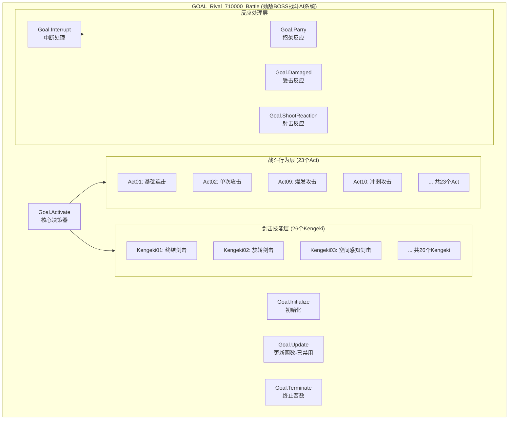
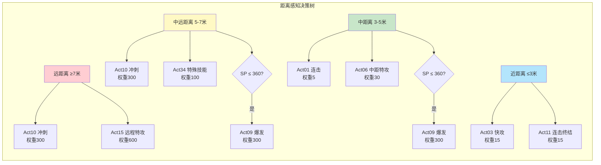
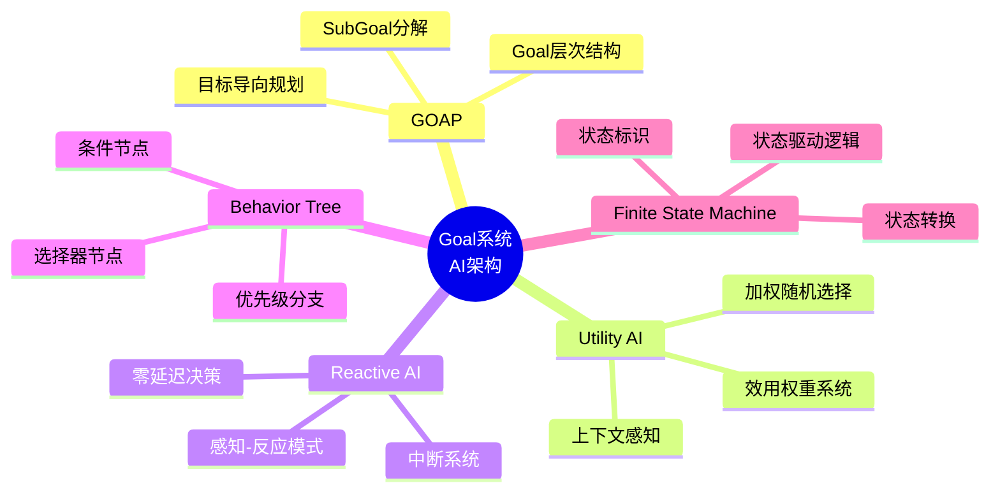
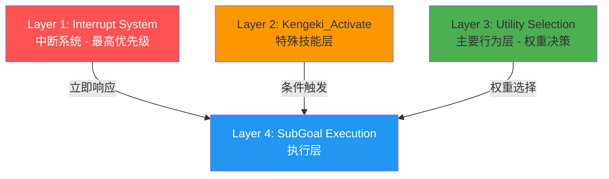
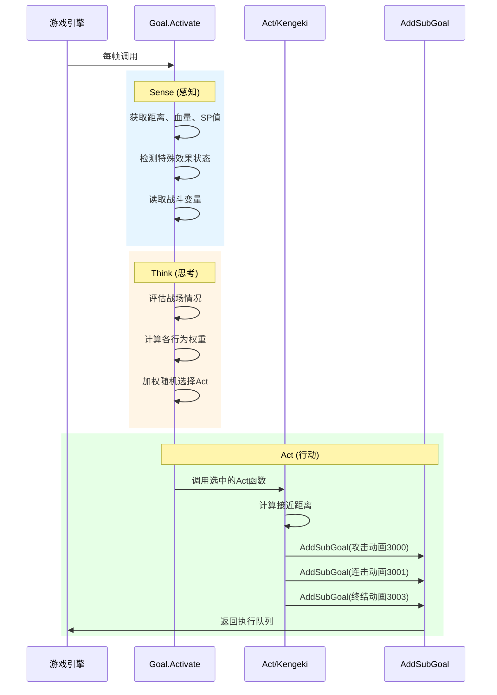
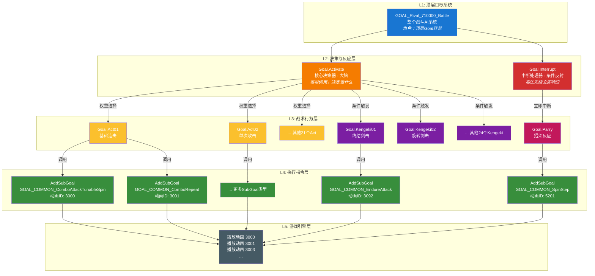
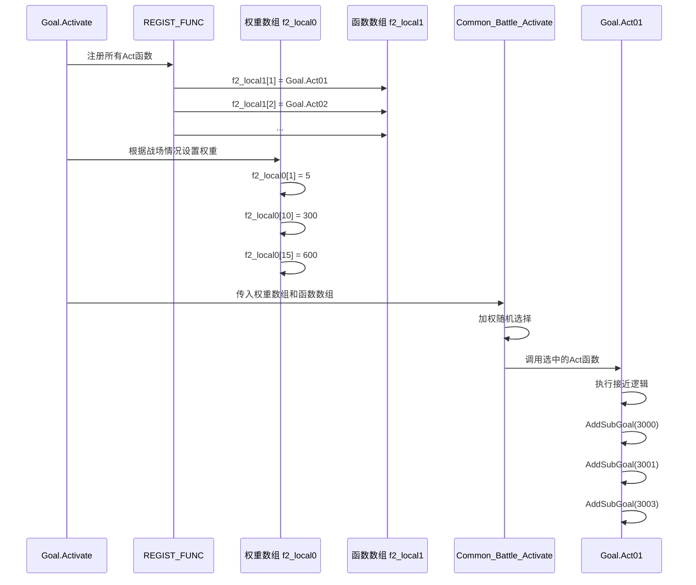
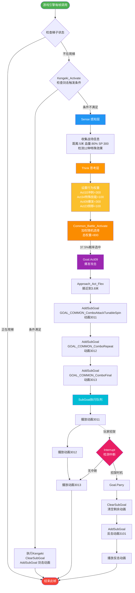
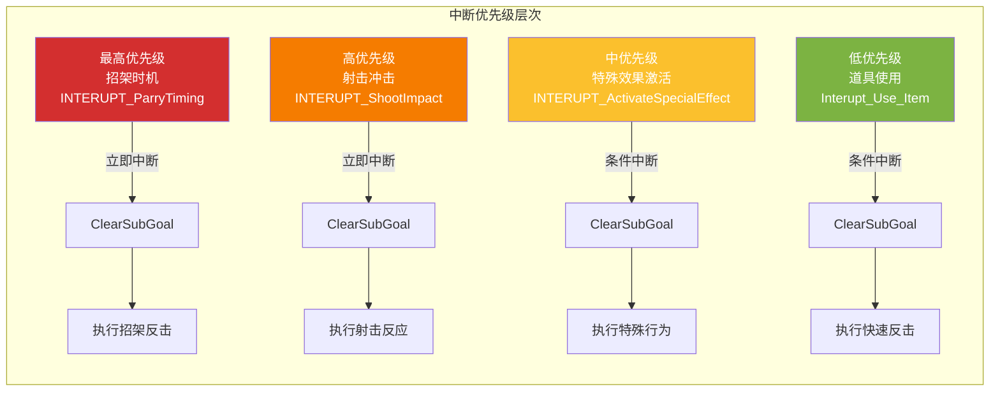

# 只狼 AI 系统 Goal 架构深度分析

基于 `710000_battle.lua`（剑圣/忍者大师级 BOSS）的完整解析

---

## 目录

1. [Goal 系统概述](#goal-系统概述)
2. [从 AI 领域角度理解 Goal](#从-ai-领域角度理解-goal)
3. [Goal、Act、Kengeki 与 AddSubGoal 的层次关系](#goal-act-kengeki-与-addsubgoal-的层次关系)
4. [执行流程详解](#执行流程详解)
5. [核心概念速查表](#核心概念速查表)

---

## Goal 系统概述

### 什么是 Goal？

**Goal** 是只狼 AI 系统中的**目标导向行为规划单元**，代表一个完整的 AI 行为系统。在 `710000_battle.lua` 中，Goal 被注册为：

```lua
RegisterTableGoal(GOAL_Rival_710000_Battle, "GOAL_Rival_710000_Battle")
REGISTER_GOAL_NO_UPDATE(GOAL_Rival_710000_Battle, true)
```

### Goal 的核心组成部分



### Goal 的核心功能模块

#### 1. 核心控制函数

| 函数 | 位置 | 功能 |
|------|------|------|
| **Goal.Initialize** | line 12 | 初始化函数（此 BOSS 无需特殊初始化） |
| **Goal.Activate** | line 17 | 核心战斗逻辑调度器，负责权重系统和行为选择 |
| **Goal.Update** | line 1695 | 更新函数（已禁用以提升性能） |
| **Goal.Terminate** | line 1700 | 终止函数 |

#### 2. 战斗行为函数（23个 Act）

通过**权重系统**在 Activate 中被选择的主动攻击行为：

- **Act01-Act03**: 基础连击和近战快攻
- **Act05-Act06**: 中距离特殊攻击
- **Act09**: 能量回复/爆发攻击（SP ≤ 360 时使用）
- **Act10**: 远程冲刺攻击
- **Act11**: 连击终结技
- **Act15-Act16**: 远程特殊攻击
- **Act20-Act28**: 特殊战术行为（潜行反制、背后转身攻击等）
- **Act30-Act31, Act34, Act48**: 其他战术技能

#### 3. 剑击技能系统（26个 Kengeki）

由 **Goal.Kengeki_Activate** (line 1081) 管理的高优先级技能系统：

- **Kengeki01-Kengeki47**: 26个不同的剑击技能/反击
- 在 Activate 函数之前优先检查
- 成功激活则跳过普通攻击逻辑

#### 4. 反应处理函数

响应玩家行为和战斗事件：

| 函数 | 位置 | 功能 |
|------|------|------|
| **Goal.Interrupt** | line 874 | 中断处理系统（监控12种特殊效果） |
| **Goal.Parry** | line 955 | 招架反应系统 |
| **Goal.Damaged** | line 1038 | 受击反应 |
| **Goal.ShootReaction** | line 1071 | 射击反应 |

### 距离分层战斗策略



---

## 从 AI 领域角度理解 Goal

### AI 架构类型分析



#### 1. Goal-Oriented Action Planning (GOAP)

**目标导向行为规划系统**：

- **Goal** 代表 AI 代理（Agent）的行为目标
- **SubGoal** 形成目标层次结构
- 通过分解大目标为子目标来实现复杂行为

#### 2. Utility-Based AI（效用函数 AI）

```lua
-- 在 Activate 函数中的权重系统
f2_local0[10] = 300  -- Act10的效用值
f2_local0[15] = 600  -- Act15的效用值
```

- 每个行为有**效用权重**（utility score）
- 系统根据**上下文**（距离、血量、SP值）动态调整权重
- 使用**加权随机选择**决定下一步行为

#### 3. Reactive AI（反应式 AI）

通过 **Goal.Interrupt** 实现**快速反应层**：

- **Perception（感知）**: 监控 12 种特殊效果
- **Stimulus-Response（刺激-反应）**: 玩家攻击 → 立即招架
- **零延迟决策**: 优先于主循环的中断系统

#### 4. Behavior Tree（行为树）变体

虽然不是标准行为树，但具有类似结构：

```
Activate (Root)
├─ Kengeki_Activate (高优先级分支)
├─ Special State Checks (条件节点)
└─ Distance-Based Strategy (选择器节点)
   ├─ Long Range Actions
   ├─ Medium Range Actions
   └─ Close Range Actions
```

#### 5. Finite State Machine (FSM) 元素

通过特殊效果 ID 管理状态：

- **状态标识**: `HasSpecialEffectId(TARGET_SELF, 3710040)`
- **状态转换**: 特殊效果激活/失效触发行为改变
- **状态驱动逻辑**: 不同状态下执行不同的 Act

### 分层决策架构（Hierarchical Decision Making）



### Context-Aware Decision（上下文感知决策）

决策输入变量：

- **空间信息**: 距离、方向
- **状态信息**: 血量、SP值、忍杀数
- **时序信息**: 连续防御次数、计时器
- **事件信息**: 特殊效果激活/失效

### Sense-Think-Act 循环



### 与现代 AI 的对比

| 传统游戏 AI (此 Goal) | 现代机器学习 AI |
|---------------------|----------------|
| 规则驱动（Rule-based） | 数据驱动（Data-driven） |
| 确定性 + 受控随机 | 概率性预测 |
| 设计师手工调参（权重、阈值） | 自动学习参数 |
| 可解释性强（可读代码） | 黑盒模型 |
| 实时性能优异（硬编码逻辑） | 需要推理计算 |
| 行为可预测且稳定 | 可能产生意外涌现行为 |

### AI 设计模式

1. **Blackboard Pattern（黑板模式）**
   - 使用 `SetNumber()`, `GetNumber()`, `SetTimer()` 共享状态
   - 多个行为模块读写共享数据

2. **Strategy Pattern（策略模式）**
   - 不同距离采用不同战斗策略
   - 根据玩家状态切换策略（潜行/正常/背后）

### 总结

这个 Goal 系统本质上是一个 **混合式符号 AI（Hybrid Symbolic AI）**：

- **符号推理**: 基于规则的条件判断
- **启发式搜索**: 权重系统模拟"最优"行为选择
- **知识表示**: 状态机 + 目标层次结构
- **专家系统**: 设计师编码的战斗"专家知识"

它代表了游戏 AI 的**经典范式**：高性能、可控制、可调试，非常适合需要精确平衡的动作游戏。

---

## Goal、Act、Kengeki 与 AddSubGoal 的层次关系

### 整体层次结构



### 各层级详细解释

#### 1️⃣ Goal（顶层目标 - L1）

```lua
RegisterTableGoal(GOAL_Rival_710000_Battle, "GOAL_Rival_710000_Battle")
```

- **身份**: 整个战斗AI的容器/类
- **类比**: 一个"BOSS战斗策略专家"
- **包含**: 所有决策函数（Activate、Interrupt）和行为函数（Act01-48、Kengeki01-47）

#### 2️⃣ Activate & Interrupt（决策层 - L2）

**Goal.Activate** - 核心决策器：

```lua
Goal.Activate = function (f2_arg0, f2_arg1, f2_arg2)
    -- 感知战场信息
    local distance = f2_arg1:GetDist(TARGET_ENE_0)
    local hp = f2_arg1:GetHpRate(TARGET_SELF)
    local sp = f2_arg1:GetSp(TARGET_SELF)

    -- 设置行为权重
    if distance >= 7 then
        f2_local0[10] = 300  -- Act10
        f2_local0[15] = 600  -- Act15
    elseif distance >= 5 then
        f2_local0[10] = 300
        f2_local0[34] = 100
    end

    -- 根据权重选择并执行行为
    Common_Battle_Activate(f2_arg1, f2_arg2, f2_local0, f2_local1, ...)
end
```

**Goal.Interrupt** - 中断处理器：

- 高优先级反应系统
- 监控 12 种特殊效果
- 立即中断当前行为并执行反应

#### 3️⃣ Act（主动战术行为 - L3）

```lua
Goal.Act01 = function (f3_arg0, f3_arg1, f3_arg2)
    -- 1. 先接近玩家
    Approach_Act_Flex(f3_arg0, f3_arg1, 3.6, ...)

    -- 2. 添加连击子目标序列
    if random <= 30 then
        -- 连击路线1
        f3_arg1:AddSubGoal(GOAL_COMMON_ComboAttackTunableSpin, 10, 3000, ...)
        f3_arg1:AddSubGoal(GOAL_COMMON_ComboRepeat, 10, 3001, ...)
        f3_arg1:AddSubGoal(GOAL_COMMON_ComboFinal, 10, 3003, ...)
    else
        -- 连击路线2
        f3_arg1:AddSubGoal(GOAL_COMMON_ComboAttackTunableSpin, 10, 3000, ...)
        f3_arg1:AddSubGoal(GOAL_COMMON_ComboRepeat, 10, 3010, ...)
        f3_arg1:AddSubGoal(GOAL_COMMON_ComboFinal, 10, 3025, ...)
    end
end
```

**特征**：

- **调用方式**: 通过 Activate 中的权重系统**按概率选择**
- **用途**: 主动攻击策略（"我想执行一套连击"）
- **包含内容**:
  - 接近逻辑（靠近玩家）
  - 多个 `AddSubGoal` 调用（具体动作序列）
- **数量**: 23 个 Act

#### 4️⃣ Kengeki（剑击反应行为 - L3）

```lua
Goal.Kengeki01 = function (f31_arg0, f31_arg1, f31_arg2)
    f31_arg0:SetNumber(3, 1)        -- 设置标记
    f31_arg1:ClearSubGoal()         -- 清空现有子目标（打断当前行为）
    f31_arg1:AddSubGoal(GOAL_COMMON_ComboFinal, 10, 3050, ...)  -- 执行终结技
end
```

**特征**：

- **调用方式**: 通过 `Kengeki_Activate` **条件触发**（玩家露出破绽）
- **用途**: 特殊剑击技能/反击（"玩家露出破绽，我要反击"）
- **特点**:
  - 经常调用 `ClearSubGoal()`（打断当前行为）
  - 更短更精准的攻击序列
- **数量**: 26 个 Kengeki

**Act vs Kengeki 对比**：

| 特性 | Act（主动行为） | Kengeki（反应行为） |
|------|---------------|------------------|
| **触发方式** | 权重概率选择 | 条件触发（玩家行为） |
| **优先级** | 普通 | 高（优先于Act） |
| **是否打断** | 否 | 是（ClearSubGoal） |
| **复杂度** | 高（多步骤连招） | 低（快速反击） |
| **类比** | 进攻计划 | 条件反射 |

#### 5️⃣ AddSubGoal（底层执行指令 - L4）

```lua
f3_arg1:AddSubGoal(GOAL_COMMON_ComboAttackTunableSpin, 10, 3000, TARGET_ENE_0, distance, 0, 0, 0, 0)
                   └─────────┬──────────────────┘  │   └─┬─┘  └────┬────┘  └─────┬──────┘
                          子目标类型              超时  动画ID    目标      攻击参数
```

**作用**：

- **身份**: **原子级行为指令**（游戏引擎能直接执行的动作）
- **类比**: 汇编指令（CPU 能直接理解）
- **常见类型**:

| SubGoal 类型 | 功能 | 示例 |
|-------------|------|------|
| `GOAL_COMMON_ComboAttackTunableSpin` | 可调整旋转的连击攻击 | 连击起手 |
| `GOAL_COMMON_ComboRepeat` | 连击中段重复 | 连击第2、3击 |
| `GOAL_COMMON_ComboFinal` | 连击终结技 | 连击最后一击 |
| `GOAL_COMMON_EndureAttack` | 霸体攻击（不会被打断） | 反击招架 |
| `GOAL_COMMON_SpinStep` | 旋转步伐 | 后退旋转 |
| `GOAL_COMMON_SidewayMove` | 侧向移动 | 横向闪避 |
| `GOAL_COMMON_AttackTunableSpin` | 单次可调整攻击 | 单次强攻 |

### 行为注册与调度机制



**注册代码示例**：

```lua
-- 在 Activate 函数中 (line 200-240)
f2_local1[1] = REGIST_FUNC(f2_arg1, f2_arg2, f2_arg0.Act01)   -- 注册Act01
f2_local1[2] = REGIST_FUNC(f2_arg1, f2_arg2, f2_arg0.Act02)   -- 注册Act02
f2_local1[10] = REGIST_FUNC(f2_arg1, f2_arg2, f2_arg0.Act10)  -- 注册Act10

-- 设置权重
if distance >= 7 then
    f2_local0[10] = 300  -- Act10有300权重
    f2_local0[15] = 600  -- Act15有600权重
end

-- 最终调度
Common_Battle_Activate(f2_arg1, f2_arg2, f2_local0, f2_local1, ...)
-- 这个函数会根据权重随机选择并调用对应的Act
```

---

## 执行流程详解

### 完整执行流程示例

**场景**: 玩家在 5 米外，BOSS SP 值为 300



### 分步骤详解

#### Step 1: 感知阶段（Sense）

```lua
local distance = f2_arg1:GetDist(TARGET_ENE_0)          -- 5米
local hp = f2_arg1:GetHpRate(TARGET_SELF)               -- 0.8 (80%)
local sp = f2_arg1:GetSp(TARGET_SELF)                   -- 300
local ninsatsu = f2_arg1:GetNinsatsuNum()               -- 玩家忍杀数

-- 监控特殊效果
f2_arg1:AddObserveSpecialEffectAttribute(TARGET_SELF, 5025)
f2_arg1:AddObserveSpecialEffectAttribute(TARGET_ENE_0, 110010)
-- ... 共监控12种效果
```

#### Step 2: 思考阶段（Think）

```lua
-- 距离5-7米的决策分支
if distance >= 5 and distance < 7 then
    f2_local0[10] = 300  -- Act10冲刺攻击
    f2_local0[34] = 100  -- Act34特殊技能
    f2_local0[23] = 100  -- Act23侧移攻击

    -- SP ≤ 360 时加强攻击性
    if sp <= 360 then
        f2_local0[9] = 300  -- Act09爆发攻击（高权重）
    end
end

-- 当前权重分布：
-- Act09: 300
-- Act10: 300
-- Act34: 100
-- Act23: 100
-- 总权重: 800
--
-- 选择概率：
-- Act09: 37.5%
-- Act10: 37.5%
-- Act34: 12.5%
-- Act23: 12.5%
```

#### Step 3: 行动阶段（Act）

假设选中 **Goal.Act09** (爆发攻击)：

```lua
Goal.Act09 = function (f8_arg0, f8_arg1, f8_arg2)
    -- 1. 接近逻辑
    local dist = 3.8 - f8_arg0:GetMapHitRadius(TARGET_SELF)
    Approach_Act_Flex(f8_arg0, f8_arg1, dist, dist+2, dist+3, 100, 0, 2.5, 3)

    -- 2. 添加连击序列
    f8_arg1:AddSubGoal(GOAL_COMMON_ComboAttackTunableSpin, 10, 3011, TARGET_ENE_0, 4, 0, 0, 0, 0)
    f8_arg1:AddSubGoal(GOAL_COMMON_ComboRepeat, 10, 3012, TARGET_ENE_0, 4.5, 0)
    f8_arg1:AddSubGoal(GOAL_COMMON_ComboFinal, 10, 3013, TARGET_ENE_0, 9999, 0, 0)

    return 100
end
```

#### Step 4: 执行阶段（Execute）

```
SubGoal 队列:
┌──────────────────────────────────────────┐
│ 1. GOAL_COMMON_ComboAttackTunableSpin    │
│    动画: 3011, 目标距离: 4米              │
├──────────────────────────────────────────┤
│ 2. GOAL_COMMON_ComboRepeat               │
│    动画: 3012, 目标距离: 4.5米            │
├──────────────────────────────────────────┤
│ 3. GOAL_COMMON_ComboFinal                │
│    动画: 3013, 目标距离: 9999米(无限)     │
└──────────────────────────────────────────┘

按顺序执行：
播放动画 3011 → 播放动画 3012 → 播放动画 3013
```

#### Step 5: 中断处理（可选）

如果在播放动画 3012 时，玩家进行了招架：

```lua
Goal.Interrupt = function (f26_arg0, f26_arg1, f26_arg2)
    -- 检测到招架时机
    if f26_arg1:IsInterupt(INTERUPT_ParryTiming) then
        return f26_arg0.Parry(f26_arg1, f26_arg2, 100, 0)
    end
end

Goal.Parry = function (f27_arg0, f27_arg1, f27_arg2, f27_arg3)
    -- 立即清空剩余SubGoal（3013不会播放了）
    f27_arg1:ClearSubGoal()

    -- 添加反击动画
    f27_arg1:AddSubGoal(GOAL_COMMON_EndureAttack, 0.3, 3101, TARGET_ENE_0, 9999, 0)

    return true
end
```

### 中断优先级系统



---

## 核心概念速查表

### 层次关系总览

| 层级 | 概念 | 调用方式 | 作用 | 数量 | 位置 |
|------|------|----------|------|------|------|
| **L1** | **Goal** | 游戏引擎注册 | 整个AI系统容器 | 1 | line 8 |
| **L2** | **Activate** | 每帧调用 | 核心决策器（大脑） | 1 | line 17 |
| **L2** | **Interrupt** | 事件触发 | 中断处理器（条件反射） | 1 | line 874 |
| **L3** | **Act** | 权重选择 | 主动战术行为 | 23 | line 247+ |
| **L3** | **Kengeki** | 条件触发 | 剑击反应行为 | 26 | line 1292+ |
| **L3** | **Parry** | 中断调用 | 招架反应 | 1 | line 955 |
| **L4** | **AddSubGoal** | Act/Kengeki调用 | 执行指令（动画） | N/A | 各函数内 |

### Act vs Kengeki 快速对比

| 特性 | Act | Kengeki |
|------|-----|---------|
| **触发** | 权重概率 | 条件触发 |
| **优先级** | 普通 | 高 |
| **打断** | ❌ | ✅ ClearSubGoal |
| **复杂度** | 多步骤连招 | 快速反击 |
| **调用时机** | Activate主循环 | Kengeki_Activate优先检查 |
| **类比** | 进攻计划 | 条件反射 |

### 常用 SubGoal 类型速查

| SubGoal 类型 | 简称 | 用途 | 常见参数 |
|-------------|------|------|---------|
| `GOAL_COMMON_ComboAttackTunableSpin` | 连击起手 | 可调整旋转的攻击 | 动画ID, 目标, 距离, 角度 |
| `GOAL_COMMON_ComboRepeat` | 连击中段 | 连击中间段 | 动画ID, 目标, 距离 |
| `GOAL_COMMON_ComboFinal` | 连击终结 | 连击最后一击 | 动画ID, 目标, 距离 |
| `GOAL_COMMON_EndureAttack` | 霸体攻击 | 不被打断的攻击 | 动画ID, 目标, 超时 |
| `GOAL_COMMON_AttackTunableSpin` | 单次攻击 | 单次可调整攻击 | 动画ID, 目标, 距离, 角度 |
| `GOAL_COMMON_SpinStep` | 旋转步伐 | 方向性步伐移动 | 步伐ID, 目标, 方向 |
| `GOAL_COMMON_SidewayMove` | 横向移动 | 侧向闪避移动 | 目标, 方向, 角度, 距离 |

### 权重系统理解

```lua
-- 权重设置示例
f2_local0[9] = 300   -- Act09: 300权重
f2_local0[10] = 300  -- Act10: 300权重
f2_local0[34] = 100  -- Act34: 100权重
f2_local0[23] = 100  -- Act23: 100权重
-- 总权重: 800

-- 选择概率计算
P(Act09) = 300/800 = 37.5%
P(Act10) = 300/800 = 37.5%
P(Act34) = 100/800 = 12.5%
P(Act23) = 100/800 = 12.5%
```

### 关键 API 速查

| API | 用途 | 返回值 |
|-----|------|--------|
| `GetDist(TARGET_ENE_0)` | 获取与玩家距离 | 数值（米） |
| `GetHpRate(TARGET_SELF)` | 获取自身血量百分比 | 0.0-1.0 |
| `GetSp(TARGET_SELF)` | 获取SP值（架势） | 数值 |
| `GetNinsatsuNum()` | 获取玩家忍杀数 | 整数 |
| `HasSpecialEffectId(target, id)` | 检查特殊效果 | true/false |
| `IsInsideTarget(target, dir, angle)` | 检查目标方位 | true/false |
| `SetNumber(index, value)` | 设置AI变量 | 无 |
| `SetTimer(index, seconds)` | 设置计时器 | 无 |
| `ClearSubGoal()` | 清空子目标队列 | 无 |
| `AddSubGoal(type, timeout, ...)` | 添加子目标 | 无 |

### 公司组织类比

| AI概念 | 公司类比 | 职责 |
|--------|---------|------|
| **Goal** | 整个公司 | 提供组织框架 |
| **Activate** | CEO决策会议 | 制定战略方向 |
| **Interrupt** | 危机应对小组 | 紧急事件处理 |
| **Act** | 市场部营销计划 | 主动进攻策略 |
| **Kengeki** | 客服应急响应 | 客户问题反应 |
| **AddSubGoal** | 员工具体任务 | 执行实际工作 |
| **权重系统** | 预算分配 | 资源优先级 |

---

## 附录：代码位置索引

### 核心函数位置

```
710000_battle.lua
├── line 8    : RegisterTableGoal (Goal注册)
├── line 12   : Goal.Initialize
├── line 17   : Goal.Activate (核心决策器)
│   ├── line 200-235 : 行为函数注册
│   ├── line 240     : Common_Battle_Activate调用
│
├── line 247  : Goal.Act01 (基础连击)
├── line 292  : Goal.Act02 (单次攻击)
├── line 319  : Goal.Act03 (近距快攻)
├── ...       : Act05-Act48
│
├── line 874  : Goal.Interrupt (中断处理)
├── line 955  : Goal.Parry (招架反应)
├── line 1038 : Goal.Damaged (受击反应)
├── line 1071 : Goal.ShootReaction (射击反应)
│
├── line 1081 : Goal.Kengeki_Activate (剑击激活器)
├── line 1292 : Goal.Kengeki01 (终结剑击)
├── line 1303 : Goal.Kengeki02 (旋转剑击)
├── ...       : Kengeki03-Kengeki47
│
├── line 1685 : Goal.NoAction
├── line 1690 : Goal.ActAfter_AdjustSpace
├── line 1695 : Goal.Update (已禁用)
└── line 1700 : Goal.Terminate
```

---

**文档版本**: 1.0
**生成时间**: 2025-10-27
**基于文件**: `m11_02_00_00-luabnd-dcx\script\ai\out\bin\710000_battle.lua`
**分析对象**: GOAL_Rival_710000_Battle（劲敌BOSS战斗AI）