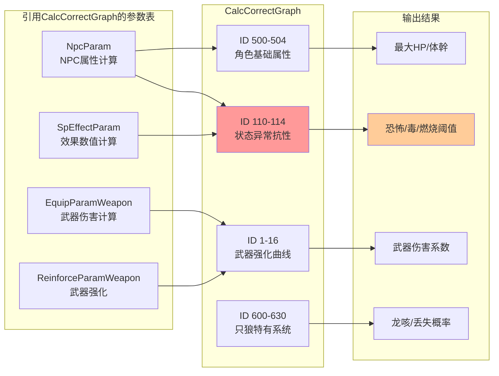

# CalcCorrectGraph 参数含义完整推测

> 基于 `param/param/CalcCorrectGraph.csv` 数据分析推测
> 生成时间：2026-01-23

---

## 概述

### 什么是 CalcCorrectGraph？

CalcCorrectGraph 是只狼/黑暗之魂系列中的**数值计算曲线参数表**，定义了游戏中各种属性值根据输入参数（等级、属性点等）如何进行非线性映射计算。该表使用**分段线性插值算法**，将输入值映射到输出值。

```
┌─────────────────────────────────────────────────────────────────────────┐
│               CalcCorrectGraph 在游戏系统中的位置                        │
├─────────────────────────────────────────────────────────────────────────┤
│                                                                         │
│  输入参数                                                                │
│  ├─ 角色等级 (Soul Level)                                               │
│  ├─ 属性点 (体力/精力/筋力/技量等)                                       │
│  ├─ 武器强化等级                                                         │
│  └─ 其他数值输入                                                         │
│              ↓                                                          │
│  CalcCorrectGraph (计算曲线定义层)                                       │
│  ├─ 分段阈值 (stageMaxVal0-4)                                           │
│  ├─ 分段输出值 (stageMaxGrowVal0-4)                                     │
│  └─ 曲线调整系数 (adjPt_maxGrowVal0-4)                                  │
│              ↓                                                          │
│  输出结果                                                                │
│  ├─ 最大HP/体幹                                                          │
│  ├─ 各类抗性阈值 (毒/恐怖/燃烧等)                                        │
│  ├─ 防御力                                                               │
│  ├─ 武器伤害系数                                                         │
│  └─ 其他计算属性                                                         │
│                                                                         │
└─────────────────────────────────────────────────────────────────────────┘
```

### 核心计算原理

CalcCorrectGraph 使用**5段分段线性插值**，输入值在不同区间内对应不同的输出增长率：

```
输出值
  ^
  │                              ┌─────── stageMaxGrowVal4
  │                        ●────●
  │                   ●───/
  │              ●───/           stageMaxGrowVal2
  │         ●───/
  │    ●───/                     stageMaxGrowVal0
  │───●
  └──────┬────┬────┬────┬────┬────────> 输入值
         │    │    │    │    │
         0    1    2    3    4
              stageMaxVal (分段阈值)
```

---

## 完整参数列表及含义

### 一、基础标识参数

#### 1.1 ID（条目ID）

| 参数名 | 日文名 | 类型 | 含义 | 取值范围 |
|--------|--------|------|------|----------|
| **ID** | ID | s32 | 曲线定义的唯一标识符 | 0 ~ 999999 |

**详细说明**：
- 被其他参数表引用以指定使用哪条计算曲线
- ID 编号有一定规律：
  - 0-16: 武器强化相关
  - 50-51: 装备重量相关
  - 100-140: 角色属性（HP/防御/抗性）
  - 200: 等级消耗
  - 210-213: 坠落伤害
  - 300+: 等级同步
  - 500+: 只狼专用属性
  - 600+: 只狼技能/龙咳系统

---

#### 1.2 Name（名称）

| 参数名 | 日文名 | 类型 | 含义 | 取值范围 |
|--------|--------|------|------|----------|
| **Name** | 名前 | string | 曲线的描述性名称 | 文本 |

**详细说明**：
- 格式通常为 `英文描述 -- 日文描述`
- 用于标识该曲线的用途

---

### 二、分段阈值参数（Stage Max Values）

#### 2.1 stageMaxVal0 ~ stageMaxVal4（阶段输入阈值）

| 参数名 | 日文名 | 类型 | 含义 | 取值范围 |
|--------|--------|------|------|----------|
| **stageMaxVal0** | ステージ最大値0 | f32 | 第0段的输入上限值 | 0 ~ 999 |
| **stageMaxVal1** | ステージ最大値1 | f32 | 第1段的输入上限值 | 0 ~ 999 |
| **stageMaxVal2** | ステージ最大値2 | f32 | 第2段的输入上限值 | 0 ~ 999 |
| **stageMaxVal3** | ステージ最大値3 | f32 | 第3段的输入上限值 | 0 ~ 999 |
| **stageMaxVal4** | ステージ最大値4 | f32 | 第4段的输入上限值 | 0 ~ 999 |

**详细说明**：
- 定义输入值的分段点，将输入范围划分为5个区间
- 通常 stageMaxVal4 = 99 表示最大等级/属性点上限
- 各阶段为：`[0, Val0]`, `(Val0, Val1]`, `(Val1, Val2]`, `(Val2, Val3]`, `(Val3, Val4]`

**使用示例**：
```
恐怖抗性 (ID 111):
├─ stageMaxVal: 1, 9, 10, 11, 99
└─ 分段: [0-1], (1-9], (9-10], (10-11], (11-99]
```

---

### 三、分段输出值参数（Stage Max Grow Values）

#### 3.1 stageMaxGrowVal0 ~ stageMaxGrowVal4（阶段输出值）

| 参数名 | 日文名 | 类型 | 含义 | 取值范围 |
|--------|--------|------|------|----------|
| **stageMaxGrowVal0** | ステージ最大成長値0 | f32 | 输入达到阶段0时的输出值 | -9999 ~ 9999 |
| **stageMaxGrowVal1** | ステージ最大成長値1 | f32 | 输入达到阶段1时的输出值 | -9999 ~ 9999 |
| **stageMaxGrowVal2** | ステージ最大成長値2 | f32 | 输入达到阶段2时的输出值 | -9999 ~ 9999 |
| **stageMaxGrowVal3** | ステージ最大成長値3 | f32 | 输入达到阶段3时的输出值 | -9999 ~ 9999 |
| **stageMaxGrowVal4** | ステージ最大成長値4 | f32 | 输入达到阶段4时的输出值 | -9999 ~ 9999 |

**详细说明**：
- 定义每个分段点对应的输出值
- 输入值在两个分段点之间时，输出值通过插值计算
- **关键用途**：定义各种属性的基础数值

**使用示例**：
```
主角恐怖阈值 (ID 111):
├─ stageMaxGrowVal: 200, 200, 200, 200, 200
└─ 输出恒定为 200（主角恐怖槽上限）

最大HP (ID 500):
├─ stageMaxGrowVal: 320, 1120, 1120, 1120, 1120
└─ 基础HP从320增长到1120
```

---

### 四、曲线调整系数（Adjustment Points）

#### 4.1 adjPt_maxGrowVal0 ~ adjPt_maxGrowVal4（调整系数）

| 参数名 | 日文名 | 类型 | 含义 | 取值范围 |
|--------|--------|------|------|----------|
| **adjPt_maxGrowVal0** | 補正ポイント最大成長値0 | f32 | 阶段0的曲线调整系数 | -10 ~ 10 |
| **adjPt_maxGrowVal1** | 補正ポイント最大成長値1 | f32 | 阶段1的曲线调整系数 | -10 ~ 10 |
| **adjPt_maxGrowVal2** | 補正ポイント最大成長値2 | f32 | 阶段2的曲线调整系数 | -10 ~ 10 |
| **adjPt_maxGrowVal3** | 補正ポイント最大成長値3 | f32 | 阶段3的曲线调整系数 | -10 ~ 10 |
| **adjPt_maxGrowVal4** | 補正ポイント最大成長値4 | f32 | 阶段4的曲线调整系数 | -10 ~ 10 |

**详细说明**：
- 控制插值曲线的形状（线性/加速/减速）
- **= 1.0**：线性插值（匀速增长）
- **> 1.0**：前期增长较快，后期减缓
- **< 1.0**：前期增长较慢，后期加速
- **负值**：特殊曲线效果（如 -1.2 表示反向调整）

**曲线效果图示**：
```
adjPt = 1.0 (线性)          adjPt > 1.0 (前快后慢)      adjPt < 1.0 (前慢后快)
    │    ●                      │    ●                      │         ●
    │   /                       │  ●/                       │        /
    │  /                        │ /                         │      ●/
    │ /                         │/                          │    ●/
    │●                          ●                           ●──●/
    └──────                     └──────                     └──────
```

**使用示例**：
```
硬石强化 (ID 1):
├─ adjPt: 1.2, -1.2, 1, 1.5, 1
└─ 阶段0加速增长，阶段1减速调整，阶段3加速
```

---

### 五、等级消耗专用参数

#### 5.1 init_inclination_soul（初始斜率）

| 参数名 | 日文名 | 类型 | 含义 | 取值范围 |
|--------|--------|------|------|----------|
| **init_inclination_soul** | 初期ソウル傾斜 | f32 | 等级消耗计算的初始斜率系数 | 0 ~ 10 |

**详细说明**：
- 仅用于 ID 200（成長消費ソウル）和 ID 600（必要スキル経験値）
- 控制等级/技能升级所需经验的初始增长速度
- **其他曲线此值通常为 0**

---

#### 5.2 adjustment_value（调整值）

| 参数名 | 日文名 | 类型 | 含义 | 取值范围 |
|--------|--------|------|------|----------|
| **adjustment_value** | 調整値 | f32 | 等级消耗计算的基础调整值 | 0 ~ 100 |

**详细说明**：
- 仅用于等级/技能经验计算
- 影响升级所需经验的基础数值
- **其他曲线此值通常为 0**

---

#### 5.3 boundry_inclination_soul（边界斜率）

| 参数名 | 日文名 | 类型 | 含义 | 取值范围 |
|--------|--------|------|------|----------|
| **boundry_inclination_soul** | 境界ソウル傾斜 | f32 | 等级消耗的边界斜率系数 | 0 ~ 10 |

**详细说明**：
- 仅用于等级/技能经验计算
- 控制高等级时经验需求的增长曲线
- **其他曲线此值通常为 0**

---

#### 5.4 boundry_value（边界值）

| 参数名 | 日文名 | 类型 | 含义 | 取值范围 |
|--------|--------|------|------|----------|
| **boundry_value** | 境界値 | f32 | 等级消耗的边界阈值 | 0 ~ 999 |

**详细说明**：
- 仅用于等级/技能经验计算
- 定义计算公式切换的边界点
- **其他曲线此值通常为 0**

**等级消耗计算示例**：
```
ID 200 (成長消費ソウル):
├─ init_inclination_soul = 0.1
├─ adjustment_value = 1
├─ boundry_inclination_soul = 0.02
└─ boundry_value = 92
→ 等级92前后使用不同的经验计算公式
```

---

#### 5.5 pad（填充字段）

| 参数名 | 日文名 | 类型 | 含义 | 取值范围 |
|--------|--------|------|------|----------|
| **pad** | パディング | byte[4] | 结构体对齐填充 | [0\|0\|0\|0] |

**详细说明**：
- 用于内存对齐，无实际游戏功能
- 固定值 `[0|0|0|0]`

---

## 只狼重要曲线ID速查表

### 状态异常抗性阈值

| ID | 名称 | 用途 | 输出值 |
|----|------|------|--------|
| **110** | 病毒耐性（毒） | 主角毒抗性阈值 | **200** |
| **111** | 発狂耐性（恐怖） | **主角恐怖槽上限** | **200** |
| **112** | 炎上耐性（燃烧） | 主角燃烧抗性阈值 | **200** |
| **113** | 老化耐性 | 主角老化抗性阈值 | **200** |
| **114** | 感電耐性 | 主角雷电抗性阈值 | **200** |

### 角色基础属性

| ID | 名称 | 用途 | 输出值范围 |
|----|------|------|------------|
| **500** | 最大HP | 主角最大生命值 | 320 → 1120 |
| **501** | 最大スタミナ | 主角最大体幹 | 120 → 420 |
| **504** | スタミナ回復速度 | 体幹恢复速度 | 30 → 105 |

### 只狼特有系统

| ID | 名称 | 用途 |
|----|------|------|
| **600** | 必要スキル経験値 | 技能升级所需经验 |
| **610** | 残機プロテクト | 复活保护价格 |
| **620** | 竜咳発生率 | 龙咳发生概率（%） |
| **630** | ロスト発生率 | 死亡丢失金钱/经验概率（%） |

---

## 计算公式推测

### 分段线性插值公式

```
给定输入值 input，查找所在区间 [stageMaxVal[i], stageMaxVal[i+1]]

基础插值:
ratio = (input - stageMaxVal[i]) / (stageMaxVal[i+1] - stageMaxVal[i])

曲线调整:
adjusted_ratio = ratio ^ adjPt_maxGrowVal[i]

最终输出:
output = stageMaxGrowVal[i] + adjusted_ratio * (stageMaxGrowVal[i+1] - stageMaxGrowVal[i])
```

### 等级消耗特殊公式

```
当 level < boundry_value:
  souls = base + init_inclination_soul * level * adjustment_value

当 level >= boundry_value:
  souls = base + boundry_inclination_soul * (level - boundry_value + 1)^2
```

---

## 实际应用示例

### 示例1：恐怖系统阈值查询

```
无首狮子猿血吼攻击:
├─ SpEffect 9220: registIllness = 18 (每次累积恐怖值)
├─ CalcCorrectGraph ID 111: stageMaxGrowVal = 200 (恐怖阈值)
└─ 计算: 200 ÷ 18 ≈ 11次 命中触发恐怖死亡
```

### 示例2：HP计算

```
CalcCorrectGraph ID 500:
├─ stageMaxVal: 1, 11, 12, 13, 99
├─ stageMaxGrowVal: 320, 1120, 1120, 1120, 1120
└─ 结果: 角色HP从320增长至1120，等级11后不再增长
```

### 示例3：龙咳发生率

```
CalcCorrectGraph ID 620:
├─ stageMaxVal: 0, 9, 10, 15, 15
├─ stageMaxGrowVal: 0, 0, 50, 100, 100
└─ 结果: 死亡次数0-9次不触发龙咳，10次后50%概率，15次后100%
```

---

## 总结

| 参数组 | 包含字段 | 主要用途 |
|--------|----------|----------|
| **基础标识** | ID, Name | 条目标识和描述 |
| **分段阈值** | stageMaxVal0-4 | 定义输入值的分段点 |
| **分段输出** | stageMaxGrowVal0-4 | 定义各分段的输出值 |
| **曲线调整** | adjPt_maxGrowVal0-4 | 控制插值曲线形状 |
| **等级消耗** | init/boundry_inclination_soul, adjustment/boundry_value | 等级/技能经验计算专用 |
| **填充** | pad | 内存对齐 |

**关键发现**：
- 只狼中玩家的**恐怖阈值 = 200**（CalcCorrectGraph ID 111）
- 所有状态异常抗性阈值统一为 200
- 角色HP上限在等级11时达到最大值1120
- 龙咳系统使用ID 620控制发生概率

---

## 与其他参数表的关联


