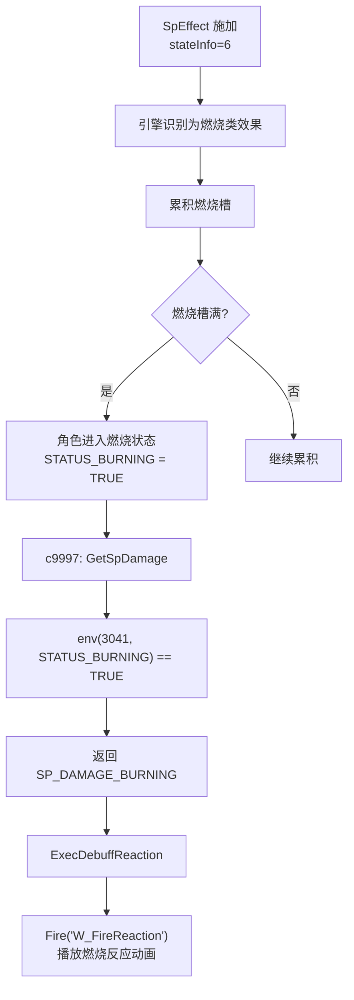

# SpEffectParam 参数含义完整推测

> 基于 `param/SDT/Defs/SpEffect.xml` 和 `param/SDT/Meta/SpEffect.xml` 定义文件推测
> 生成时间：2026-01-19

---

## 概述

### 什么是 SpEffectParam？

SpEffectParam 是只狼战斗系统中的**特殊效果参数表**，定义了游戏中所有临时状态效果（Buff/Debuff）、被动技能、道具效果、状态异常等。该表继承自Dark Souls系列，并为只狼做了大量定制修改。

```
┌─────────────────────────────────────────────────────────────────────────┐
│                    SpEffectParam 在战斗系统中的位置                      │
├─────────────────────────────────────────────────────────────────────────┤
│                                                                         │
│  触发来源                                                                │
│  ├─ TAE 动画事件 (AddSpEffect[67])                                      │
│  ├─ 攻击命中 (AtkParam.spEffectId)                                      │
│  ├─ 道具使用 (GoodsParam)                                               │
│  ├─ AI脚本 (act(2002, SpEffectId))                                      │
│  └─ BehaviorParam (refType=2)                                           │
│              ↓                                                          │
│  SpEffectParam (效果定义层)                                              │
│  ├─ 触发条件 (HP条件、持续时间)                                          │
│  ├─ 效果参数 (伤害修改、属性变化)                                        │
│  ├─ 目标筛选 (自己/友方/敌方)                                            │
│  └─ 效果链 (后续效果、周期效果)                                          │
│              ↓                                                          │
│  效果输出                                                                │
│  ├─ 伤害计算修正                                                         │
│  ├─ 体幹/姿勢系统                                                        │
│  ├─ 状态异常累积                                                         │
│  ├─ AI参数修改                                                           │
│  └─ 视觉/音效触发                                                        │
│                                                                         │
└─────────────────────────────────────────────────────────────────────────┘
```

### 只狼与Dark Souls的差异

| 系统 | Dark Souls | 只狼 |
|------|-----------|------|
| **Stamina** | 体力（行动消耗） | **体幹/姿勢（Posture）** |
| **MP/FP** | 魔法消耗 | 未使用（部分复用） |
| **人间性** | 特殊货币 | 未使用 |
| **魔法/奇跡** | 魔法系统 | 未使用（字段保留） |
| **状态异常** | 毒/出血/诅咒 | 毒/恐怖(Terror)/燃烧(Burn)/虚弱(Enfeeble) |
| **新增** | - | 忍殺系统、弹反系统 |

---

## 完整参数列表及含义

### 一、基础控制参数

#### 1.1 iconId（图标ID）

| 参数名 | 日文名 | 类型 | 含义 | 取值范围 |
|--------|--------|------|------|----------|
| **iconId** | アイコンID | s32 | 状态栏显示的图标ID | -1 ~ 999999 |

**详细说明**：
- **-1** 表示不显示图标（隐藏效果）
- 有图标的效果会在玩家状态栏下方显示
- 用于让玩家了解当前生效的Buff/Debuff

---

#### 1.2 effectEndurance（效果持续时间）

| 参数名 | 日文名 | 类型 | 含义 | 取值范围 |
|--------|--------|------|------|----------|
| **effectEndurance** | 効果持続時間[s] | f32 | 效果持续的秒数 | -1 ~ 9999 |

**详细说明**：
- **-1** = 永久效果（直到被清除或死亡）
- **0** = 瞬间效果（只执行一次）
- **> 0** = 持续指定秒数

**使用示例**：
```
永久被动技能: effectEndurance = -1
道具回血效果: effectEndurance = 5 (持续5秒)
瞬间伤害: effectEndurance = 0
```

---

#### 1.3 motionInterval（触发间隔）

| 参数名 | 日文名 | 类型 | 含义 | 取值范围 |
|--------|--------|------|------|----------|
| **motionInterval** | 発動間隔[s] | f32 | 效果触发的时间间隔 | -1 ~ 999 |

**详细说明**：
- 用于实现 DoT（持续伤害）和 HoT（持续回复）效果
- 每隔 `motionInterval` 秒触发一次 `changeHpPoint` 或 `changeHpRate`
- **-1** 表示只在效果开始和结束时触发

**DoT效果示例**：
```
毒效果:
├─ effectEndurance = 60 (持续60秒)
├─ motionInterval = 2 (每2秒触发)
└─ changeHpPoint = -50 (每次扣50HP)
→ 总共触发30次，造成1500点伤害
```

---

#### 1.4 conditionHp（HP条件-低于）

| 参数名 | 日文名 | 类型 | 含义 | 取值范围 |
|--------|--------|------|------|----------|
| **conditionHp** | 残りHP比率[%] | f32 | HP低于此百分比才触发 | -1 ~ 100 |

**详细说明**：
- **-1** = 无条件限制
- 用于实现"濒死强化"类效果
- 只有当HP ≤ maxHP × conditionHp% 时效果才生效

**使用示例**：
```
濒死攻击力提升:
├─ conditionHp = 30
└─ physicsAttackPowerRate = 1.5
→ HP低于30%时攻击力提升50%
```

---

#### 1.5 conditionHpRate（HP条件-高于）

| 参数名 | 日文名 | 类型 | 含义 | 取值范围 |
|--------|--------|------|------|----------|
| **conditionHpRate** | 残りHP一定以上[%] | f32 | HP高于此百分比才触发 | -1 ~ 100 |

**详细说明**：
- **-1** = 无条件限制
- 用于实现"满血强化"类效果
- 只有当HP ≥ maxHP × conditionHpRate% 时效果才生效

---

### 二、HP/MP/体幹 变化参数

#### 2.1 changeHpRate（HP变化-百分比）

| 参数名 | 日文名 | 类型 | 含义 | 取值范围 |
|--------|--------|------|------|----------|
| **changeHpRate** | HPダメージ量[%] | f32 | 每次触发时HP变化量（百分比） | -100 ~ 100 |

**详细说明**：
- 正值 = 回复HP（基于最大HP的百分比）
- 负值 = 扣除HP（基于最大HP的百分比）
- 配合 `motionInterval` 实现持续效果

---

#### 2.2 changeHpPoint（HP变化-固定值）

| 参数名 | 日文名 | 类型 | 含义 | 取值范围 |
|--------|--------|------|------|----------|
| **changeHpPoint** | HPダメージ[point] | s32 | 每次触发时HP变化量（固定值） | -9999 ~ 9999 |

**详细说明**：
- 正值 = 回复固定HP
- 负值 = 扣除固定HP
- 与 `changeHpRate` 可以同时生效

---

#### 2.3 changeStaminaRate（体幹变化-百分比）

| 参数名 | 日文名 | 类型 | 含义 | 取值范围 |
|--------|--------|------|------|----------|
| **changeStaminaRate** | スタミナダメージ量[%] | f32 | 每次触发时体幹变化量（百分比） | -100 ~ 100 |

**只狼特殊说明**：
- 在只狼中，"Stamina"被重新设计为**体幹/姿勢（Posture）系统**
- 正值 = 恢复体幹
- 负值 = 削减体幹

---

#### 2.4 changeStaminaPoint（体幹变化-固定值）

| 参数名 | 日文名 | 类型 | 含义 | 取值范围 |
|--------|--------|------|------|----------|
| **changeStaminaPoint** | スタミナダメージ[point] | s32 | 每次触发时体幹变化量（固定值） | -9999 ~ 9999 |

---

#### 2.5 staminaRecoverChangeSpeed（体幹恢复速度）

| 参数名 | 日文名 | 类型 | 含义 | 取值范围 |
|--------|--------|------|------|----------|
| **staminaRecoverChangeSpeed** | スタミナ回復速度変化[point] | s32 | 体幹恢复速度的修改值 | -100 ~ 100 |

**详细说明**：
- 正值 = 加快体幹恢复
- 负值 = 减慢体幹恢复
- 影响被击中后体幹的自然恢复速度

---

#### 2.6 maxHpRate（最大HP倍率）

| 参数名 | 日文名 | 类型 | 含义 | 默认值 |
|--------|--------|------|------|--------|
| **maxHpRate** | 最大HP倍率[%] | f32 | 最大HP的乘数 | 1.0 |

**详细说明**：
- 1.0 = 100%（无变化）
- 1.5 = 150%（提升50%最大HP）
- 0.5 = 50%（降低50%最大HP）

---

#### 2.7 maxHpChangeRate（最大HP变化倍率）

| 参数名 | 日文名 | 类型 | 含义 | 取值范围 |
|--------|--------|------|------|----------|
| **maxHpChangeRate** | 最大HP変化倍率 | f32 | 临时改变最大HP的倍率 | 0 ~ 99 |

---

### 三、物理伤害系统

#### 3.1 攻击侧（攻撃側）- 伤害输出修正

| 参数名 | 日文名 | 类型 | 默认值 | 含义 |
|--------|--------|------|--------|------|
| **physicsAttackRate** | 物理ダメージ倍率 | f32 | 1.0 | 物理伤害倍率 |
| **magicAttackRate** | 魔法ダメージ倍率 | f32 | 1.0 | 魔法伤害倍率 |
| **fireAttackRate** | 炎ダメージ倍率 | f32 | 1.0 | 火焰伤害倍率 |
| **thunderAttackRate** | 電撃ダメージ倍率 | f32 | 1.0 | 雷电伤害倍率 |
| **darkAttackRate** | 闇ダメージ倍率 | f32 | 1.0 | 暗属性伤害倍率 |

**详细说明**：
- 这些参数修正**自己造成的伤害**
- 1.0 = 100%（无修正）
- 1.5 = 150%（伤害提升50%）
- 0.5 = 50%（伤害降低50%）

---

#### 3.2 攻击侧 - 攻击力修正

| 参数名 | 日文名 | 类型 | 默认值 | 含义 |
|--------|--------|------|--------|------|
| **physicsAttackPowerRate** | 物理攻撃力倍率 | f32 | 1.0 | 物理攻击力乘数 |
| **magicAttackPowerRate** | 魔法攻撃力倍率 | f32 | 1.0 | 魔法攻击力乘数 |
| **fireAttackPowerRate** | 炎攻撃力倍率 | f32 | 1.0 | 火焰攻击力乘数 |
| **thunderAttackPowerRate** | 電撃攻撃力倍率 | f32 | 1.0 | 雷电攻击力乘数 |
| **darkAttackPowerRate** | 闇攻撃力倍率 | f32 | 1.0 | 暗属性攻击力乘数 |

---

#### 3.3 攻击侧 - 攻击力加值

| 参数名 | 日文名 | 类型 | 默认值 | 含义 |
|--------|--------|------|--------|------|
| **physicsAttackPower** | 物理攻撃力[point] | s32 | 0 | 物理攻击力加值 |
| **magicAttackPower** | 魔法攻撃力[point] | s32 | 0 | 魔法攻击力加值 |
| **fireAttackPower** | 炎攻撃力[point] | s32 | 0 | 火焰攻击力加值 |
| **thunderAttackPower** | 電撃攻撃力[point] | s32 | 0 | 雷电攻击力加值 |
| **darkAttackPower** | 闇攻撃力[point] | s32 | 0 | 暗属性攻击力加值 |

---

#### 3.4 攻击侧 - 物理属性细分

| 参数名 | 日文名 | 类型 | 默认值 | 含义 |
|--------|--------|------|--------|------|
| **slashAttackRate** | 斬撃ダメージ倍率 | f32 | 1.0 | 斩击伤害倍率 |
| **lightHitAttackRate** | 軽打ダメージ倍率 | f32 | 1.0 | 轻打伤害倍率 |
| **thrustAttackRate** | 刺突ダメージ倍率 | f32 | 1.0 | 刺突伤害倍率 |
| **neutralAttackRate** | 無属性ダメージ倍率 | f32 | 1.0 | 无属性伤害倍率 |

**物理属性说明**：
```
物理伤害细分为多种类型：
├─ 斬撃(Slash): 刀剑横斩
├─ 軽打(Light Hit): 轻型打击
├─ 刺突(Thrust): 刺击、突刺
├─ 無属性(Neutral): 无特定类型
├─ 忍殺(Ninsatsu): 忍杀专用
├─ 重打(Heavy Hit): 重型打击
├─ 対地(Anti Ground): 对地攻击
├─ 対空(Anti Air): 对空攻击
└─ 軽射(Light Shoot): 轻型射击
```

---

#### 3.5 防御侧（防御側）- 伤害减免

| 参数名 | 日文名 | 类型 | 默认值 | 含义 |
|--------|--------|------|--------|------|
| **slashDamageCutRate** | 斬撃ダメージ倍率 | f32 | 1.0 | 受到的斩击伤害倍率 |
| **lightHitDamageCutRate** | 軽打ダメージ倍率 | f32 | 1.0 | 受到的轻打伤害倍率 |
| **thrustDamageCutRate** | 刺突ダメージ倍率 | f32 | 1.0 | 受到的刺突伤害倍率 |
| **neutralDamageCutRate** | 無属性ダメージ倍率 | f32 | 1.0 | 受到的无属性伤害倍率 |
| **magicDamageCutRate** | 魔法ダメージ倍率 | f32 | 1.0 | 受到的魔法伤害倍率 |
| **fireDamageCutRate** | 炎ダメージ倍率 | f32 | 1.0 | 受到的火焰伤害倍率 |
| **thunderDamageCutRate** | 電撃ダメージ倍率 | f32 | 1.0 | 受到的雷电伤害倍率 |
| **darkDamageCutRate** | 闇ダメージ倍率 | f32 | 1.0 | 受到的暗属性伤害倍率 |

**详细说明**：
- 这些参数修正**自己受到的伤害**
- 1.0 = 100%（无减免）
- 0.5 = 50%（减少50%伤害）
- 1.5 = 150%（增加50%伤害，即弱点）

---

#### 3.6 防御侧 - 防御力修正

| 参数名 | 日文名 | 类型 | 默认值 | 含义 |
|--------|--------|------|--------|------|
| **physicsDiffenceRate** | 物理防御力倍率 | f32 | 1.0 | 物理防御力乘数 |
| **magicDiffenceRate** | 魔法防御力倍率 | f32 | 1.0 | 魔法防御力乘数 |
| **fireDiffenceRate** | 炎防御力倍率 | f32 | 1.0 | 火焰防御力乘数 |
| **thunderDiffenceRate** | 電撃防御力倍率 | f32 | 1.0 | 雷电防御力乘数 |
| **darkDiffenceRate** | 闇防御力倍率 | f32 | 1.0 | 暗属性防御力乘数 |

---

#### 3.7 防御侧 - 防御力加值

| 参数名 | 日文名 | 类型 | 默认值 | 含义 |
|--------|--------|------|--------|------|
| **physicsDiffence** | 物理防御力[point] | s32 | 0 | 物理防御力加值 |
| **magicDiffence** | 魔法防御力[point] | s32 | 0 | 魔法防御力加值 |
| **fireDiffence** | 炎防御力[point] | s32 | 0 | 火焰防御力加值 |
| **thunderDiffence** | 電撃防御力[point] | s32 | 0 | 雷电防御力加值 |
| **darkDiffence** | 闘防御力[point] | s32 | 0 | 暗属性防御力加值 |

---

### 四、只狼特有：体幹(Posture)系统

#### 4.1 体幹攻击相关

| 参数名 | 日文名 | 类型 | 默认值 | 含义 |
|--------|--------|------|--------|------|
| **staminaAttackRate** | スタミナ攻撃力倍率 | f32 | 1.0 | 体幹攻击力乘数 |
| **defStaminaAttackRate** | 防御側スタミナ攻撃倍率 | f32 | 1.0 | 受到的体幹伤害倍率 |
| **attackHitParryStaminaAttackRate** | パリィスタミナ攻撃倍率 | f32 | 1.0 | 弹反时的体幹伤害倍率 |

**只狼体幹系统说明**：
```
体幹系统核心机制：
├─ 攻击会对敌人造成体幹伤害
├─ 防御/格挡会减少体幹伤害
├─ 弹反(Deflect)会反弹体幹伤害给敌人
├─ 体幹满后可以进行忍杀
└─ 体幹会随时间自然恢复
```

---

#### 4.2 各物理属性的体幹伤害倍率

| 参数名 | 日文名 | 类型 | 默认值 | 含义 |
|--------|--------|------|--------|------|
| **defSlashStaminaDmgRate** | 斬撃スタミナダメージ倍率 | f32 | 1.0 | 受到的斩击体幹伤害倍率 |
| **defLightHitStaminaDmgRate** | 軽打スタミナダメージ倍率 | f32 | 1.0 | 受到的轻打体幹伤害倍率 |
| **defThrustStaminaDmgRate** | 刺突スタミナダメージ倍率 | f32 | 1.0 | 受到的刺突体幹伤害倍率 |
| **defNeutralStaminaDmgRate** | 無属性スタミナダメージ倍率 | f32 | 1.0 | 受到的无属性体幹伤害倍率 |
| **defNinsatuStaminaDmgRate** | 忍殺スタミナダメージ倍率 | f32 | 1.0 | 受到的忍殺体幹伤害倍率 |
| **defHeavyHitStaminaDmgRate** | 重打スタミナダメージ倍率 | f32 | 1.0 | 受到的重打体幹伤害倍率 |
| **defAntiGroundStaminaDmgRate** | 対地スタミナダメージ倍率 | f32 | 1.0 | 受到的对地攻击体幹伤害倍率 |
| **defAntiAirStaminaDmgRate** | 対空スタミナダメージ倍率 | f32 | 1.0 | 受到的对空攻击体幹伤害倍率 |
| **defLightShootStaminaDmgRate** | 軽射スタミナダメージ倍率 | f32 | 1.0 | 受到的轻射体幹伤害倍率 |

---

### 五、只狼特有：忍殺(Ninsatsu)系统

#### 5.1 忍殺伤害相关

| 参数名 | 日文名 | 类型 | 默认值 | 含义 |
|--------|--------|------|--------|------|
| **atkNinsatsuDmgRate** | 攻撃側：忍殺ダメージ倍率 | f32 | 1.0 | 造成的忍殺伤害倍率 |
| **defNinsatsuDmgRate** | 防御側：忍殺ダメージ倍率 | f32 | 1.0 | 受到的忍殺伤害倍率 |
| **ninsatsuAttackPowerRate** | 忍殺攻撃力倍率 | f32 | 1.0 | 忍殺攻击力乘数 |
| **ninsatsuAttackPower** | 忍殺攻撃力[point] | s32 | 0 | 忍殺攻击力加值 |

---

#### 5.2 忍殺回复

| 参数名 | 日文名 | 类型 | 含义 | 取值范围 |
|--------|--------|------|------|----------|
| **recoveRremainNinsatsuNum** | 必要忍殺回数回復 | u8 | 恢复的忍殺次数 | 0 ~ 99 |

**详细说明**：
- 某些技能需要累积忍殺次数才能使用
- 此参数用于恢复这些次数
- 最大值不超过技能设定的上限

---

### 六、状态异常系统

#### 6.1 状态异常攻击力

| 参数名 | 日文名 | 类型 | 含义 |
|--------|--------|------|------|
| **poizonAttackPower** | 毒耐性攻撃力[point] | s32 | 命中时给予目标的毒累积值 |
| **registIllness** | 疫病耐性攻撃力[point] | s32 | 命中时给予目标的恐怖(Terror)累积值 |
| **registBlood** | 出血耐性攻撃力[point] | s32 | 命中时给予目标的燃烧(Burn)累积值 |
| **registCurse** | 呪耐性攻撃力[point] | s32 | 命中时给予目标的虚弱(Enfeeble)累积值 |
| **registFreeze** | 冷気耐性攻撃力[point] | s32 | 命中时给予目标的冷气(Freeze)累积值 |

**只狼状态异常对应表**：

| 参数名 | Dark Souls | 只狼 | 效果 |
|--------|-----------|------|------|
| **poizon** | 毒 | 毒 | 持续HP伤害 |
| **registIllness** | 疫病 | 恐怖(Terror) | 累积满后即死 |
| **registBlood** | 出血 | 燃烧(Burn) | 持续伤害+体幹削减 |
| **registCurse** | 诅咒 | 虚弱(Enfeeble) | 降低攻防 |
| **registFreeze** | 冷气 | 冷气 | DS3继承，只狼少用 |

---

#### 6.2 状态异常抗性倍率

| 参数名 | 日文名 | 类型 | 默认值 | 含义 |
|--------|--------|------|--------|------|
| **registPoizonChangeRate** | 毒耐性変化倍率 | f32 | 0 | 毒累积速度倍率 |
| **registIllnessChangeRate** | 疫病耐性変化倍率 | f32 | 0 | 恐怖累积速度倍率 |
| **registBloodChangeRate** | 出血耐性変化倍率 | f32 | 0 | 燃烧累积速度倍率 |
| **registCurseChangeRate** | 呪耐性変化倍率 | f32 | 0 | 虚弱累积速度倍率 |
| **registFreezeChangeRate** | 冷気耐性変化倍率 | f32 | 0 | 冷气累积速度倍率 |

---

#### 6.3 状态异常抗性加值

| 参数名 | 日文名 | 类型 | 含义 |
|--------|--------|------|------|
| **changePoisonResistPoint** | 毒耐性変化[point] | s32 | 毒抗性修改值 |
| **changeDiseaseResistPoint** | 疫病耐性変化[point] | s32 | 恐怖抗性修改值 |
| **changeBloodResistPoint** | 出血耐性変化[point] | s32 | 燃烧抗性修改值 |
| **changeCurseResistPoint** | 呪耐性変化[point] | s32 | 虚弱抗性修改值 |
| **changeFreezeResistPoint** | 冷気耐性変化[point] | s32 | 冷气抗性修改值 |

---

#### 6.4 状态异常免疫

| 参数名 | 日文名 | 类型 | 含义 |
|--------|--------|------|------|
| **disablePoison** | 毒無効 | u8:1 | 免疫毒 |
| **disableDisease** | 疫病無効 | u8:1 | 免疫恐怖 |
| **disableBlood** | 出血無効 | u8:1 | 免疫燃烧 |
| **disableCurse** | 呪無効 | u8:1 | 免疫虚弱 |
| **disableFreeze** | 冷気無効 | u8:1 | 免疫冷气 |

---

### 七、AI参数修改

#### 7.1 视觉索敌参数

| 参数名 | 日文名 | 类型 | 默认值 | 含义 |
|--------|--------|------|--------|------|
| **sightSearchEnemyCut** | 視覚距離カット率 | s32 | 0 | 被看到的视觉距离削减率(%) |
| **sightSearchRate** | 視覚距離倍率 | f32 | 1.0 | 自己的视觉距离倍率 |
| **aroundSightPointAddRate** | 発見ポイント増加倍率 | f32 | 1.0 | 被发现点数增加倍率 |

**详细说明**：
- `sightSearchEnemyCut` 用于**被看到方**（实现隐蔽效果）
- `sightSearchRate` 用于**看的方**（增强敌人警觉）
- 隐蔽技能示例：`sightSearchEnemyCut = 50` → 敌人视觉距离减半

---

#### 7.2 视野角度修改

| 参数名 | 日文名 | 类型 | 含义 |
|--------|--------|------|------|
| **eyeAngUpper** | 視覚角度（高さ_上）[deg] | u8 | 上方视野角度 |
| **eyeAngBottom** | 視覚角度（高さ_下）[deg] | u8 | 下方视野角度 |
| **eyeAngLeft** | 視覚角度（幅_左）[deg] | u8 | 左方视野角度 |
| **eyeAngRight** | 視覚角度（幅_右）[deg] | u8 | 右方视野角度 |
| **eyeAngUpper_Perceive** | 認識視覚角度（高さ_上）[deg] | u8 | 战斗中上方视野角度 |
| **eyeAngBottom_Perceive** | 認識視覚角度（高さ_下）[deg] | u8 | 战斗中下方视野角度 |

---

#### 7.3 听觉索敌参数

| 参数名 | 日文名 | 类型 | 默认值 | 含义 |
|--------|--------|------|--------|------|
| **hearingSearchEnemyRate** | AI音半径倍率 | f32 | 1.0 | 自己发出声音的半径倍率 |
| **hearingSearchEnemyCut** | AI音半径カット率 | s32 | 0 | 听到声音的距离削减率(%) |
| **hearingSearchRate** | AI聴覚距離倍率 | f32 | 1.0 | 自己的听觉距离倍率 |

**详细说明**：
- `hearingSearchEnemyRate` 用于**发出声音方**（降低脚步声）
- 隐蔽技能示例：`hearingSearchEnemyRate = 0.5` → 脚步声范围减半

---

#### 7.4 目标优先度

| 参数名 | 日文名 | 类型 | 含义 | 取值范围 |
|--------|--------|------|------|----------|
| **targetPriority** | ターゲット優先度加算分 | f32 | 被敌人优先攻击的程度 | -1 ~ 10 |

**详细说明**：
- 正值 = 更容易被敌人攻击（嘲讽效果）
- 负值 = 更不容易被敌人攻击
- 用于多人游戏或NPC同伴场景

---

### 八、效果链系统

#### 8.1 replaceSpEffectId（后续效果）

| 参数名 | 日文名 | 类型 | 含义 |
|--------|--------|------|------|
| **replaceSpEffectId** | 差し替える特殊効果 | s32 | 效果结束后应用的新效果ID |

**详细说明**：
- **-1** = 无后续效果
- 当前效果结束（寿命耗尽）后，自动应用指定的新效果
- 用于实现效果转换（如"强化 → 虚弱"）

**使用示例**：
```
临时强化 → 虚弱：
效果A (强化):
├─ effectEndurance = 30
├─ physicsAttackPowerRate = 1.5
└─ replaceSpEffectId = 效果B的ID

效果B (虚弱):
├─ effectEndurance = 10
└─ physicsAttackPowerRate = 0.8
```

---

#### 8.2 cycleOccurrenceSpEffectId（周期效果）

| 参数名 | 日文名 | 类型 | 含义 |
|--------|--------|------|------|
| **cycleOccurrenceSpEffectId** | 周期発生特殊効果 | s32 | 效果持续期间周期性触发的效果ID |

**详细说明**：
- **-1** = 无周期效果
- 配合 `motionInterval` 使用
- 每次触发间隔到达时，应用指定的效果

---

#### 8.3 atkOccurrenceSpEffectId（攻击触发效果）

| 参数名 | 日文名 | 类型 | 含义 |
|--------|--------|------|------|
| **atkOccurrenceSpEffectId** | 攻撃発生特殊効果 | s32 | 攻击命中时触发的效果ID |

**详细说明**：
- **-1** = 无攻击触发效果
- 需要配合 `stateInfo` 为 152/153/62/64 使用
- 用于实现武器附魔效果

---

#### 8.4 counterSpEffectId（反击效果）

| 参数名 | 日文名 | 类型 | 含义 |
|--------|--------|------|------|
| **counterSpEffectId** | 反撃特殊効果ID | s32 | 被攻击时触发的效果ID |

---

### 九、效果分类与控制

#### 9.1 stateInfo（状态变化类型）

| 参数名 | 日文名 | 类型 | 含义 |
|--------|--------|------|------|
| **stateInfo** | 状態変化タイプ | u16 | 决定效果的行为类型 |

**关键枚举值 (SP_EFFECT_TYPE)**：

| 值 | 名称 | 说明 |
|----|------|------|
| 0 | None | 无特殊类型 |
| 2 | Poison | 毒状态（需要poizonAttackPower） |
| 5 | Terror | 恐怖状态 |
| 6 | Burn | 燃烧状态 |
| 7 | Ghost | 幽灵状态 |
| 42 | HP Recovery | HP回复效果 |
| 46 | Modify Target Priority | 修改目标优先度 |
| 47 | Disable Fall Damage | 禁用落下伤害 |
| 116 | Enfeeble | 虚弱状态 |
| 120 | Damage Level Change (pre-poise) | 破防前的伤害等级变更 |
| 121 | Damage Level Change | 伤害等级变更 |
| 132 | Change Team Type | 改变阵营 |
| 142 | NPC Behavior ID Change | NPC行为ID变更 |
| 152 | Enable Attack Effect (Enemy) | 启用对敌人的攻击效果 |
| 153 | Enable Attack Effect (Player) | 启用对玩家的攻击效果 |
| 260 | Shock | 雷电异常 |
| 275 | Player Behavior ID Change | 玩家行为ID变更 |

---

#### 9.2 spCategory（效果类别）

| 参数名 | 日文名 | 类型 | 含义 |
|--------|--------|------|------|
| **spCategory** | 特殊効果カテゴリ | u16 | 决定效果的叠加行为 |

**关键枚举值 (SP_EFFECT_SPCATEGORY)**：

| 值 | 名称 | 说明 |
|----|------|------|
| 0 | None | 无特殊行为 |
| 1 | Persist through Death | 死亡后保留 |
| 10 | Stack Self | 可以自我叠加 |
| 20 | Reset on Apply | 重新应用时重置计时器 |
| 100-168 | Remove Previous | 移除之前同类效果 |
| 1000-1006 | Apply Highest | 只保留优先级最高的 |
| 10000-10008 | Apply First | 只保留首个效果 |

---

#### 9.3 categoryPriority（类别优先度）

| 参数名 | 日文名 | 类型 | 含义 |
|--------|--------|------|------|
| **categoryPriority** | カテゴリ内優先度 | u8 | 同类别中的优先级（数字越小优先级越高） |

---

#### 9.4 saveCategory（保存类别）

| 参数名 | 日文名 | 类型 | 含义 |
|--------|--------|------|------|
| **saveCategory** | 保存カテゴリ | s8 | 退出游戏后是否保存 |

**枚举值**：
- **-1** = 不保存（退出后消失）
- **0-12** = 保存到对应槽位

---

### 十、目标筛选系统

#### 10.1 效果目标 - 所属

| 参数名 | 日文名 | 类型 | 含义 |
|--------|--------|------|------|
| **effectTargetSelf** | 効果対象：自分 | u8:1 | 对自己有效 |
| **effectTargetFriend** | 効果対象：味方 | u8:1 | 对友方有效 |
| **effectTargetEnemy** | 効果対象：敵 | u8:1 | 对敌方有效 |

---

#### 10.2 效果目标 - 操作

| 参数名 | 日文名 | 类型 | 含义 |
|--------|--------|------|------|
| **effectTargetPlayer** | 効果対象：PC | u8:1 | 对玩家角色有效 |
| **effectTargetAI** | 効果対象：AI | u8:1 | 对AI控制角色有效 |

---

#### 10.3 效果目标 - 状态

| 参数名 | 日文名 | 类型 | 含义 |
|--------|--------|------|------|
| **effectTargetLive** | 効果対象：生存 | u8:1 | 对存活角色有效 |
| **effectTargetGhost** | 効果対象：全ゴースト | u8:1 | 对幽灵状态有效 |
| **effectTargetAttacker** | 効果対象：攻撃者 | u8:1 | 对攻击者有效（防御方使用） |

---

### 十一、视觉效果参数

#### 11.1 VFX效果ID

| 参数名 | 日文名 | 类型 | 含义 |
|--------|--------|------|------|
| **vfxId** | 特殊効果VfxId_０ | s32 | 主视觉效果ID |
| **vfxId1** ~ **vfxId7** | 特殊効果VfxId_１～７ | s32 | 额外视觉效果ID (最多8个) |

**详细说明**：
- **-1** = 无视觉效果
- 效果生效时会在角色身上播放指定的VFX
- 多个VFX可以同时播放

---

#### 11.2 其他视觉参数

| 参数名 | 日文名 | 类型 | 含义 |
|--------|--------|------|------|
| **dmypolyId** | ダミポリID | s16 | VFX挂载的骨骼点ID |
| **postEffectType** | 画面効果タイプ | u8 | 全屏后处理效果类型 |
| **addFootEffectSfxId** | 追加フットエフェクト識別子 | s16 | 脚步特效ID |

---

### 十二、伤害等级修改

#### 12.1 伤害等级替换

| 参数名 | 日文名 | 类型 | 含义 |
|--------|--------|------|------|
| **dmgLv_None** | DL_ダメージなし（0） | s8 | 替换伤害等级0 |
| **dmgLv_S** | DL_小（1） | s8 | 替换伤害等级1（小） |
| **dmgLv_M** | DL_中（2） | s8 | 替换伤害等级2（中） |
| **dmgLv_L** | DL_大（3） | s8 | 替换伤害等级3（大） |
| **dmgLv_BlowM** | DL_吹っ飛び（4） | s8 | 替换伤害等级4（吹飞） |
| **dmgLv_Push** | DL_プッシュ（5） | s8 | 替换伤害等级5（推） |
| **dmgLv_Strike** | DL_叩きつけ（6） | s8 | 替换伤害等级6（击倒） |
| **dmgLv_BlowS** | DL_小吹っ飛び（7） | s8 | 替换伤害等级7（小吹飞） |
| **dmgLv_Min** | DL_極小（8） | s8 | 替换伤害等级8（极小） |
| **dmgLv_Uppercut** | DL_打ち上げ（9） | s8 | 替换伤害等级9（打飞） |
| **dmgLv_BlowLL** | DL_特大吹っ飛び（10） | s8 | 替换伤害等级10（特大吹飞） |
| **dmgLv_Breath** | DL_ブレス（11） | s8 | 替换伤害等级11（吐息） |

**枚举值 (ATKPARAM_REP_DMGTYPE)**：

| 值 | 名称 | 说明 |
|----|------|------|
| 0 | None | 不替换 |
| 1 | No Stagger (no additive) | 无硬直（无附加动画） |
| 2 | No Stagger (additive) | 无硬直（有附加动画） |
| 3-7 | NPC specific | NPC特定受击动画 |

---

### 十三、防御与弹反参数

#### 13.1 防御参数

| 参数名 | 日文名 | 类型 | 默认值 | 含义 |
|--------|--------|------|--------|------|
| **guardDefFlickPowerRate** | ガード時はじき防御力倍率 | f32 | 1.0 | 防御时的弹开防御力倍率 |
| **guardStaminaCutRate** | ガード時スタミナカット倍率 | f32 | 1.0 | 防御时的体幹消耗倍率 |
| **defFlickPower** | はじき防御力_上書き | u8 | 0 | 弹开防御力覆盖值 |
| **flickDamageCutRate** | はじき時ダメージ減衰率[%] | u8 | 0 | 弹开时的伤害减免率 |
| **NoGuardDamageRate** | 隙ダメージ倍率 | f32 | 1.0 | 破防时的伤害倍率 |

---

### 十四、杂项参数

#### 14.1 超级装甲

| 参数名 | 日文名 | 类型 | 含义 |
|--------|--------|------|------|
| **changeSuperArmorPoint** | SA値[point] | s16 | 超级装甲值修改 |
| **saReceiveDamageRate** | SA値_被ダメージ倍率 | f32 | 受到的超级装甲伤害倍率 |
| **toughnessDamageCutRate** | 強靭度 被ダメージ倍率 | f32 | 强韧度伤害减免倍率 |

---

#### 14.2 资源获取

| 参数名 | 日文名 | 类型 | 含义 |
|--------|--------|------|------|
| **soulRate** | 取得ソウル倍率 | f32 | 金币获取倍率 |
| **soul** | ソウル加算 | s32 | 金币固定加值 |
| **itemDropRate** | アイテムドロップ補正 | f32 | 道具掉落率修正 |

---

#### 14.3 动画相关

| 参数名 | 日文名 | 类型 | 含义 |
|--------|--------|------|------|
| **animIdOffset** | アニメIDオフセット | s32 | 动画ID偏移值 |
| **grabityRate** | グラビティ率 | f32 | 动画速度倍率（DS1） |

---

#### 14.4 行为判定ID修改

| 参数名 | 日文名 | 类型 | 含义 |
|--------|--------|------|------|
| **behaviorId** | 行動ID指定枠 | s32 | 指定的行为ID |
| **addBehaviorJudgeId_condition** | 行動判定ID条件値 | s8 | 行为判定ID条件值 |
| **addBehaviorJudgeId_add** | 行動判定ID加算値 | u16 | 行为判定ID加算值 |

---

#### 14.5 BehaviorRefID（SP_EFFECT_REF_* 标记系统）

| 参数名 | 日文名 | 类型 | 含义 |
|--------|--------|------|------|
| **behaviorRefId** | Behavior参照ID | s32 | 用于从行为脚本判定多个不同特效是否处于激活状态的ID |

**字段说明**：

根据 `SpEffect.xml` 定义：
> 異なる特殊効果をまとめてビヘイビアスクリプトから発動中かどうか判別するためのID
> （用于从行为脚本统一判定多个不同特效是否处于激活状态的ID）

**结论：SP_EFFECT_REF_* 常量与 SpEffectParam.behaviorRefId 是一一对应的**

- `SP_EFFECT_REF_*` 定义在 `c9997.dec.lua` 中（第570-660行）
- `behaviorRefId` 是 SpEffectParam.csv 中的一个字段
- 当一个 SpEffect 被施加到角色身上时，其 `behaviorRefId` 值会被注册为一个标记
- 动作脚本通过 `env(3036, SP_EFFECT_REF_*)` 查询该标记是否激活

##### 二、完整对应关系表

| SP_EFFECT_REF_* 常量 | 值 | 含义           | SpEffect ID 示例 | SpEffect 名称 |
|---------------------|-----|--------------|------------------|---------------|
| **AI状态系统** |
| SP_EFFECT_REF_AI_DEFAULT | 1000000 | AI状态：通常（非战斗） | 200000 | AI状态_通常 |
| SP_EFFECT_REF_AI_CAUTION_NO_BATTLE | 1000001 | AI状态：警戒（非战斗） | 200001 | AI状态_非战斗警戒 |
| SP_EFFECT_REF_AI_CAUTION_BATTLE | 1000002 | AI状态：警戒（战斗）  | 200002 | AI状态_战斗警戒 |
| SP_EFFECT_REF_AI_BATTLE | 1000003 | AI状态：战斗      | 200004 | AI状态_发现/战斗 |
| **姿态系统** |
| SP_EFFECT_REF_STAND | 1000010 | 站立姿态         | 200010 | AnimeID偏移00[0] |
| SP_EFFECT_REF_CROUCH | 1000011 | 蹲伏姿态         | 200011 | AnimeID偏移00[1] |
| SP_EFFECT_REF_FLIGHT | 1000012 | 飞行姿态         | 200012 | AnimeID偏移00[2] |
| **武器切换系统** |
| SP_EFFECT_REF_WEAPON_0 | 1000020 | 武器形态0        | 200030 | AnimeID偏移[0]00 |
| SP_EFFECT_REF_WEAPON_1 | 1000021 | 武器形态1        | 200031, 3702050 | AnimeID偏移[1]00 |
| SP_EFFECT_REF_WEAPON_2 | 1000022 | 武器形态2        | 200032 | AnimeID偏移[2]00 |
| SP_EFFECT_REF_WEAPON_3 | 1000023 | 武器形态3        | 200033 | AnimeID偏移[3]00 |
| SP_EFFECT_REF_WEAPON_4 | 1000024 | 武器形态4        | 200034 | AnimeID偏移[4]00 |
| **反应控制系统** |
| SP_EFFECT_REF_NO_FIRE_REACTION | 1000030 | 禁用燃烧反应       | 6010, 6011 | 燃烧反应不播放_瞬间/永久 |
| SP_EFFECT_REF_SPECIAL_POISON | 1000031 | 特殊毒(小太刀)     | 9020 | 毒伤害_对女00 |
| SP_EFFECT_REF_WOMAN_POISON | 1000032 | 女性专用毒        | 9003-9009 | 疫病耐性削减系列 |
| SP_EFFECT_REF_FINGER_WHISTLE | 1000035 | 指笛攻击         | 230530 | 指笛LV3_小型_发动 |
| SP_EFFECT_REF_NO_FINGER_WHISTLE_REACTION | 1000036 | 禁用指笛反应       | 230540 | 指笛LV3_小型_无效 |
| **元素反应启用** |
| SP_EFFECT_REF_FIRE_ACTION_ENABLE | 1000040 | 启用火焰动作反应     | 6020 | 播放火焰反应动画 |
| SP_EFFECT_REF_LIGHTNING_DAMAGE_ENABLE | 1000041 | 启用雷电伤害反应     | 6021 | 播放雷电伤害动画 |
| SP_EFFECT_REF_HIDE_ACTION | 1000042 | 启用神隐反应       | 6022 | 播放神隐反应动画 |
| SP_EFFECT_REF_BACK_REALITY | 1000043 | 启用返回现实反应     | 6023 | 播放幻觉解除动画 |
| SP_EFFECT_REF_NO_BURST_REACTION | 1000044 | 禁用爆竹反应       | 6070, 6071, 251070+ | 不转入爆竹反应 |
| SP_EFFECT_REF_NO_ASH_BAG_REACTION | 1000045 | 禁用灰袋反应       | 220080, 220081 | 灰袋无效 |
| **雷电系统** |
| SP_EFFECT_REF_LIGHTNING_DAMAGE | 1000050 | 雷电伤害状态       | 9420-9435 | 电击_耐性削减系列 |
| SP_EFFECT_REF_LIGHTNING_LOOP_LIFE | 1000051 | 雷电循环生命周期     | 6030-6039 | 雷电伤害有效_N秒 |
| **爆竹系统** |
| SP_EFFECT_REF_BURST_ENABLE | 1000055 | 爆竹攻击启用       | 230100 | 爆竹_特攻对象定义 |
| SP_EFFECT_REF_BURST_ATTACK_NONCRETICAL | 1000056 | 非特攻角色爆竹攻击    | 230110 | 爆竹_vs非特攻角色攻击 |
| SP_EFFECT_REF_BURST_ATTACK_CRETICAL | 1000057 | 特攻角色爆竹/攻击    | 230111 | 爆竹_vs特攻角色攻击 |
| SP_EFFECT_REF_ASH_BAG_ATTACK | 1000058 | 灰袋攻击         | 220018 | 敌人反应播放_模糊(灰袋) |
| **空中伤害系统** |
| SP_EFFECT_REF_AERIAL_DAMAGE | 1000060 | 空中伤害/崩溃/死亡   | 5900 | 播放空中伤害动画 |
| SP_EFFECT_REF_AERIAL_DAMAGE_TO_DIRECT_LOOP | 1000065 | 空中伤害直接转坠落循环  | 5905 | 直接连接坠落循环 |
| SP_EFFECT_REF_LANDING_DECISION | 1000070 | 着陆判定         | 5910 | 无着陆动作 |
| **转身控制** |
| SP_EFFECT_REF_NO_SPIN | 1000071 | 禁用旋转         | 230630, 230631 | 敌人转身_无效 |
| SP_EFFECT_REF_NO_QUICK_TURN | 1000072 | 禁用快速转身       | 31122, 400300 | 快速转身禁止 |
| **面向控制** |
| SP_EFFECT_REF_NOT_FACE_ATTACKER | 1000080 | 伤害时不面向攻击者    | 400100 | 伤害时不从行为转身 |
| SP_EFFECT_REF_BREAK_FACE_FRONT | 1000081 | 破坏时面向前方      | 400110 | 伤害时必须从行为转身 |
| **防御系统** |
| SP_EFFECT_REF_ENEMY_JUST_GUARD | 1000090 | 敌人完美格挡       | 200220 | 敌人JustGuard_弾き防御力强化 |
| SP_EFFECT_REF_SPECIAL_GUARD | 1000100 | 特殊防御1        | 200230 | 特殊弾き动画播放 |
| SP_EFFECT_REF_SPECIAL_GUARD2 | 1000101 | 特殊防御2        | 200231 | 特殊弾き动画2播放 |
| SP_EFFECT_REF_GUARD_TO_ADD_DAMAGE | 1000105 | 防御转附加伤害      | 220062, 220063 | 铠/盾格挡可能 |
| **死亡/复活系统** |
| SP_EFFECT_REF_NO_DEAD | 1000110 | 不死状态         | 5830 | 不死 |
| SP_EFFECT_REF_NOT_TO_DEATH_ANIME | 1000111 | 不转入死亡动画      | 5831, 220030-220032 | 避免不死_死亡判定用 |
| SP_EFFECT_REF_RESURRECTION | 1000120 | 假死/复活        | 5840, 3720110 | 装死 |
| SP_EFFECT_REF_EXPLOSION | 1000121 | 自爆           | 5841 | 自爆 |
| SP_EFFECT_REF_RESURRECTION_ZOMBIE | 1000122 | 僵尸假死         | 5842 | 装死_僵尸 |
| SP_EFFECT_REF_RESURRECTION_IDLE_DOWNWARD | 1000123 | 复活等待_俯卧动画    | 5845, 3102021等 | 复活等待_俯卧动画 |
| SP_EFFECT_REF_RESURRECTION_IDLE_UPWARD | 1000124 | 复活等待_仰卧动画    | 5846, 3102020等 | 复活等待_仰卧动画 |
| SP_EFFECT_REF_NOT_RESURRECTION | 1000126 | 禁止复活         | 220020 | 傀儡忍杀_效果中判定用 |
| **状态异常** |
| SP_EFFECT_REF_BURNING | 1000130 | 燃烧状态         | 4012-4022, 9100-9125 | 燃烧伤害系列 |
| **水中系统** |
| SP_EFFECT_REF_HEADWATER | 1000140 | 水面           | 5850 | 水上 |
| SP_EFFECT_REF_UNDERWATER | 1000141 | 水中           | 5851 | 水中 |
| SP_EFFECT_REF_BOTTOMWATER | 1000142 | 水底           | 5852 | 水底 |
| **其他控制** |
| SP_EFFECT_REF_NO_FALL_PREVENTION_ASSIST | 1000150 | 禁用坠落防止辅助     | 5920-5922 | 坠落防止辅助无效化 |
| SP_EFFECT_REF_SAME_THRWO_DEF | 1000160 | 特殊状态动画统一处理   | 5860 | 敌人特殊状态动画同等处理 |
| SP_EFFECT_REF_SAME_THRWO_DEF_DEATH | 1000161 | 特殊状态死亡统一处理   | 5861 | 敌人特殊状态死亡同等处理 |
| SP_EFFECT_REF_DISABLE_THROWN | 1000170 | 禁用投技         | 30200-30210, 400500-400501 | 投技无效/体幹伤害倍率0 |
| SP_EFFECT_REF_TO_DEATH_UNIQUE_CASE | 1000180 | 死亡_特殊动画转换    | 6040, 6041 | 死亡_转入特殊动画 |
| SP_EFFECT_REF_TO_DEATH_IDLE_UNIQUE_CASE | 1000190 | 死亡_特殊待机动画转换  | 6050, 6051 | 死亡_特殊_转入待机动画 |
| SP_EFFECT_REF_JUMP_BEFORE | 1000210 | 跳跃前判定        | 6060 | 跳跃前判定 |
| SP_EFFECT_REF_WOMAN | 1000220 | 女性角色         | 9080 | 女性毒追加伤害许可 |
| SP_EFFECT_REF_NO_ALL_REACTION | 1000230 | 禁用所有反应       | 220500, 220501 | 各种反应禁止 |
| SP_EFFECT_REF_NO_FIRE_FIAR_REACTION | 1000240 | 禁用火焰恐惧反应     | 281400+, 3101010+ | 火焰恐惧反应冷却/禁止 |
| SP_EFFECT_REF_REACTION_SAFE_TIME | 1000250 | 反应保证时间内不崩溃   | 6080 | 反应保证时间内不崩溃 |
| SP_EFFECT_REF_NO_LIGHTNING_DAMAGE | 1000260 | 禁用雷电伤害       | 3711920 | 敌人(裸)_雷电无效(雷返准备) |
| SP_EFFECT_REF_ENABLE_NOMAL_BACK_AND_SIDE_WALK | 1000300 | 启用左右后方行走     | 3100000 | 群巡逻用可左右后方行走 |
| SP_EFFECT_REF_DELAY_BGM_REQUEST | 1000350 | 延迟BGM请求      | 220700 | BGM触发禁止 |
| **钩锁系统** |
| SP_EFFECT_REF_ENABLE_WIRE_DAMAGE0 | 1000400 | 钩锁伤害类型0      | 510010 | 钩锁命中_8910转换 |
| SP_EFFECT_REF_ENABLE_WIRE_DAMAGE1 | 1000401 | 钩锁伤害类型1      | 510011 | 钩锁命中_8911转换 |
| SP_EFFECT_REF_ENABLE_WIRE_DAMAGE2 | 1000402 | 钩锁伤害类型2      | 510012 | 钩锁命中_8912转换 |
| SP_EFFECT_REF_ENABLE_WIRE_DAMAGE3 | 1000403 | 钩锁伤害类型3      | 510013 | 钩锁命中_8913转换 |
| SP_EFFECT_REF_ENABLE_WIRE_DAMAGE4 | 1000404 | 钩锁伤害类型4      | 510014 | 钩锁命中_8914转换 |
| SP_EFFECT_REF_WIRE_ATTACK | 1000410 | 钩锁攻击         | 510000 | 钩锁命中 |
| SP_EFFECT_REF_ENABLE_ROLLING | 1000420 | 启用翻滚压制       | 6000 | 可被步压制 |
| SP_EFFECT_REF_DISABLE_ROLLING | 1000421 | 禁用翻滚压制       | 6001 | 步压制禁止 |
| SP_EFFECT_REF_ASSASSINATION_BLOOD | 1000500 | 刺杀血雾         | 220010 | 敌人反应播放_致盲(血雾) |
| **事件动画系统** |
| SP_EFFECT_REF_TO_DEATH_EVENT20000 | 1020000 | 死亡转事件动画20000 | 222000 | 死亡开始动画用事件动画(ID20000) |
| SP_EFFECT_REF_TO_DEATH_EVENT20000+1~20 | 1020001~1020020 | 死亡转事件动画序列    | 222001~222020 | 死亡开始动画序列 |
| **角色专用** |
| SP_EFFECT_REF_1130_FALL_START_DOWNWARD | 1113000 | c1130坠落_俯卧   | 3113030 | 南蛮铠_坠落时俯卧 |
| SP_EFFECT_REF_1130_FALL_START_UPWARD | 1113001 | c1130坠落_仰卧   | 3113031 | 南蛮铠_坠落时仰卧 |
| SP_EFFECT_REF_1130_NEAR_CLIFF | 1113020 | c1130靠近悬崖    | 3113070 | 南蛮铠_墙壁判定用 |
| SP_EFFECT_REF_1130_PERMISSION_FALL_FRONT | 1113030 | c1130允许前方坠落  | 3113060 | 南蛮铠_坠落准备_仰卧 |
| SP_EFFECT_REF_1130_PERMISSION_FALL_BACK | 1113031 | c1130允许后方坠落  | 3113061 | 南蛮铠_坠落准备_俯卧 |
| SP_EFFECT_REF_1180_FALL_DISABLE_SIDE_WALK | 1118000 | c1180坠落禁用侧走  | 3118030 | 下人_巡逻中禁止横移动 |
| SP_EFFECT_REF_1400_IDENTIFY | 1140000 | c1400角色识别    | 261400 | 角色识别_c1400_剑士 |
| SP_EFFECT_REF_1470_IDENTIFY | 1147000 | c1470角色识别    | 261470 | 角色识别_c1470_影众 |
| SP_EFFECT_REF_1500_UG_DAMAGE | 1150000 | c1500地面束缚伤害  | 3150100 | 村民僵尸_地面束缚判定 |
| SP_EFFECT_REF_1510_SWITCH_GENERATE | 1151000 | c1510切换生成    | 3151030 | 村民僵尸(蝴蝶召唤)_出现动画切换 |
| SP_EFFECT_REF_1550_SHIELD_TYPE | 1155000 | c1550盾牌类型    | 3155030 | 野盗_受伤不转普通姿态 |
| SP_EFFECT_REF_5010_EVENT_TRANSITION | 1501000 | c5010事件转换    | 3501070 | 大蛇_结束后转入事件动画 |
| SP_EFFECT_REF_5080_NO_BACK_MOVE | 1508000 | c5080禁用后退    | 3508500 | 骑马武士_不播放转身动画 |

##### 三、查询机制

```lua
-- 在 c9997.dec.lua 中的查询示例
if env(3036, SP_EFFECT_REF_AI_BATTLE) == TRUE then
    -- 角色当前处于战斗状态
end

if env(3036, SP_EFFECT_REF_FIRE_ACTION_ENABLE) == TRUE and
   env(3036, SP_EFFECT_REF_NO_FIRE_FIAR_REACTION) == FALSE then
    -- 启用火焰反应且未被禁用
    ret = SP_DAMAGE_FIRE
end
```

##### 四、总结

1. **一一对应关系**：每个 `SP_EFFECT_REF_*` 常量值都对应一个或多个 SpEffectParam 条目的 `behaviorRefId` 字段
2. **多对一情况**：多个 SpEffect 可以共用同一个 `behaviorRefId`（如多个燃烧伤害条目都使用 1000130）
3. **标记系统**：`behaviorRefId` 本质上是一个"标记ID"，用于在动作脚本中查询角色当前的状态
4. **作用范围**：主要用于控制动画反应、AI状态、元素伤害响应、死亡/复活逻辑等

---

#### **与 behaviorId 的区别**：

- **behaviorId**：当 `stateInfo = 275` 时，触发 BehaviorParam 中对应的行为动作
- **behaviorRefId**：注册一个标记（SP_EFFECT_REF_*），供动作脚本通过 `env(3036, X)` 查询

两者是完全独立的系统，不要混淆。

---

### 十五、玩家/敌人分别补正

#### 15.1 防御侧补正

| 参数名 | 含义 |
|--------|------|
| **defPlayerDmgCorrectRate_Physics** | 受到玩家的物理伤害补正 |
| **defPlayerDmgCorrectRate_Magic** | 受到玩家的魔法伤害补正 |
| **defPlayerDmgCorrectRate_Fire** | 受到玩家的火焰伤害补正 |
| **defPlayerDmgCorrectRate_Thunder** | 受到玩家的雷电伤害补正 |
| **defPlayerDmgCorrectRate_Dark** | 受到玩家的暗属性伤害补正 |
| **defPlayerDmgCorrectRate_Stamina** | 受到玩家的体幹伤害补正 |
| **defEnemyDmgCorrectRate_Physics** | 受到敌人的物理伤害补正 |
| **defEnemyDmgCorrectRate_Magic** | 受到敌人的魔法伤害补正 |
| **defEnemyDmgCorrectRate_Fire** | 受到敌人的火焰伤害补正 |
| **defEnemyDmgCorrectRate_Thunder** | 受到敌人的雷电伤害补正 |
| **defEnemyDmgCorrectRate_Dark** | 受到敌人的暗属性伤害补正 |
| **defEnemyDmgCorrectRate_Stamina** | 受到敌人的体幹伤害补正 |
| **defObjDmgCorrectRate** | 受到物体的伤害补正 |

---

#### 15.2 攻击侧补正

| 参数名 | 含义 |
|--------|------|
| **atkPlayerDmgCorrectRate_Physics** | 对玩家的物理伤害补正 |
| **atkPlayerDmgCorrectRate_Magic** | 对玩家的魔法伤害补正 |
| **atkPlayerDmgCorrectRate_Fire** | 对玩家的火焰伤害补正 |
| **atkPlayerDmgCorrectRate_Thunder** | 对玩家的雷电伤害补正 |
| **atkPlayerDmgCorrectRate_Dark** | 对玩家的暗属性伤害补正 |
| **atkPlayerDmgCorrectRate_Stamina** | 对玩家的体幹伤害补正 |
| **atkEnemyDmgCorrectRate_Physics** | 对敌人的物理伤害补正 |
| **atkEnemyDmgCorrectRate_Magic** | 对敌人的魔法伤害补正 |
| **atkEnemyDmgCorrectRate_Fire** | 对敌人的火焰伤害补正 |
| **atkEnemyDmgCorrectRate_Thunder** | 对敌人的雷电伤害补正 |
| **atkEnemyDmgCorrectRate_Dark** | 对敌人的暗属性伤害补正 |
| **atkEnemyDmgCorrectRate_Stamina** | 对敌人的体幹伤害补正 |

---

### 十六、特攻倍率

| 参数名 | 日文名 | 类型 | 默认值 | 含义 |
|--------|--------|------|--------|------|
| **weakDmgRateA** | 特攻Aダメージ倍率補正 | f32 | 1.0 | 特攻A伤害倍率 |
| **weakDmgRateB** | 特攻Bダメージ倍率補正 | f32 | 1.0 | 特攻B伤害倍率 |
| **weakDmgRateC** | 特攻Cダメージ倍率補正 | f32 | 1.0 | 特攻C伤害倍率 |
| **weakDmgRateD** | 特攻Dダメージ倍率補正 | f32 | 1.0 | 特攻D伤害倍率 |
| **weakDmgRateE** | 特攻Eダメージ倍率補正 | f32 | 1.0 | 特攻E伤害倍率 |
| **weakDmgRateF** | 特攻Fダメージ倍率補正 | f32 | 1.0 | 特攻F伤害倍率 |

---

### 十七、阵营变更

| 参数名 | 日文名 | 类型 | 含义 |
|--------|--------|------|------|
| **changeTeamType** | チームタイプ変更 | s8 | 改变角色的阵营 |

**枚举值 (SP_EFFECT_CHANGE_TEAM_TYPE)**：

| 值 | 名称 | 说明 |
|----|------|------|
| -1 | Default | 不改变 |
| 0 | Disabled | 禁用 |
| 6 | Enemy | 敌人 |
| 8 | Ally | 友方 |
| 15 | Puppeteer | 傀儡师（操纵敌人） |

---

## ID 命名规则分析

### 根据SpEffectParam.txt的命名规律

| ID范围 | 用途 | 示例 |
|--------|------|------|
| 0-99 | 系统/测试效果 | 0=测试用, 4=SOS标记 |
| 100-199 | 鬼仏/休息点效果 | 100-109=鬼仏回复 |
| 200-999 | QWC/基础效果 | 201=QWC区域NPC+1 |
| 700-799 | 义手忍具升级 | 701=手里剑LV2 |
| 5000-5999 | AI逻辑判定用 | 5020=逻辑判定用通用效果1 |
| 100000-109999 | 玩家状态标记 | 100000=移动中(步行) |
| 7XXXXX | BOSS/NPC专用效果 | 710000=弦一郎攻击力UP |

---

## 与其他参数表的关联

```
┌─────────────────────────────────────────────────────────────────────────┐
│                        SpEffectParam 关联关系                            │
├─────────────────────────────────────────────────────────────────────────┤
│                                                                         │
│  触发来源                                                                │
│  ┌─────────────────┐                                                    │
│  │ AtkParam_Npc    │──→ spEffectId0~4 ──┐                              │
│  │ (攻击参数)      │                     │                              │
│  └─────────────────┘                     │                              │
│  ┌─────────────────┐                     │                              │
│  │ BehaviorParam   │──→ refType=2 ──────┼──→ SpEffectParam             │
│  │ (行为参数)      │    refId           │    ├─ 效果定义                │
│  └─────────────────┘                     │    ├─ 伤害修正                │
│  ┌─────────────────┐                     │    ├─ 状态异常                │
│  │ TAE Event       │──→ AddSpEffect ────┘    └─ AI参数                  │
│  │ (动画事件)      │                                                    │
│  └─────────────────┘                              │                      │
│                                                   │                      │
│  后续效果                                          ↓                      │
│  ┌─────────────────┐      ┌─────────────────────────────┐              │
│  │ replaceSpEffectId│ ──→ │ SpEffectParam (另一个效果)  │              │
│  │ cycleOccurrence │ ──→ │                             │              │
│  │ atkOccurrence   │ ──→ └─────────────────────────────┘              │
│  └─────────────────┘                                                    │
│                                                                         │
└─────────────────────────────────────────────────────────────────────────┘
```

---

## 实际数据分析

### 典型条目示例

#### 系统效果
```csv
ID: 0
Name: for test -- テスト用
effectEndurance: 0
stateInfo: 0
说明: 测试用空效果
```

#### 鬼仏回复效果
```csv
ID: 100
Name: 鬼仏回復効果1 -- Demon Buddha recovery effect 1
effectEndurance: 0 (瞬间)
changeHpRate: -100 (回满HP，负值表示扣除伤害，但实际是回复)
说明: 休息时的HP回复
```

#### 技能解锁效果
```csv
ID: 10
Name: 忍び流：必殺剣_回転斬り解禁 -- Shinobi-ryu: Deadly Sword_Rotating Slash Lifted
effectEndurance: -1 (永久)
说明: 解锁旋转斩武技
```

#### 义手忍具升级
```csv
ID: 701
Name: 手裏剣LV2（溜め可能） -- Shuriken LV2 (can be stored)
effectEndurance: -1 (永久)
说明: 手里剑可以蓄力
```

#### 移动状态标记
```csv
ID: 100000
Name: 移動中（歩行） -- On the move (walking)
说明: 玩家处于步行状态的标记，用于AI判断
```

---

## 修改建议

### 1. 创建新的Buff效果

```csv
# 新增攻击力提升效果
ID: 999999
effectEndurance: 30 (持续30秒)
physicsAttackPowerRate: 1.3 (攻击力+30%)
stateInfo: 0
effectTargetSelf: 1
iconId: XXX (状态图标)
```

### 2. 创建DoT效果（持续伤害）

```csv
ID: 999998
effectEndurance: 60 (持续60秒)
motionInterval: 2 (每2秒触发)
changeHpPoint: -50 (每次扣50HP)
stateInfo: 2 (毒类型)
```

### 3. 创建效果链

```csv
# 效果A: 强化
ID: 999997
effectEndurance: 20
physicsAttackPowerRate: 1.5
replaceSpEffectId: 999996 (结束后进入虚弱)

# 效果B: 虚弱
ID: 999996
effectEndurance: 10
physicsAttackPowerRate: 0.7
```

### 4. 修改AI行为

```csv
# 隐蔽效果
ID: 999995
sightSearchEnemyCut: 80 (敌人视距-80%)
hearingSearchEnemyRate: 0.2 (脚步声-80%)
effectTargetSelf: 1
```

---

### 十八、Behavior参照系统（重要）

#### 18.1 behaviorRefId（Behavior参照ID）

| 参数名 | 日文名 | 类型 | 含义 | 取值范围 |
|--------|--------|------|------|----------|
| **behaviorRefId** | Behavior参照ID | s32 | 用于从Behavior脚本判断效果是否发动中的ID | 0 ~ 8388607 |

**详细说明**：
- 允许将不同的特殊效果绑定到同一个ID，便于从Behavior脚本统一判断
- 通过 `env("特殊効果発動中か_Behavior参照ID", id)` 在Behavior脚本中查询
- 常用于动画状态机中的条件判断

---

#### 18.2 behaviorRefFlag_checkAliveFlagForBehavior（Behavior参照标志）

| 参数名 | 日文名 | 类型 | 含义 |
|--------|--------|------|------|
| **behaviorRefFlag_checkAliveFlagForBehavior** | Behavior参照フラグ_Behavior用生存フラグを見るか | u8:1 | 是否检查Behavior用生存标志 |

**详细说明**：
- **○（开启）**：即使效果存在，如果Behavior用生存标志为false，查询也返回FALSE
- **×（关闭）**：只要效果存在就返回TRUE
- 解决TAE设定的特殊效果在Behavior看来多存在1帧的问题

---

### 十九、只狼扩展物理属性系统

#### 19.1 攻击侧 - 扩展物理属性伤害倍率

| 参数名 | 日文名 | 类型 | 默认值 | 含义 |
|--------|--------|------|--------|------|
| **atkNinsatsuDmgRate** | 忍殺ダメージ倍率 | f32 | 1.0 | 忍殺伤害倍率 |
| **atkHeavyHitDmgRate** | 重打ダメージ倍率 | f32 | 1.0 | 重打伤害倍率 |
| **atkAntiGroundDmgRate** | 対地ダメージ倍率 | f32 | 1.0 | 对地攻击伤害倍率 |
| **atkAntiAirDmgRate** | 対空ダメージ倍率 | f32 | 1.0 | 对空攻击伤害倍率 |
| **atkLightShootDmgRate** | 軽射ダメージ倍率 | f32 | 1.0 | 轻射伤害倍率 |

---

#### 19.2 攻击侧 - 扩展物理属性攻击力倍率

| 参数名 | 日文名 | 类型 | 默认值 | 含义 |
|--------|--------|------|--------|------|
| **ninsatsuAttackPowerRate** | 忍殺攻撃力倍率 | f32 | 1.0 | 忍殺攻击力乘数 |
| **heavyHitAttackPowerRate** | 重打攻撃力倍率 | f32 | 1.0 | 重打攻击力乘数 |
| **antiGroundAttackPowerRate** | 対地攻撃力倍率 | f32 | 1.0 | 对地攻击力乘数 |
| **antiAirAttackPowerRate** | 対空攻撃力倍率 | f32 | 1.0 | 对空攻击力乘数 |
| **lightShootAttackPowerRate** | 軽射攻撃力倍率 | f32 | 1.0 | 轻射攻击力乘数 |

---

#### 19.3 攻击侧 - 扩展物理属性攻击力加值

| 参数名 | 日文名 | 类型 | 默认值 | 含义 |
|--------|--------|------|--------|------|
| **ninsatsuAttackPower** | 忍殺攻撃力[point] | s32 | 0 | 忍殺攻击力加值 |
| **heavyHitAttackPower** | 重打攻撃力[point] | s32 | 0 | 重打攻击力加值 |
| **antiGroundAttackPower** | 対地攻撃力[point] | s32 | 0 | 对地攻击力加值 |
| **antiAirAttackPower** | 対空攻撃力[point] | s32 | 0 | 对空攻击力加值 |
| **lightShootAttackPower** | 軽射攻撃力[point] | s32 | 0 | 轻射攻击力加值 |

---

#### 19.4 防御侧 - 扩展物理属性伤害倍率

| 参数名 | 日文名 | 类型 | 默认值 | 含义 |
|--------|--------|------|--------|------|
| **defNinsatsuDmgRate** | 忍殺ダメージ倍率 | f32 | 1.0 | 受到的忍殺伤害倍率 |
| **defHeavyHitDmgRate** | 重打ダメージ倍率 | f32 | 1.0 | 受到的重打伤害倍率 |
| **defAntiGroundDmgRate** | 対地ダメージ倍率 | f32 | 1.0 | 受到的对地伤害倍率 |
| **defAntiAirDmgRate** | 対空ダメージ倍率 | f32 | 1.0 | 受到的对空伤害倍率 |
| **defLightShootDmgRate** | 軽射ダメージ倍率 | f32 | 1.0 | 受到的轻射伤害倍率 |

---

### 二十、属性A/B/C系统（只狼扩展）

#### 20.1 攻击侧 - 属性A/B/C

| 参数名 | 日文名 | 类型 | 默认值 | 含义 |
|--------|--------|------|--------|------|
| **attriAAttackRate** | 属性Aダメージ倍率 | f32 | 1.0 | 属性A伤害倍率 |
| **attriBAttackRate** | 属性Bダメージ倍率 | f32 | 1.0 | 属性B伤害倍率 |
| **attriCAttackRate** | 属性Cダメージ倍率 | f32 | 1.0 | 属性C伤害倍率 |
| **attriAAttackPowerRate** | 属性A攻撃力倍率 | f32 | 1.0 | 属性A攻击力乘数 |
| **attriBAttackPowerRate** | 属性B攻撃力倍率 | f32 | 1.0 | 属性B攻击力乘数 |
| **attriCAttackPowerRate** | 属性C攻撃力倍率 | f32 | 1.0 | 属性C攻击力乘数 |
| **attriAAttackPower** | 属性A攻撃力[point] | s32 | 0 | 属性A攻击力加值 |
| **attriBAttackPower** | 属性B攻撃力[point] | s32 | 0 | 属性B攻击力加值 |
| **attriCAttackPower** | 属性C攻撃力[point] | s32 | 0 | 属性C攻击力加值 |

---

#### 20.2 防御侧 - 属性A/B/C

| 参数名 | 日文名 | 类型 | 默认值 | 含义 |
|--------|--------|------|--------|------|
| **attriADamageCutRate** | 属性Aダメージ倍率 | f32 | 1.0 | 受到的属性A伤害倍率 |
| **attriBDamageCutRate** | 属性Bダメージ倍率 | f32 | 1.0 | 受到的属性B伤害倍率 |
| **attriCDamageCutRate** | 属性Cダメージ倍率 | f32 | 1.0 | 受到的属性C伤害倍率 |
| **defAttriAStaminaDmgRate** | 属性Aスタミナダメージ倍率 | f32 | 1.0 | 受到的属性A体幹伤害倍率 |
| **defAttriBStaminaDmgRate** | 属性Bスタミナダメージ倍率 | f32 | 1.0 | 受到的属性B体幹伤害倍率 |
| **defAttriCStaminaDmgRate** | 属性Cスタミナダメージ倍率 | f32 | 1.0 | 受到的属性C体幹伤害倍率 |

---

### 二十一、MP系统参数

#### 21.1 MP变化参数

| 参数名 | 日文名 | 类型 | 含义 | 取值范围 |
|--------|--------|------|------|----------|
| **changeMpRate** | MPダメージ量[%] | f32 | MP变化（百分比） | -100 ~ 100 |
| **changeMpPoint** | MPダメージ[point] | s32 | MP变化（固定值） | -9999 ~ 9999 |
| **mpRecoverChangeSpeed** | MP回復速度変化[point] | s32 | MP恢复速度修改 | -100 ~ 100 |
| **maxMpRate** | 最大MP倍率[%] | f32 | 最大MP的乘数 | 0 ~ 99 |

---

### 二十二、状态属性加值系统

| 参数名 | 日文名 | 类型 | 含义 | 取值范围 |
|--------|--------|------|------|----------|
| **addLifeForceStatus** | 生命力追加値 | s8 | 生命力加值 | 0 ~ 99 |
| **addWillpowerStatus** | 精神力追加値 | s8 | 精神力加值 | 0 ~ 99 |
| **addEndureStatus** | 持久力追加値 | s8 | 持久力加值 | 0 ~ 99 |
| **addVitalityStatus** | 体力追加値 | s8 | 体力加值 | 0 ~ 99 |
| **addStrengthStatus** | 筋力追加値 | s8 | 筋力加值 | 0 ~ 99 |
| **addDexterityStatus** | 技量追加値 | s8 | 技量加值 | 0 ~ 99 |
| **addMagicStatus** | 理力追加値 | s8 | 理力加值 | 0 ~ 99 |
| **addFaithStatus** | 信仰追加値 | s8 | 信仰加值 | 0 ~ 99 |
| **addLuckStatus** | 運追加値 | s8 | 运气加值 | 0 ~ 99 |

---

### 二十三、状态异常抗性伤害倍率

| 参数名 | 日文名 | 类型 | 默认值 | 含义 |
|--------|--------|------|--------|------|
| **defPoisonResistDamageRate** | 毒耐性ダメージ倍率 | f32 | 1.0 | 受到的毒累积伤害倍率 |
| **defDiseaseResistDamageRate** | 疫病耐性ダメージ倍率 | f32 | 1.0 | 受到的恐怖累积伤害倍率 |
| **defBloodResistDamageRate** | 出血耐性ダメージ倍率 | f32 | 1.0 | 受到的燃烧累积伤害倍率 |
| **defCurseResistDamageRate** | 呪耐性ダメージ倍率 | f32 | 1.0 | 受到的虚弱累积伤害倍率 |
| **defFreezeResistDamageRate** | 冷気耐性ダメージ倍率 | f32 | 1.0 | 受到的冷气累积伤害倍率 |

---

### 二十四、钩锁/线系统（只狼专用）

| 参数名 | 日文名 | 类型 | 默认值 | 含义 |
|--------|--------|------|--------|------|
| **chrWireVariationNo** | キャラワイヤーバリエーション番号 | s32 | -1 | 钩锁变体ID（-1禁用） |
| **chrWireTargetDmypolyId** | キャラワイヤーターゲットダミポリID | s16 | -1 | 钩锁目标挂载点ID |
| **chrWireLandingPointDmypolyId** | キャラワイヤーランディングポイントダミポリID | s16 | -1 | 钩锁落点挂载点ID |

**详细说明**：
- 用于只狼的钩锁（ワイヤー）系统
- 允许特定效果启用不同的钩锁行为
- **-1** 表示禁用钩锁功能

---

### 二十五、体幹恢复速度与弹反系统

| 参数名 | 日文名 | 类型 | 默认值 | 含义 |
|--------|--------|------|--------|------|
| **staminaRecoverSpeedRate** | スタミナ回復速度変化倍率 | f32 | 1.0 | 体幹恢复速度倍率 |
| **defStaminaAttackRate** | 受動スタミナ攻撃力倍率 | f32 | 1.0 | 弹反(ジャスガ)成功时反弹的体幹伤害倍率 |
| **attackHitParryStaminaAttackRate** | 攻撃接触パリィ時スタミナ攻撃力倍率 | f32 | 1.0 | 见切り(パリィ)成功时反弹的体幹伤害倍率 |
| **staminaPhysicsAttribute** | スタミナ物理属性 | u8 | 0 | 决定参照哪个体幹伤害倍率 |

**详细说明**：
- `defStaminaAttackRate` 用于弹反系统，成功弹反时乘以攻击方的体幹伤害
- `attackHitParryStaminaAttackRate` 用于见切り系统

---

### 二十六、消费倍率系统

| 参数名 | 日文名 | 类型 | 默认值 | 含义 |
|--------|--------|------|--------|------|
| **consumeStaminaRate** | 消費スタミナ倍率 | f32 | 1.0 | 行动消费体幹倍率 |
| **artsConsumptionRate** | アーツ消費MP倍率 | f32 | 1.0 | 武技消费MP倍率 |
| **magicConsumptionRate** | 魔法消費MP倍率 | f32 | 1.0 | 魔法消费MP倍率 |
| **shamanConsumptionRate** | 呪術消費MP倍率 | f32 | 1.0 | 咒术消费MP倍率 |
| **miracleConsumptionRate** | 奇跡消費MP倍率 | f32 | 1.0 | 奇迹消费MP倍率 |

---

### 二十七、寿命延长/短缩系统

| 参数名 | 日文名 | 类型 | 默认值 | 含义 |
|--------|--------|------|--------|------|
| **extendLifeRate** | 寿命延長倍率 | f32 | 1.0 | 效果寿命延长倍率 |
| **contractLifeRate** | 寿命短縮倍率 | f32 | 1.0 | 效果寿命短缩倍率 |
| **isExtendSpEffectLife** | 寿命延長効果で延長するか？ | u8:1 | 0 | 是否受寿命延长效果影响 |
| **isContractSpEffectLife** | 寿命短縮効果で短縮するか？ | u8:1 | 0 | 是否受寿命短缩效果影响 |

---

### 二十八、反击效果系统

| 参数名 | 日文名 | 类型 | 含义 |
|--------|--------|------|------|
| **counterSpEffectId** | カウンター特殊効果ID | s32 | 反击条件满足时给予攻击者的效果ID |
| **counterSpEffectCondition** | カウンター特殊効果発動条件 | u8 | 反击效果发动条件（需与攻击参数匹配） |

**详细说明**：
- 用于实现"受到特定攻击时给予攻击者反击效果"
- 配合 `AtkParam` 的 `counterSpEffectIdentificationValue` 使用

---

### 二十九、HP/体幹最大值加值

| 参数名 | 日文名 | 类型 | 含义 | 取值范围 |
|--------|--------|------|------|----------|
| **maxHpIncrease** | 最大HP増減量[point] | s16 | 最大HP加值 | -9999 ~ 9999 |
| **maxSpIncrease** | 最大スタミナ増減量[point] | s16 | 最大体幹加值 | -9999 ~ 9999 |

---

### 三十、艾斯特瓶（回复道具）系统

| 参数名 | 日文名 | 类型 | 含义 |
|--------|--------|------|------|
| **changeHpEstusFlaskRate** | エスト瓶HPダメージ量[%] | s32 | 艾斯特瓶HP回复量（百分比） |
| **changeHpEstusFlaskPoint** | エスト瓶HPダメージ量[point] | s32 | 艾斯特瓶HP回复量（固定值） |
| **changeMpEstusFlaskRate** | エスト瓶MPダメージ量[%] | s32 | 艾斯特瓶MP回复量（百分比） |
| **changeMpEstusFlaskPoint** | エスト瓶MPダメージ量[point] | s32 | 艾斯特瓶MP回复量（固定值） |
| **changeHpEstusFlaskCorrectRate** | エスト瓶HPダメージ倍率 | f32 | 艾斯特瓶HP回复倍率 |
| **changeMpEstusFlaskCorrectRate** | エスト瓶MPダメージ倍率 | f32 | 艾斯特瓶MP回复倍率 |

---

### 三十一、资源与技能点系统

| 参数名 | 日文名 | 类型 | 含义 |
|--------|--------|------|------|
| **skillPoint** | スキル経験値加算 | s32 | 技能点加值 |
| **haveSkillPointRate** | 所持スキル経験値率 | f32 | 击杀敌人获得技能点倍率 |
| **resourceItemDropRate** | リソースアイテムドロップ補正 | f32 | 资源道具掉落率修正 |
| **revivalRecastDamage** | 復活リキャストポイントダメージ[point] | s32 | 复活冷却点伤害 |

---

### 三十二、武器补正修改

| 参数名 | 日文名 | 类型 | 含义 | 取值范围 |
|--------|--------|------|------|----------|
| **changeStrengthPoint** | 筋力補正変化[point] | s32 | 筋力补正修改值 | -9999 ~ 9999 |
| **changeAgilityPoint** | 俊敏補正変化[point] | s32 | 敏捷补正修改值 | -9999 ~ 9999 |
| **changeMagicPoint** | 魔力補正変化[point] | s32 | 魔力补正修改值 | -9999 ~ 9999 |
| **changeFaithPoint** | 信仰補正変化[point] | s32 | 信仰补正修改值 | -9999 ~ 9999 |
| **changeLuckPoint** | 運補正変化[point] | s32 | 运气补正修改值 | -9999 ~ 9999 |

---

### 三十三、杂项参数补充

#### 33.1 投掷相关

| 参数名 | 日文名 | 类型 | 含义 |
|--------|--------|------|------|
| **overrideThrowTypeId** | 投げタイプID | s32 | 覆盖投掷类型ID |
| **throwChangeIdOffset** | 投げ変化IDオフセット | u32 | 投掷变化ID偏移 |
| **throwCondition** | 投げ条件 | u8 | 投掷条件类型 |

---

#### 33.2 视觉相关补充

| 参数名 | 日文名 | 类型 | 含义 |
|--------|--------|------|------|
| **sightSearchLeftAngleCut** | 視覚角度（幅_左）カット率 | u8 | 被看到方视野左角度削减率 |
| **sightSearchRightAngleCut** | 視覚角度（幅_右）カット率 | u8 | 被看到方视野右角度削减率 |
| **sightSearchUpperAngleCut** | 視覚角度（高さ_上）カット率 | u8 | 被看到方视野上角度削减率 |
| **sightSearchBottomAngleCut** | 視覚角度（高さ_下）カット率 | u8 | 被看到方视野下角度削减率 |
| **eyeAngLeft_Around** | 周辺視覚角度（幅_左）上書き[deg] | u8 | 看的方周边视野左角度 |
| **eyeAngRight_Around** | 周辺視覚角度（幅_右）上書き[deg] | u8 | 看的方周边视野右角度 |
| **eyeAngUpper_Around** | 周辺視覚角度（高さ_上）上書き[deg] | u8 | 看的方周边视野上角度 |
| **eyeAngBottom_Around** | 周辺視覚角度（高さ_下）上書き[deg] | u8 | 看的方周边视野下角度 |

---

#### 33.3 特殊系统参数

| 参数名 | 日文名 | 类型 | 含义 |
|--------|--------|------|------|
| **AppearAiSoundId** | 弾丸着弾時発生AI音ID | s32 | 弹丸落地时发出的AI音ID |
| **applyIdOnGetSoul** | HPドレイン発動特殊効果 | s32 | HP吸取发动时的效果ID |
| **agingFadeTime** | 老化フェード時間[s] | f32 | 老化模型切换淡入淡出时间 |
| **effectEndDeleteDecalGroupId** | 特殊効果消失時にキャラのペイントデカールを削除するグループID | s16 | 效果消失时删除贴花的组ID |
| **defObjectAttackPowerRate** | 被ダメージ オブジェクト攻撃力倍率 | f32 | 受到物体伤害的攻击力倍率 |
| **teamOffenseEffectivity** | チーム攻撃影響力_上書き | s8 | 覆盖队伍攻击影响力 |
| **dexterityCancelSystemOnlyAddDexterity** | 技量キャンセル用仮想ステータス | s8 | 技量取消系统用虚拟状态 |
| **value_Magnification** | 販売価格補正：倍率 | f32 | 销售价格倍率修正 |

---

#### 33.4 发动条件补充

| 参数名 | 日文名 | 类型 | 含义 |
|--------|--------|------|------|
| **invocationConditionsStateChange1** | 発動条件状態変化タイプ1 | u16 | 发动条件状态变化类型1 |
| **invocationConditionsStateChange2** | 発動条件状態変化タイプ2 | u16 | 发动条件状态变化类型2 |
| **invocationConditionsStateChange3** | 発動条件状態変化タイプ3 | u16 | 发动条件状态变化类型3 |

---

#### 33.5 地图视野相关

| 参数名 | 日文名 | 类型 | 含义 |
|--------|--------|------|------|
| **mapVisibilityOverrideGood** | 対象のマップ視界タイプ上書き_良好 | u8 | 视野良好时覆盖为此值 |
| **mapVisibilityOverrideDark** | 対象のマップ視界タイプ上書き_暗闇 | u8 | 暗处时覆盖为此值 |
| **mapVisibilityOverridePitchDark** | 対象のマップ視界タイプ上書き_真っ暗闇 | u8 | 极暗处时覆盖为此值 |
| **antiDarkSightRadius** | 暗闘丸見え半径[m] | f32 | 暗处完全可见半径 |
| **antiDarkSightDmypolyId** | 暗闇丸見えダミポリID | s32 | 暗处可见中心挂载点ID |

---

#### 33.6 伪装与濡湿

| 参数名 | 日文名 | 类型 | 含义 |
|--------|--------|------|------|
| **unlockThresholdCamouflage** | 姿隠しロック不可になるα値[%] | s8 | 隐身中不可锁定的透明度阈值 |
| **camouflageHitPartsGroup** | 偽装先ダメージ部位 | u8 | 伪装受伤部位 |
| **wetConditionType** | 濡れタイプ | u8 | 濡湿类型 |

---

#### 33.7 亡者系统（Dark Souls遗留）

| 参数名 | 日文名 | 类型 | 含义 |
|--------|--------|------|------|
| **addDeceasedLv** | 亡者度 変更 | s16 | 亡者度变化值 |

---

#### 33.8 耐久度系统

| 参数名 | 日文名 | 类型 | 含义 |
|--------|--------|------|------|
| **insideDurability** | 耐久度変化：内部損耗度[point] | s32 | 内部耐久度变化 |
| **maxDurability** | 耐久度変化：最大損耗度変化[point] | s32 | 最大耐久度变化 |

---

#### 33.9 弓箭系统

| 参数名 | 日文名 | 类型 | 含义 |
|--------|--------|------|------|
| **bowDistRate** | 弓飛距離補正[％] | s16 | 弓箭飞行距离修正百分比 |

---

#### 33.10 艺术点回复

| 参数名 | 日文名 | 类型 | 含义 |
|--------|--------|------|------|
| **recoverArtsPoint_Str** | アーツポイント回復 筋力系 | s8 | 筋力系艺术点回复 |
| **recoverArtsPoint_Dex** | アーツポイント回復 技量系 | s8 | 技量系艺术点回复 |
| **recoverArtsPoint_Magic** | アーツポイント回復 魔法系 | s8 | 魔法系艺术点回复 |
| **recoverArtsPoint_Miracle** | アーツポイント回復 奇跡系 | s8 | 奇迹系艺术点回复 |

---

### 三十四、布尔型标志参数汇总

| 参数名 | 日文名 | 含义 |
|--------|--------|------|
| **dispIconNonactive** | 発動してなくてもアイコン表示 | 未发动也显示图标 |
| **useSpEffectEffect** | 特殊効果エフェクトを使用するか | 是否使用特效（未使用） |
| **bAdjustMagicAblity** | 魔力補正するか？ | 是否应用魔力补正 |
| **bAdjustFaithAblity** | 信仰補正するか？ | 是否应用信仰补正 |
| **bAdjustStrengthAblity** | 筋力補正するか？ | 是否应用筋力补正 |
| **bAdjustAgilityAblity** | 技量補正するか？ | 是否应用技量补正 |
| **bGameClearBonus** | 周回ボーナス用か？ | 是否用于周目奖励 |
| **bCurrHPIndependeMaxHP** | 最大HPが増減しても、現在HPは影響しないか？ | 最大HP变化是否影响当前HP |
| **corrosionIgnore** | 腐食無視 | 忽略腐蚀 |
| **sightSearchCutIgnore** | 視覚索敵カット無視 | 忽略视觉索敌削减 |
| **hearingSearchCutIgnore** | 聴覚索敵カット無視 | 忽略听觉索敌削减 |
| **antiMagicIgnore** | アンチマジック無効 | 反魔法无效 |
| **fakeTargetIgnore** | 偽ターゲット無効 | 假目标无效 |
| **fakeTargetIgnoreUndead** | 偽ターゲット無効_不死系 | 不死系假目标无效 |
| **fakeTargetIgnoreAnimal** | 偽ターゲット無効_獣系 | 兽系假目标无效 |
| **grabityIgnore** | グラビティ無効 | 重力效果无效 |
| **enableCharm** | 魅了有効 | 启用魅惑效果 |
| **enableLifeTime** | TAEフラグの寿命延長可能か？ | TAE标志是否可延长寿命 |
| **effectTargetPCOnlyTarget** | 効果対象：PCのみ | 效果对象：仅PC |
| **effectTargetPcDeceased** | 効果対象：PC亡者のみ | 效果对象：仅PC亡者 |
| **isFireDamageCancel** | 解除条件:炎ダメージ | 解除条件：火焰伤害 |
| **isWaitModeDelete** | 待ち状態に入ると削除 | 进入等待状态时删除 |
| **isIgnoreNoDamage** | 無敵時でも発動するか | 无敌时是否发动 |
| **isDisableNetSync** | ネット同期しない | 不进行网络同步 |
| **isUseStatusAilmentAtkPowerCorrect** | 状態異常攻撃力倍率補正を適応するか | 是否应用状态异常攻击力补正 |
| **isUseAtkParamAtkPowerCorrect** | 攻撃パラメータの攻撃力倍率補正を適応するか | 是否应用攻击参数攻击力补正 |
| **isForceVisibleFootEffect** | 姿隠し中　フットエフェクト強制表示 | 隐身中强制显示脚步特效 |
| **magParamChange** | 対魔法パラメータ変化 | 对魔法参数变化 |
| **miracleParamChange** | 対奇跡パラメータ変化 | 对奇迹参数变化 |
| **shamanParamChange** | 対呪術パラメータ変化 | 对咒术参数变化 |
| **chargeAttackParamChange** | 対溜めパラメータ変化 | 对蓄力参数变化 |
| **throwAttackParamChange** | 対投げパラメータ変化 | 对投掷参数变化 |
| **clearSoul** | 所持ソウルクリアするか | 是否清空持有灵魂 |
| **noDead** | 成仏不可　判定フラグ | 不可死亡标志 |
| **requestSOS** | SOSサイン　判定フラグ | SOS标志请求 |
| **requestBlackSOS** | ブラックSOSサイン　判定フラグ | 黑SOS标志请求 |
| **requestForceJoinBlackSOS** | ブラック強制参加SOSサイン　判定フラグ | 强制参加黑SOS请求 |
| **requestKickSession** | キック　判定フラグ | 踢出会话请求 |
| **requestLeaveSession** | 退出　判定フラグ | 退出会话请求 |
| **requestLeaveColiseumSession** | 闘技場退出　判定フラグ | 退出竞技场请求 |
| **requestNpcInveda** | NPCへの侵入　判定フラグ | 侵入NPC请求 |
| **vowType0~15** | 誓約0~15 | 誓约0~15标志 |
| **effectTargetOpposeTarget** | 効果対象：●敵対 | 效果对象：敌对 |
| **effectTargetFriendlyTarget** | 効果対象：○味方 | 效果对象：友方 |
| **effectTargetSelfTarget** | 効果対象：自分 | 效果对象：自己 |
| **effectTargetWhiteGhost** | 効果対象：状態　白ゴースト | 效果对象：白灵 |
| **effectTargetBlackGhost** | 効果対象：状態　黒ゴースト | 效果对象：黑灵 |

---

## 注意事项

1. **默认值理解**：大部分倍率参数默认为1.0，表示无修正
2. **Stamina = 体幹**：只狼中Stamina字段被重新设计为体幹系统
3. **效果叠加**：注意`spCategory`和`categoryPriority`控制效果叠加行为
4. **目标筛选**：确保`effectTarget*`参数正确设置
5. **stateInfo重要**：某些效果需要特定的stateInfo才能正常工作
6. **behaviorRefId重要**：用于Behavior脚本判断效果状态，只狼中常用

---

## 参数总结表

| 参数名 | 类型 | 重要性 | 只狼用途 |
|--------|------|--------|----------|
| **effectEndurance** | f32 | ★★★ | 效果持续时间 |
| **stateInfo** | u16 | ★★★ | 效果类型决定 |
| **changeHpPoint/Rate** | s32/f32 | ★★★ | HP变化 |
| **changeStaminaPoint/Rate** | s32/f32 | ★★★ | 体幹变化 |
| **physicsAttackPowerRate** | f32 | ★★★ | 攻击力倍率 |
| **behaviorRefId** | s32 | ★★★ | Behavior脚本参照ID |
| **spCategory** | u16 | ★★☆ | 效果叠加规则 |
| **effectTarget*** | u8:1 | ★★☆ | 目标筛选 |
| **replaceSpEffectId** | s32 | ★★☆ | 效果链 |
| **sightSearchEnemyCut** | s32 | ★★☆ | AI隐蔽 |
| **defStaminaAttackRate** | f32 | ★★☆ | 弹反体幹伤害 |
| **vfxId** | s32 | ★☆☆ | 视觉效果 |
| **iconId** | s32 | ★☆☆ | 状态图标 |

---

**文档完成度：100%**
**参数数量：约300+个**
**主要参考：SpEffect.xml定义文件 + 实际CSV数据**


# SpEffectParam.stateInfo 深度分析

> 基于 `Meta/SpEffect.xml` 定义和实际数据分析
> 分析时间：2026-01-21

---

## 一、stateInfo 的本质

### 1.1 官方定义

根据 `param/SDT/Meta/SpEffect.xml` 中的 Wiki 说明：

```xml
<stateInfo AltName="State Info"
    Wiki="Handles various hardcoded actions (not all stateInfos have hardcoded actions).
          Can also be used to apply conditional effects."
    Enum="SP_EFFECT_TYPE" />
```

**翻译**：处理各种硬编码的引擎行为（不是所有 stateInfo 值都有硬编码行为）。也可用于应用条件效果。

### 1.2 核心作用

**stateInfo 是一个引擎层面的"效果分类标识符"**，它告诉引擎如何处理这个 SpEffect：

- **不是**简单的"状态类型"标签
- **而是**引擎行为的**触发开关**

---

## 二、SP_EFFECT_TYPE 枚举值

### 2.1 状态异常类（累积槽系统）

| 值 | 名称 | 引擎硬编码行为 |
|----|------|---------------|
| **2** | Poison | 累积毒槽 → 满后进入中毒状态 |
| **5** | Terror | 累积恐怖槽 → 满后即死 |
| **6** | Burn | 累积燃烧槽 → 满后进入燃烧状态 |
| **116** | Enfeeble | 虚弱状态（只狼特有） |
| **260** | Shock | 雷电异常状态 |

### 2.2 状态清除类

| 值 | 名称 | 说明 |
|----|------|------|
| 10 | Remove Poison | 清除毒状态 |
| 11 | Remove Terror | 清除恐怖状态 |
| 12 | Remove Burn | 清除燃烧状态 |
| 13 | Remove All Status | 清除所有状态异常 |
| 118 | Cure Enfeeble | 治疗虚弱 |
| 276 | Cure Shock | 治疗雷电异常 |

### 2.3 视觉特效类

| 值 | 名称 | 说明 |
|----|------|------|
| 28 | Right-hand Buff VFX | 右手武器 Buff 特效 |
| 29 | Body Buff VFX | 身体 Buff 特效 |
| 60 | Magic Buff VFX | 魔法 Buff 特效 |
| 62 | Fire Weapon Buff VFX | 火焰武器 Buff 特效 |
| 151 | Lightning Weapon Buff VFX | 雷电武器 Buff 特效 |
| 158 | Left-hand Buff VFX | 左手武器 Buff 特效 |

### 2.4 行为修改类

| 值 | 名称 | 说明 |
|----|------|------|
| 120 | Damage Level Change (pre-poise) | 破防前伤害等级变更 |
| 121 | Damage Level Change | 伤害等级变更 |
| 132 | Change Team Type | 改变阵营 |
| **142** | NPC Behavior ID Change | 改变 NPC 的 BehaviorParam |
| **275** | Player Behavior ID Change | 改变玩家的 BehaviorParam |
| 334 | Bullet Behavior ID Change | 改变子弹的 BehaviorParam |

### 2.5 攻击效果类

| 值 | 名称 | 说明 |
|----|------|------|
| **152** | Enable Attack Effect (Enemy) | 启用对敌人的攻击效果 |
| **153** | Enable Attack Effect (Player) | 启用对玩家的攻击效果 |
| 110 | Counter Damage | 反击伤害 |

### 2.6 其他功能类

| 值 | 名称 | 说明 |
|----|------|------|
| 0 | None | 无特殊处理，纯数值效果 |
| 42 | HP Recovery | 触发 HP 回复逻辑 |
| 46 | Modify Target Priority | 修改目标优先度 |
| 47 | Disable Fall Damage | 禁用落下伤害 |
| 154 | Block Estus usage | 禁用药瓶使用 |
| 155 | Modify Poise | 修改姿态值 |

---

## 三、实际数据验证

### 3.1 毒类效果 (stateInfo = 2)

| SpEffect ID | 名称 | stateInfo | poizonAttackPower | effectEndurance |
|-------------|------|-----------|-------------------|-----------------|
| 6500 | 毒_1 | **2** | 30 | 40 |
| 6501 | 毒_2 | **2** | 33 | 40 |
| 1200 | 毒云用的毒 | **2** | 10 | 180 |

### 3.2 燃烧效果 (stateInfo = 6)

| SpEffect ID | 名称 | stateInfo | 说明 |
|-------------|------|-----------|------|
| 9100 | 炎上ダメージ00 | **6** | PC削り25 |
| 9101 | 炎上ダメージ01 | **6** | PC削り33 |

### 3.3 无状态效果 (stateInfo = 0)

| SpEffect ID | 名称 | stateInfo | 说明 |
|-------------|------|-----------|------|
| 6010 | 燃烧反应不播放_瞬间 | **0** | 纯行为控制 |
| 6011 | 燃烧反应不播放_永久 | **0** | 纯行为控制 |

---

## 四、stateInfo 与 c9997.dec.lua 的关系

### 4.1 关键区分

**stateInfo ≠ 直接的状态标志**

| 概念 | 层面 | 说明 |
|------|------|------|
| `stateInfo` | 配置层 | SpEffectParam 中的分类标识，告诉引擎"这个效果属于什么类型" |
| `STATUS_*` | 运行时 | c9997 中的状态查询，表示"角色当前是否处于某状态" |

### 4.2 c9997 中的对应常量

```lua
-- c9997.dec.lua:197-198
STATUS_SPECIAL_POISON = 0  -- 中毒状态（对应 stateInfo=2 的结果）
STATUS_BURNING = 2         -- 燃烧状态（对应 stateInfo=6 的结果）
```

**注意**：`STATUS_*` 的值与 `stateInfo` 的值**不相同**！

- `stateInfo = 2` (Poison) → 累积后产生 → `STATUS_SPECIAL_POISON = 0`
- `stateInfo = 6` (Burn) → 累积后产生 → `STATUS_BURNING = 2`

### 4.3 状态转换流程

```
配置层                    引擎层                      运行时
stateInfo=6        →    累积燃烧槽    →    STATUS_BURNING=TRUE
(Burn类型标识)          (引擎处理)         (env(3041)可查询)
```

---

## 五、stateInfo 如何参与伤害计算

### 5.1 流程图



### 5.2 GetSpDamage() 中的状态检查

```lua
-- c9997.dec.lua:1132-1136
-- 检查的是状态结果，而非 stateInfo 配置值

-- 燃烧状态检查
if env(3041, STATUS_BURNING) == TRUE and
   IsExistAnime(ANIME_ID_FIRE_REACTION) == TRUE and
   env(3036, SP_EFFECT_REF_NO_FIRE_REACTION) == FALSE then
    ret = SP_DAMAGE_BURNING
end

-- 中毒状态检查
if env(3041, STATUS_SPECIAL_POISON) == TRUE and
   env(3036, SP_EFFECT_REF_WOMAN) == TRUE and
   env(3036, SP_EFFECT_REF_WOMAN_POISON) == TRUE then
    ret = SP_DAMAGE_POISON_REACTION
end
```

### 5.3 ExecDamage 处理链

```lua
function ExecDamage(transition_rank)
    local pre_sp_damage = GetSpDamage()  -- 获取特殊伤害类型

    -- 按优先级处理
    if ExecDebuffReaction(damage_level, pre_sp_damage, transition_rank) == TRUE then
        return  -- 处理燃烧/中毒反应
    end
    -- ... 其他处理
end

function ExecDebuffReaction(damage_level, pre_sp_damage, transition_rank)
    -- 燃烧反应
    if pre_sp_damage == SP_DAMAGE_BURNING then
        Fire("W_FireReaction")
        return TRUE
    end

    -- 毒反应
    if pre_sp_damage == SP_DAMAGE_POISON_REACTION then
        Fire("W_SpecialPoisonReaction")
        return TRUE
    end
end
```

---

## 六、stateInfo 的其他用途

### 6.1 条件效果触发

SpEffectParam 中有三个字段可以检查目标的 stateInfo：

```xml
<invocationConditionsStateChange1 AltName="Trigger on State Info [1]" Enum="SP_EFFECT_TYPE" />
<invocationConditionsStateChange2 AltName="Trigger on State Info [2]" Enum="SP_EFFECT_TYPE" />
<invocationConditionsStateChange3 AltName="Trigger on State Info [3]" Enum="SP_EFFECT_TYPE" />
```

这允许创建**效果链**：当目标处于特定状态时，触发后续效果。

### 6.2 效果持续时间修改

```xml
<lifeReductionType AltName="Effect Duration Multiplier - State Info" Enum="SP_EFFECT_TYPE" />
```

可以根据 stateInfo 类型修改效果的持续时间。

---

## 七、总结

| 方面 | 说明 |
|------|------|
| **本质** | 引擎层的效果分类标识符 |
| **作用** | 告诉引擎如何处理这个 SpEffect（累积什么槽、触发什么逻辑） |
| **枚举** | SP_EFFECT_TYPE（约80+个值） |
| **与 c9997 关系** | 间接关系：stateInfo → 引擎状态系统 → env(3041) 查询 |
| **伤害计算** | 不直接参与，通过状态异常系统间接影响 |
| **c9997 对应概念** | `STATUS_*` 常量（运行时状态）而非枚举值 |

### 关键理解

1. **stateInfo 是配置，STATUS_ 是结果**
2. **引擎是中间层**，负责将 stateInfo 的配置转换为运行时状态
3. **c9997 只查询结果**，不直接读取 stateInfo 配置

---