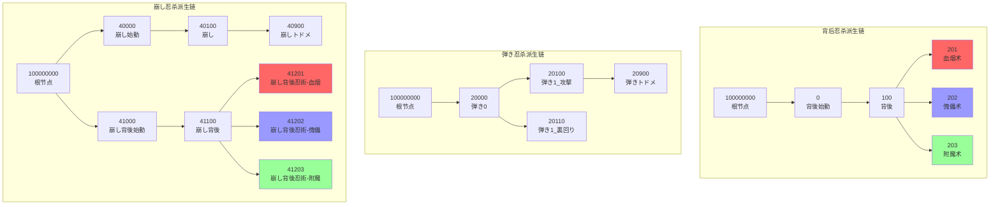
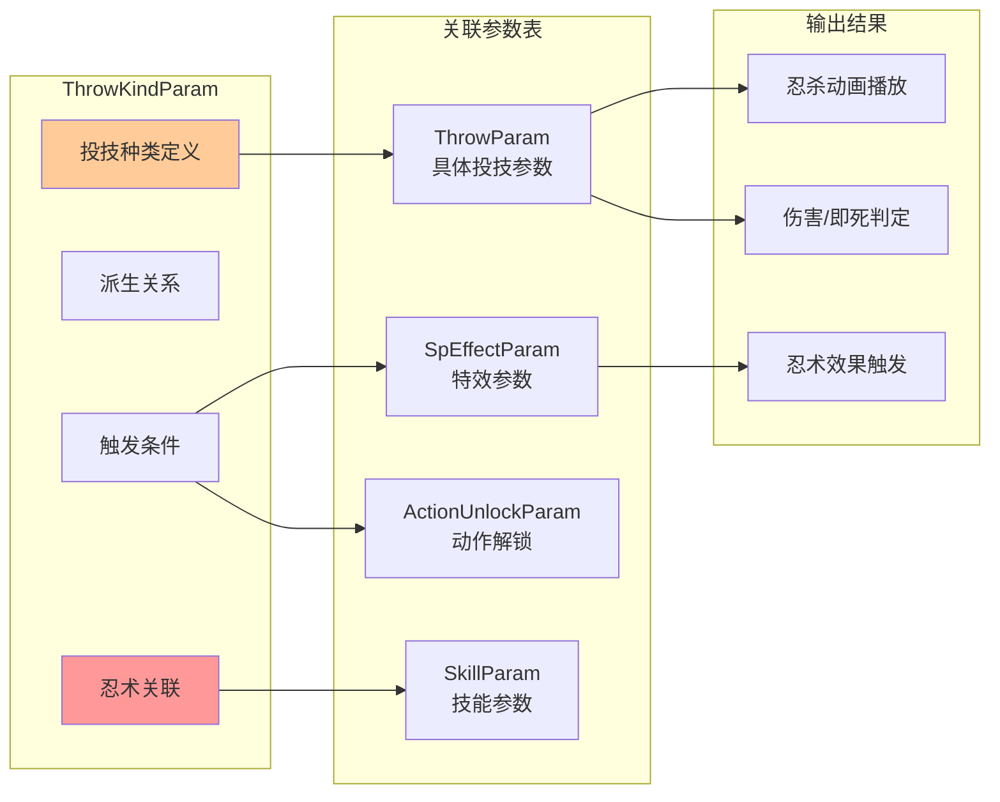

# ThrowKindParam 参数含义完整推测

> 基于 `param/param/ThrowKindParam.csv` 数据分析推测
> 生成时间：2026-01-23

---

## 概述

### 什么是 ThrowKindParam？

ThrowKindParam 是只狼战斗系统中的**投技种类参数表**，定义了游戏中所有忍杀（投技/Throw）的类型分类、触发条件、派生关系和忍术关联。该表是只狼忍杀系统的核心配置表之一。

```
┌─────────────────────────────────────────────────────────────────────────┐
│                  ThrowKindParam 在忍杀系统中的位置                       │
├─────────────────────────────────────────────────────────────────────────┤
│                                                                         │
│  触发检测                                                                │
│  ├─ 玩家输入（攻击键）                                                   │
│  ├─ 敌人状态（体幹崩溃/背后/空中等）                                     │
│  └─ 场景条件（地面/屋顶/水中等）                                         │
│              ↓                                                          │
│  ThrowKindParam (投技种类定义层)                                         │
│  ├─ throwKindCategory（投技分类：背后/弾き/崩し等）                      │
│  ├─ throwCheckSituation（场景检查：地面/屋顶/水中）                      │
│  ├─ derivationSourceThrowKind（派生源：连续忍杀链）                      │
│  └─ throwSkillId（忍术技能：血烟/傀儡/附魔）                             │
│              ↓                                                          │
│  ThrowParam (具体投技参数)                                               │
│  ├─ 攻击者/受击者动画                                                    │
│  ├─ 判定距离和角度                                                       │
│  └─ 吸附和逃脱参数                                                       │
│              ↓                                                          │
│  执行忍杀                                                                │
│  ├─ 播放忍杀动画                                                         │
│  ├─ 触发忍术效果                                                         │
│  └─ 造成伤害/即死                                                        │
│                                                                         │
└─────────────────────────────────────────────────────────────────────────┘
```

### 只狼忍杀系统的核心概念

| 术语 | 日文 | 含义 |
|------|------|------|
| **背後** | はいご | 背后忍杀（潜行暗杀） |
| **弾き** | はじき | 弹反忍杀（完美弹反后的处决） |
| **崩し** | くずし | 崩溃忍杀（体幹破坏后的处决） |
| **見切り** | みきり | 看破（踩踏危险攻击后的反击） |
| **トドメ** | とどめ | 止め/最后一击（BOSS第二次忍杀等） |
| **忍術** | にんじゅつ | 忍术（血烟/傀儡/附魔等派生技能） |

---

## 完整参数列表及含义

### 一、基础标识参数

#### 1.1 ID（条目ID）

| 参数名 | 日文名 | 类型 | 含义 | 取值范围 |
|--------|--------|------|------|----------|
| **ID** | ID | s32 | 投技种类的唯一标识符 | 0 ~ 100000000 |

**详细说明**：
- ID编号规律：
  - **0-299999**: 玩家（PC）普通忍杀
  - **500000-699999**: 玩家屋顶上忍杀（【屋根上】）
  - **1000000-1000999**: 敌人（Enemy）投技
  - **100000000**: 特殊标记（派生源根节点）

**ID分段示例**：
```
0       - 背後始動（背后忍杀起始）
100     - 背後（背后忍杀）
201-203 - 背後忍術（血烟/傀儡/附魔）
20000   - 弾き0（弹反忍杀起始）
40000   - 崩し始動（崩溃忍杀起始）
500000+ - 屋顶上系列
1000000 - 敌人投技0
```

---

#### 1.2 Name（名称）

| 参数名 | 日文名 | 类型 | 含义 | 取值范围 |
|--------|--------|------|------|----------|
| **Name** | 名前 | string | 投技种类的描述性名称 | 文本 |

**详细说明**：
- 格式通常为 `【PC/敵】类型描述 -- 日文描述`
- 【PC】表示玩家可执行
- 【敵】表示敌人可执行

---

### 二、投技类型参数

#### 2.1 throwTypeId（投技类型ID）

| 参数名 | 日文名 | 类型 | 含义 | 取值范围 |
|--------|--------|------|------|----------|
| **throwTypeId** | 投げ型ID | u8 | 投技的基础类型标识 | 0 ~ 255 |

**详细说明**：
- 用于区分不同的投技基础类型
- 与 ThrowParam 中的 throwTypeId 关联
- **0** = 默认/通用类型
- **1-4** = 敌人投技变体类型

**使用示例**：
```
玩家忍杀: throwTypeId = 0 (统一使用默认类型)
敌人投技0: throwTypeId = 0
敌人投技1: throwTypeId = 1
敌人投技2: throwTypeId = 2
```

---

#### 2.2 throwKindCategory（投技种类分类）

| 参数名 | 日文名 | 类型 | 含义 | 取值范围 |
|--------|--------|------|------|----------|
| **throwKindCategory** | 投げ種類カテゴリ | u8 | 投技的功能分类 | 0 ~ 255 |

**枚举值**：

| 值 | 含义 | 说明 |
|----|------|------|
| **0** | 背後系（潜行忍杀） | 背后忍杀、墙壁忍杀、悬挂忍杀 |
| **1** | 崩し系近距离 | 体幹崩溃近距离忍杀 |
| **2** | 崩し系远距离 | 体幹崩溃远距离/弾き忍杀 |
| **3** | 落下系 | 坠落忍杀、崩し裏回り |
| **4** | 蹴り崩し系 | 无限制落下忍杀 |
| **10** | 背後高优先级 | 高优先级背后忍杀 |
| **100** | 事件特殊 | 大蛇輿等特殊事件 |

---

#### 2.3 throwKindCheckMethod（投技检查方法）

| 参数名 | 日文名 | 类型 | 含义 | 取值范围 |
|--------|--------|------|------|----------|
| **throwKindCheckMethod** | 投げ種類チェック方法 | u8 | 触发投技的检查方式类型 | 0 ~ 255 |

**枚举值**：

| 值 | 名称 | 说明 |
|----|------|------|
| **0** | 背後 | 背后忍杀检查 |
| **1** | しゃがみ背後 | 蹲伏背后忍杀 |
| **2** | 弾き | 弹反忍杀检查 |
| **3** | 見切り/見切り崩し | 看破/看破崩溃 |
| **4** | 崩し | 体幹崩溃忍杀 |
| **5** | 敵特殊状態 | 敌人特殊状态（如BOSS第二阶段） |
| **6** | 落下 | 坠落忍杀 |
| **7** | 制限なし落下 | 无限制坠落 |
| **8** | 対空 | 对空忍杀 |
| **9** | 左壁張り付き | 左墙贴附忍杀 |
| **10** | 右壁張り付き | 右墙贴附忍杀 |
| **11** | ぶら下がり | 悬挂忍杀 |
| **12** | イベント | 事件忍杀 |
| **13** | 崩し落下 | 崩溃坠落 |
| **14** | 蹴り崩し | 踢击崩溃 |
| **15** | 崩しワイヤー | 钩绳崩溃 |
| **16** | トドメ | 最后一击 |
| **17** | 老化背後 | 老化状态背后 |
| **18** | 老化崩し | 老化状态崩溃 |
| **19** | 老化崩し背後 | 老化崩溃背后 |
| **20** | 崩し裏回り | 崩溃绕背 |
| **21** | 水中崩し | 水中崩溃 |
| **100** | 敵投げ | 敌人投技 |
| **101** | 敵投げ水中 | 敌人水中投技 |

---

### 三、派生与链接参数

#### 3.1 derivationSourceThrowKind（派生源投技种类）

| 参数名 | 日文名 | 类型 | 含义 | 取值范围 |
|--------|--------|------|------|----------|
| **derivationSourceThrowKind** | 派生元投げ種類 | s32 | 该投技派生自哪个投技种类 | -1 ~ 100000000 |

**详细说明**：
- 定义忍杀的连锁派生关系
- **100000000** = 根节点（无派生源，作为起点）
- 其他值 = 指向父级 ThrowKindParam 的 ID

**派生链示例**：
```
背后忍杀派生链:
100000000（根）
    └─ 0（背後始動）
        └─ 100（背後）
            ├─ 201（背後忍術-血烟）
            ├─ 202（背後忍術-傀儡）
            └─ 203（背後忍術-附魔）

弾き忍杀派生链:
100000000（根）
    └─ 20000（弾き0）
        └─ 20100（弾き1_攻撃）
            └─ 20900（弾きトドメ）
```

---

#### 3.2 throwChangeId（投技变换ID）

| 参数名 | 日文名 | 类型 | 含义 | 取值范围 |
|--------|--------|------|------|----------|
| **throwChangeId** | 投げ変換ID | s32 | 场景变换时对应的投技ID | 0 ~ 999999 |

**详细说明**：
- 用于不同场景间的投技切换
- **0** = 不进行变换
- **1** = 屋顶场景变换标记（触发500000系列）

---

#### 3.3 throwSkillId（投技技能ID/忍术ID）

| 参数名 | 日文名 | 类型 | 含义 | 取值范围 |
|--------|--------|------|------|----------|
| **throwSkillId** | 投げスキルID | s32 | 关联的忍术技能ID | -1 ~ 9999 |

**详细说明**：
- **-1** = 无关联忍术
- 关联到具体的忍术技能

**忍术ID对照**：
| ID | 忍术名称 | 日文 |
|----|----------|------|
| **2100** | 血烟术 | 血煙の術 |
| **2110** | 傀儡术 | 傀儡の術 |
| **2120** | 附魔术 | 不死斬りエンチャント |

---

### 四、触发条件参数

#### 4.1 throwCheckSituation（投技检查场景）

| 参数名 | 日文名 | 类型 | 含义 | 取值范围 |
|--------|--------|------|------|----------|
| **throwCheckSituation** | 投げチェック状況 | u8 | 投技可触发的场景条件 | 0 ~ 255 |

**枚举值**：

| 值 | 含义 | 说明 |
|----|------|------|
| **0** | 默认/地面 | 普通地面场景 |
| **1** | 屋顶 | 屋顶场景专用 |
| **2** | 弾き派生 | 弹反后派生 |
| **3** | 見切り派生 | 看破后派生 |
| **4** | 投技派生 | 通用投技派生 |
| **5** | 見切り | 看破触发 |

---

#### 4.2 acceptableButton（可接受按钮）

| 参数名 | 日文名 | 类型 | 含义 | 取值范围 |
|--------|--------|------|------|----------|
| **acceptableButton** | 許容ボタン | s8 | 触发该投技需要的按钮输入 | -1 ~ 127 |

**详细说明**：
- **-1** = 自动触发（无需按键）
- **0** = 需要攻击键
- **1** = 需要特定按键

---

#### 4.3 checkPriority（检查优先级）

| 参数名 | 日文名 | 类型 | 含义 | 取值范围 |
|--------|--------|------|------|----------|
| **checkPriority** | チェック優先度 | u8 | 多个投技条件满足时的优先级 | 0 ~ 255 |

**详细说明**：
- 数值越大优先级越高
- **0** = 最低优先级
- **10** = 背后忍杀高优先级
- **100** = 事件投技最高优先级

---

#### 4.4 noThrowInputSpecialEffect_forDef（无法投技时的特效）

| 参数名 | 日文名 | 类型 | 含义 | 取值范围 |
|--------|--------|------|------|----------|
| **noThrowInputSpecialEffect_forDef** | 投げ入力不可時SpEffect_被投げ者用 | s32 | 受击者无法被投技时显示的特效ID | -1 ~ 999999 |

**详细说明**：
- 指向 SpEffectParam 的 ID
- **-1** = 无特效
- **800000** = 通用忍杀提示特效
- **800010** = 忍术派生提示特效
- **800020** = 事件投技提示特效

---

### 五、状态检查参数

#### 5.1 isThrowBeginning（是否为投技起始）

| 参数名 | 日文名 | 类型 | 含义 | 取值范围 |
|--------|--------|------|------|----------|
| **isThrowBeginning** | 投げ始動か | u8 | 是否为投技序列的起始点 | 0 / 1 |

**详细说明**：
- **0** = 非起始（派生节点）
- **1** = 起始节点（进入忍杀状态）

---

#### 5.2 defAliveCheck（受击者存活检查）

| 参数名 | 日文名 | 类型 | 含义 | 取值范围 |
|--------|--------|------|------|----------|
| **defAliveCheck** | 被投げ者存命チェック | u8 | 投技后受击者的存活状态检查 | 0 ~ 5 |

**枚举值**：

| 值 | 含义 | 说明 |
|----|------|------|
| **0** | 普通处决 | 正常忍杀，敌人死亡 |
| **2** | 忍术处决 | 可触发忍术的处决 |
| **5** | 玩家忍杀 | 玩家专用忍杀类型 |
| **-1** | 敌人投技 | 敌人对玩家的投技 |

---

#### 5.3 doesSkipWeaponCategoryCheck（跳过武器类型检查）

| 参数名 | 日文名 | 类型 | 含义 | 取值范围 |
|--------|--------|------|------|----------|
| **doesSkipWeaponCategoryCheck** | 武器カテゴリチェックをスキップするか | u8 | 是否跳过武器类型检查 | 0 / 1 |

**详细说明**：
- **0** = 检查武器类型
- **1** = 跳过检查（敌人投技通常为1）

---

#### 5.4 doesCheckNormalFallOrbit（检查普通坠落轨道）

| 参数名 | 日文名 | 类型 | 含义 | 取值范围 |
|--------|--------|------|------|----------|
| **doesCheckNormalFallOrbit** | 通常落下軌道をチェックするか | u8 | 是否检查坠落轨道有效性 | 0 / 1 |

**详细说明**：
- **0** = 不检查
- **1** = 检查（坠落忍杀时需要）

---

### 六、动作解锁检查参数

#### 6.1 checkAction_ActionUnlock_0/1/2（动作解锁检查）

| 参数名 | 日文名 | 类型 | 含义 | 取值范围 |
|--------|--------|------|------|----------|
| **checkAction_ActionUnlock_0** | アクション解除チェック0 | s16 | 需要解锁的动作ID（第1个） | -1 ~ 9999 |
| **checkAction_ActionUnlock_1** | アクション解除チェック1 | s16 | 需要解锁的动作ID（第2个） | -1 ~ 9999 |
| **checkAction_ActionUnlock_2** | アクション解除チェック2 | s16 | 需要解锁的动作ID（第3个） | -1 ~ 9999 |

**详细说明**：
- **-1** = 无需解锁，默认可用
- 其他值 = 需要解锁对应动作才能使用

**动作解锁ID对照**：
| ID | 动作名称 |
|----|----------|
| **3** | 不死斬り（用于特殊敌人忍杀） |
| **5** | 基础忍杀（默认解锁） |
| **13** | 裏回り（绕背技能） |
| **18** | 対空忍殺（对空忍杀技能） |

---

#### 6.2 pad0（填充字段）

| 参数名 | 日文名 | 类型 | 含义 | 取值范围 |
|--------|--------|------|------|----------|
| **pad0** | パディング | byte[3] | 结构体对齐填充 | [0\|0\|0] |

**详细说明**：
- 用于内存对齐，无实际游戏功能

---

## 只狼重要投技种类速查表

### 玩家（PC）忍杀种类

| ID | 名称 | 类型 | 说明 |
|----|------|------|------|
| **0** | 背後始動 | 背后 | 背后忍杀起始 |
| **100** | 背後 | 背后 | 背后忍杀执行 |
| **201-203** | 背後忍術 | 背后 | 血烟/傀儡/附魔派生 |
| **20000** | 弾き0 | 弾き | 弹反忍杀起始 |
| **20100** | 弾き1_攻撃 | 弾き | 弹反攻击 |
| **20900** | 弾きトドメ | 弾き | 弹反最后一击 |
| **40000** | 崩し始動 | 崩し | 体幹崩溃忍杀起始 |
| **40100** | 崩し | 崩し | 体幹崩溃忍杀执行 |
| **70000** | 落下0 | 落下 | 坠落忍杀起始 |
| **80000** | 対空0 | 対空 | 对空忍杀（需解锁） |
| **170000** | 見切り | 見切り | 看破（踩踏危险攻击） |
| **250000** | 要不死斬り | 特殊 | 需要不死斩的忍杀 |

### 敌人（Enemy）投技种类

| ID | 名称 | 类型 |
|----|------|------|
| **1000000** | 敵投げ0 | 陆地投技 |
| **1000010-40** | 敵投げ1-4 | 陆地投技变体 |
| **1000100-140** | 敵投げ水中 | 水中投技 |

---

## 派生关系图



---

## 与其他参数表的关联



---

## 实际应用示例

### 示例1：背后忍杀完整流程

```
1. 玩家接近敌人背后
2. 系统检查 ThrowKindParam ID=0 (背後始動)
   ├─ throwCheckSituation = 0 (地面)
   ├─ throwKindCheckMethod = 0 (背後)
   └─ isThrowBeginning = 1 (起始)
3. 条件满足，显示忍杀提示
4. 玩家按下攻击键，触发 ID=100 (背後)
5. 忍杀完成后，可派生忍术:
   ├─ ID=201 (血烟术) - throwSkillId=2100
   ├─ ID=202 (傀儡术) - throwSkillId=2110
   └─ ID=203 (附魔术) - throwSkillId=2120
```

### 示例2：BOSS体幹崩溃忍杀

```
1. BOSS体幹值归零
2. 系统检查 ThrowKindParam ID=40000 (崩し始動)
   ├─ throwKindCheckMethod = 4 (崩し)
   ├─ throwKindCategory = 2 (崩し系远距离)
   └─ checkPriority = 2
3. 显示忍杀点，玩家按下攻击键
4. 触发 ID=40100 (崩し)
5. 若为多血槽BOSS，需继续触发 ID=40900 (崩しトドメ)
```

### 示例3：需要不死斩的特殊忍杀

```
弦一郎/一心等不死系敌人:
1. 系统检查 ThrowKindParam ID=250000
   ├─ checkAction_ActionUnlock_0 = 3 (不死斬り)
   └─ 需要玩家已获得不死斩
2. 若未解锁不死斩:
   ├─ 忍杀无法执行
   └─ 敌人恢复体幹
3. 若已解锁:
   └─ 执行特殊忍杀，永久击杀敌人
```

---

## 总结

| 参数组 | 包含字段 | 主要用途 |
|--------|----------|----------|
| **基础标识** | ID, Name | 投技种类标识 |
| **类型定义** | throwTypeId, throwKindCategory, throwKindCheckMethod | 投技分类和检查方式 |
| **派生链接** | derivationSourceThrowKind, throwChangeId, throwSkillId | 派生关系和忍术关联 |
| **触发条件** | throwCheckSituation, acceptableButton, checkPriority | 触发场景和优先级 |
| **状态检查** | isThrowBeginning, defAliveCheck, doesSkip* | 执行状态验证 |
| **动作解锁** | checkAction_ActionUnlock_0/1/2 | 技能解锁条件 |

**关键发现**：
- 只狼忍杀系统采用**派生链**结构，从起始节点逐级派生
- **三种忍术**（血烟/傀儡/附魔）通过 throwSkillId 关联
- **特殊忍杀**（如不死斩）需要检查 ActionUnlock 条件
- 敌人投技使用 ID 1000000+ 的独立命名空间
- 屋顶场景使用 ID 500000+ 的独立定义
