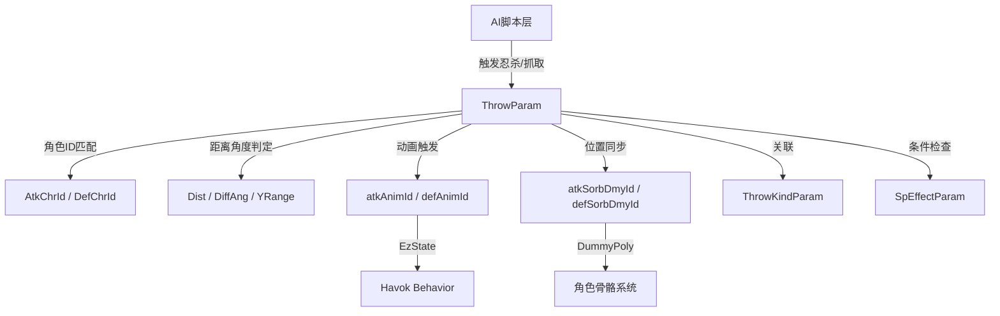
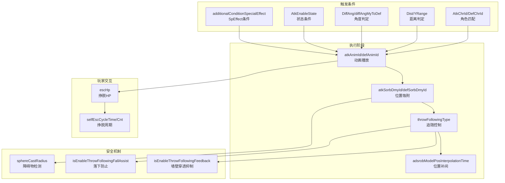

# ThrowParam 参数含义完整推测

> 基于 `param/SDT/Defs/ThrowParam.xml` 和 `param/SDT/Meta/ThrowParam.xml` 定义文件推测
> 生成时间：2026-01-21

---

## 概述

### 什么是 ThrowParam？

ThrowParam 是只狼战斗系统中的**投掷/抓取参数表**，定义了游戏中两个角色之间的同步动画交互，包括忍杀（Deathblow）、抓取（Grab）、摔投等动作。该表控制发动条件、角色位置同步、动画播放等核心机制。

```
┌─────────────────────────────────────────────────────────────────────────┐
│                    ThrowParam 在战斗系统中的位置                         │
├─────────────────────────────────────────────────────────────────────────┤
│                                                                         │
│  触发来源                                                                │
│  ├─ 背刺忍杀（Backstab Deathblow）                                      │
│  ├─ 体幹崩溃忍杀（Posture Break Deathblow）                              │
│  ├─ 敌人抓取攻击（Enemy Grab Attack）                                    │
│  ├─ 空中落下忍杀（Aerial Deathblow）                                     │
│  └─ 特殊处决动画（Special Execution）                                    │
│              ↓                                                          │
│  ThrowParam (条件判定层)                                                 │
│  ├─ 角色ID匹配 (AtkChrId ↔ DefChrId)                                    │
│  ├─ 距离判定 (Dist, upperYRange, lowerYRange)                           │
│  ├─ 角度判定 (DiffAngMin/Max, diffAngMyToDef)                           │
│  └─ 状态判定 (AtkEnableState, SpEffect条件)                              │
│              ↓                                                          │
│  动画同步层                                                              │
│  ├─ 攻击方动画 (atkAnimId + atkAnimOffset)                               │
│  ├─ 受击方动画 (defAnimId + defAnimOffset)                               │
│  ├─ 吸附点同步 (atkSorbDmyId ↔ defSorbDmyId)                            │
│  └─ 追随控制 (throwFollowingType)                                        │
│              ↓                                                          │
│  效果输出                                                                │
│  ├─ 角色位置吸附                                                         │
│  ├─ 同步动画播放                                                         │
│  ├─ 伤害判定触发                                                         │
│  └─ 投掷挣脱判定                                                         │
│                                                                         │
└─────────────────────────────────────────────────────────────────────────┘
```

### ThrowParam 与其他系统的关联



### 只狼中的主要应用场景

| 场景 | 说明 | 典型ID范围 |
|------|------|-----------|
| **忍杀** | 背刺、正面处决、体幹崩溃处决 | 通用模板 |
| **BOSS专属处决** | 特定BOSS的多阶段忍杀动画 | 按角色ID分配 |
| **敌人抓取** | 某些敌人的抓取攻击（如大猿抓取） | 敌人角色ID |
| **空中忍杀** | 落下时的空中处决 | 特殊判定条件 |
| **骑乘相关** | 马背上的特殊交互 | 特殊分类 |

---

## 完整参数列表及含义

### 一、角色匹配参数

#### 1.1 AtkChrId（投掷方角色ID）

| 参数名 | 日文名 | 类型 | 含义 | 取值范围 |
|--------|--------|------|------|----------|
| **AtkChrId** | 投げ側キャラID | s32 | 发起投掷/抓取的角色ID | 0 ~ 10000 |

**详细说明**：
- **0** = 玩家角色（c0000）
- 用于指定哪个角色可以发起此投掷
- 与 `DefChrId` 配对使用，实现角色间的特定交互

**使用示例**：
```
玩家对落武者的忍杀:
├─ AtkChrId = 0 (玩家)
└─ DefChrId = 1010 (落武者)

BOSS抓取玩家:
├─ AtkChrId = 5040 (狮子猿)
└─ DefChrId = 0 (玩家)
```

---

#### 1.2 DefChrId（受击方角色ID）

| 参数名 | 日文名 | 类型 | 含义 | 取值范围 |
|--------|--------|------|------|----------|
| **DefChrId** | 受け側キャラID | s32 | 接受投掷/抓取的角色ID | 0 ~ 10000 |

**详细说明**：
- **0** = 玩家角色
- 指定可被发起方执行此动作的目标角色
- 不同敌人可能有不同的忍杀动画

---

### 二、距离判定参数

#### 2.1 Dist（有效距离）

| 参数名 | 日文名 | 类型 | 含义 | 取值范围 |
|--------|--------|------|------|----------|
| **Dist** | 有効距離[m] | f32 | 投掷判定的最大水平距离 | 0 ~ 10000 |

**详细说明**：
- 单位为米（m）
- 只有当两角色的水平距离 ≤ Dist 时才能触发投掷
- 典型值：忍杀约 3m，近距离抓取约 1-2m

**使用示例**：
```
近距离忍杀: Dist = 3
远距离忍杀(特殊): Dist = 5
```

---

#### 2.2 upperYRange / lowerYRange（高度范围）

| 参数名 | 日文名 | 类型 | 默认值 | 含义 |
|--------|--------|------|--------|------|
| **upperYRange** | 高さ範囲上[m] | f32 | 0.2 | Y轴上方允许的高度差 |
| **lowerYRange** | 高さ範囲下[m] | f32 | 0.2 | Y轴下方允许的高度差 |

**详细说明**：
- 控制垂直方向的判定范围
- 投掷方与受击方的Y轴相对距离必须在此范围内
- 用于防止在高度差过大时触发不合理的投掷动画

**判定逻辑**：
```
有效条件：-lowerYRange ≤ (受击方Y - 投掷方Y) ≤ upperYRange
```

---

#### 2.3 Dist_start / upperYRange_start / lowerYRange_start（投掷开始时的距离判定）

| 参数名 | 日文名 | 类型 | 含义 |
|--------|--------|------|------|
| **Dist_start** | 有効距離(投げ開始)[m] | f32 | 投掷开始时的有效距离 |
| **upperYRange_start** | 高さ範囲上(投げ開始)[m] | f32 | 投掷开始时的上方高度范围 |
| **lowerYRange_start** | 高さ範囲下(投げ開始)[m] | f32 | 投掷开始时的下方高度范围 |

**详细说明**：
- 专门用于**背刺开始**（Backstab）判定
- 区分"可以发起"和"可以成功执行"两个阶段
- 允许更宽松的发起条件，更严格的执行条件

---

### 三、角度判定参数

#### 3.1 DiffAngMin / DiffAngMax（角度差范围）

| 参数名 | 日文名 | 类型 | 含义 | 取值范围 |
|--------|--------|------|------|----------|
| **DiffAngMin** | 自分の向きと相手の向きの角度差範囲min | f32 | 投掷方与受击方朝向角度差的最小值 | 0 ~ 180 |
| **DiffAngMax** | 自分の向きと相手の向きの角度差範囲max | f32 | 投掷方与受击方朝向角度差的最大值 | 0 ~ 180 |

**详细说明**：
- 基于Y轴（垂直轴）计算角度差
- 角度差必须在 [DiffAngMin, DiffAngMax] 范围内才能触发

**背刺判定示例**：
```
背刺忍杀（从背后）:
├─ DiffAngMin = 90  (最小90度)
├─ DiffAngMax = 180 (最大180度)
└─ 含义：两角色朝向相同方向（从背后）

正面忍杀:
├─ DiffAngMin = 0   (最小0度)
├─ DiffAngMax = 90  (最大90度)
└─ 含义：两角色面对面
```

```
           投掷方朝向
               ↑
               |
      ┌────────┼────────┐
      │   90°  │  90°   │
      │  ↙     │     ↘  │
   180° ←──────●──────→ 0°
      │  ↖     │     ↗  │
      │        │        │
      └────────┴────────┘
               ↓
           受击方朝向

背刺判定: 90° ~ 180° (从背后)
正面判定: 0° ~ 90° (从正面)
```

---

#### 3.2 diffAngMyToDef（方向角度差）

| 参数名 | 日文名 | 类型 | 默认值 | 含义 |
|--------|--------|------|--------|------|
| **diffAngMyToDef** | 自分の向きと自分から相手への方向の角度差 | f32 | 60 | 投掷方朝向与指向受击方向量的角度差上限 |

**详细说明**：
- 判断投掷方是否"面向"受击方
- 投掷方的正面向量与指向受击方的向量夹角 ≤ diffAngMyToDef 才能触发
- 防止从侧面或背对目标时触发投掷

**示意图**：
```
          投掷方正面朝向
               ↑
              /|\
             / | \
            /  |  \
           /   |   \
          / 60°|60° \
         ────────────
                ● 受击方
```

---

#### 3.3 DiffAngMin_start / DiffAngMax_start / diffAngMyToDef_start（投掷开始时的角度判定）

| 参数名 | 日文名 | 类型 | 含义 |
|--------|--------|------|------|
| **DiffAngMin_start** | 自分の向きと相手の向きの角度差範囲min(投げ開始) | f32 | 投掷开始时的朝向角度差最小值 |
| **DiffAngMax_start** | 自分の向きと相手の向きの角度差範囲max(投げ開始) | f32 | 投掷开始时的朝向角度差最大值 |
| **diffAngMyToDef_start** | 自分の向きと自分から相手への方向の角度差(投げ開始) | f32 | 投掷开始时的方向角度差 |

**详细说明**：
- 专门用于背刺开始时的判定
- 与 `Dist_start` 等配合使用

---

### 四、动画参数

#### 4.1 atkAnimId / defAnimId（动画ID）

| 参数名 | 日文名 | 类型 | 含义 | 取值范围 |
|--------|--------|------|------|----------|
| **atkAnimId** | 投げ側アニメID | s32 | 投掷方播放的动画ID | 0 ~ 1E+08 |
| **defAnimId** | 受け側アニメID | s32 | 受击方播放的动画ID | 0 ~ 1E+08 |

**详细说明**：
- 与 EzState 动画状态机关联
- 投掷方和受击方同时播放对应动画
- 动画会通过吸附点同步两角色的位置

---

#### 4.2 atkAnimOffset / defAnimOffset（动画偏移）

| 参数名 | 日文名 | 类型 | 含义 | 取值范围 |
|--------|--------|------|------|----------|
| **atkAnimOffset** | 投げ側アニメオフセット | u16 | 攻击方动画ID的偏移值 | 0 ~ 999 |
| **defAnimOffset** | 受け側アニメオフセット | u16 | 受击方动画ID的偏移值 | 0 ~ 999 |

**详细说明**：
- 与 Behavior CMSG 的 OffsetType "ThrowCategory" 对应
- 允许同一基础动画ID产生多个变体
- 用于实现同一忍杀的不同表现形式

---

#### 4.3 throwTypeId（投掷类型ID）

| 参数名 | 日文名 | 类型 | 含义 | 取值范围 |
|--------|--------|------|------|----------|
| **throwTypeId** | 投げタイプID | s32 | 投掷的种类标识符 | 0 ~ 1E+08 |

**详细说明**：
- 与攻击参数表（AtkParam）关联
- 用于区分不同类型的投掷行为

---

### 五、吸附同步参数

#### 5.1 atkSorbDmyId / defSorbDmyId（吸附Dummy Poly ID）

| 参数名 | 日文名 | 类型 | 含义 | 取值范围 |
|--------|--------|------|------|----------|
| **atkSorbDmyId** | 投げ側 吸着ダミポリID | s16 | 投掷方的吸附点ID | 0 ~ 31999 |
| **defSorbDmyId** | 受け側 吸着ダミポリID | s16 | 受击方的吸附点ID | 0 ~ 31999 |

**详细说明**：
- Dummy Poly 是角色模型上的定位点（骨骼挂点）
- 投掷时，受击方会被吸附到投掷方的指定Dummy Poly位置
- 反之亦然，确保两角色在动画过程中保持正确的相对位置

**常见Dummy Poly ID**：
```
通用定位点：
├─ 0: 根骨骼（通常为脚部）
├─ 230-240: 手部区域
├─ 200-210: 武器挂点
└─ 其他: 角色特定定位点
```

---

#### 5.2 atkSorbDmyId_old / defSorbDmyId_old（旧版吸附ID）

| 参数名 | 日文名 | 类型 | 含义 |
|--------|--------|------|------|
| **atkSorbDmyId_old** | 投げ側 吸着ダミポリID（削除予定） | u8 | 旧版投掷方吸附点ID（已废弃） |
| **defSorbDmyId_old** | 受け側 吸着ダミポリID（削除予定） | u8 | 旧版受击方吸附点ID（已废弃） |

**详细说明**：
- Uint8 类型的旧数据，已被 s16 版本取代
- 保留仅为兼容性

---

#### 5.3 judgeRangeBasePosDmyId1 / judgeRangeBasePosDmyId2（判定基准Dummy Poly ID）

| 参数名 | 日文名 | 类型 | 默认值 | 含义 |
|--------|--------|------|--------|------|
| **judgeRangeBasePosDmyId1** | 投げ側の投げ範囲判定基準ダミポリId | s32 | -1 | 投掷方判定自身位置的Dummy Poly |
| **judgeRangeBasePosDmyId2** | 投られ側の投げ範囲判定基準ダミポリId | s32 | -1 | 受击方判定自身位置的Dummy Poly |

**详细说明**：
- **-1** = 使用角色胶囊体原点
- 用于自定义距离/范围判定的基准点
- 例如：大型BOSS可能需要从特定部位判定距离

---

#### 5.4 adsrobModelPosInterpolationTime（吸附时模型位置补间时间）

| 参数名 | 日文名 | 类型 | 默认值 | 含义 |
|--------|--------|------|--------|------|
| **adsrobModelPosInterpolationTime** | 吸着時モデル位置補間時間[s] | f32 | 0.5 | 胶囊体吸附后模型移动到正确位置的补间时间 |

**详细说明**：
- 单位为秒
- **0** = 不进行补间，吸附后立即按动画数据位置播放
- **> 0** = 模型会在指定时间内平滑移动到目标位置
- 避免角色模型的瞬间跳跃

---

### 六、追随控制参数

#### 6.1 throwFollowingType（投掷追随方式）

| 参数名 | 日文名 | 类型 | 含义 |
|--------|--------|------|------|
| **throwFollowingType** | 投げ追従方式 | u8 | 投掷执行中角色如何跟随吸附点 |

**枚举值**（THROW_FOLLOWING_TYPE）：
| 值 | 含义 |
|----|------|
| 0 | 标准追随 |
| 1+ | 其他追随方式（待确认） |

**详细说明**：
- 控制投掷过程中的位置同步方式
- 追随期间由 TAE（Timeline Action Event）控制

---

#### 6.2 isEnableThrowFollowingFallAssist（追随解除时落下防止）

| 参数名 | 日文名 | 类型 | 默认值 | 含义 |
|--------|--------|------|--------|------|
| **isEnableThrowFollowingFallAssist** | 投げ追従解除時の落下を防止するか？ | u8 (bool) | 1 | 追随解除时是否防止角色从段差落下 |

**详细说明**：
- **1（ON）** = 启用落下防止，与墙壁穿透防止相同的处理
- **0（OFF）** = 不启用
- 防止忍杀动画结束后角色意外落入深渊

---

#### 6.3 isEnableThrowFollowingFeedback（追随中墙壁穿透抑制）

| 参数名 | 日文名 | 类型 | 默认值 | 含义 |
|--------|--------|------|--------|------|
| **isEnableThrowFollowingFeedback** | 投げ追従中の壁めり込みを抑制するか？ | u8 (bool) | 1 | 追随中是否抑制墙壁穿透 |

**详细说明**：
- **1（ON）** = 检测到碰撞或落下时，将吸附点持有方角色一起推回
- **0（OFF）** = 不处理
- 防止投掷动画过程中角色穿墙或出现异常位置

---

### 七、投掷挣脱参数

#### 7.1 escHp（投掷挣脱HP）

| 参数名 | 日文名 | 类型 | 含义 | 取值范围 |
|--------|--------|------|------|----------|
| **escHp** | 投げ抜けHP | u16 | 投掷挣脱所需的"HP" | 0 ~ 9999 |

**详细说明**：
- 玩家在被抓取时可以通过连打按键挣脱
- 每次按键减少一定的 escHp
- 当 escHp 降为 0 时挣脱成功

---

#### 7.2 selfEscCycleTime / selfEscCycleCnt（自力挣脱周期）

| 参数名 | 日文名 | 类型 | 含义 |
|--------|--------|------|------|
| **selfEscCycleTime** | 自力投げ抜けサイクル時間[ms] | u16 | 自力挣脱的周期时间（毫秒） |
| **selfEscCycleCnt** | 自力投げ抜けサイクル回数 | u8 | 自力挣脱的周期次数 |

**详细说明**：
- 定义玩家自力挣脱的时间窗口和机会次数
- 在每个周期内可以进行一定次数的挣脱尝试

---

### 八、状态与条件参数

#### 8.1 AtkEnableState（投掷方可投掷状态）

| 参数名 | 日文名 | 类型 | 含义 |
|--------|--------|------|------|
| **AtkEnableState** | 投げ側の投げ可能状態タイプ | u8 | 投掷方必须处于的状态类型 |

**枚举值**（THROW_ENABLE_STATE）：
| 值 | 推测含义 |
|----|----------|
| 0 | 标准状态 |
| 其他 | 特定状态要求（如空中、下落等） |

**详细说明**：
- 控制在何种状态下可以发起投掷
- 例如：空中忍杀需要攻击方处于下落状态

---

#### 8.2 PadType（操作类型）

| 参数名 | 日文名 | 类型 | 默认值 | 含义 |
|--------|--------|------|--------|------|
| **PadType** | 操作タイプ | u8 | 1 | 触发投掷的操作方式 |

**枚举值**（THROW_PAD_TYPE）：
| 值 | 推测含义 |
|----|----------|
| 0 | 自动触发 |
| 1 | 攻击键触发 |
| 其他 | 特殊按键组合 |

---

#### 8.3 additionalConditionSpecialEffect（追加条件特殊效果）

| 参数名 | 日文名 | 类型 | 默认值 | 含义 |
|--------|--------|------|--------|------|
| **additionalConditionSpecialEffect_forAtk** | 追加条件特殊効果（投げ側） | s32 | -1 | 投掷方必须拥有的SpEffect |
| **additionalConditionSpecialEffect_forDef** | 追加条件特殊効果（受け側） | s32 | -1 | 受击方必须拥有的SpEffect |

**详细说明**：
- **-1** = 不检查
- 用于特殊条件的投掷（如只有在目标处于特定状态时才能触发的处决）
- 与 SpEffectParam 关联

---

### 九、投掷种类参数

#### 9.1 throwKind（投掷种类）

| 参数名 | 日文名 | 类型 | 默认值 | 含义 |
|--------|--------|------|--------|------|
| **throwKind** | 投げ種別 | u32 | 1E+08 | 投掷的类型分类 |

**枚举值**（THROW_KIND_PARAM_TYPE）：
| 值 | 推测含义 |
|----|----------|
| 40000 | 崩溃忍杀（Posture Break Deathblow） |
| 其他 | 其他类型投掷 |

**详细说明**：
- 决定投掷的成立条件、优先级、成立后的行为
- 与 ThrowKindParam 参数表关联

---

#### 9.2 throwType_old（旧版投掷种别）

| 参数名 | 日文名 | 类型 | 含义 |
|--------|--------|------|------|
| **throwType_old** | 投げ種別(旧) | u8 | 旧版投掷类型（已废弃） |

**枚举值**（THROW_TYPE）：
| 值 | 推测含义 |
|----|----------|
| 8 | 某种特定投掷类型 |

---

### 十、落下轨道判定参数

#### 10.1 normalFallOrbitCheck_range / normalFallOrbitCheck_heightLimit

| 参数名 | 日文名 | 类型 | 含义 |
|--------|--------|------|------|
| **normalFallOrbitCheck_range** | 落下軌道上判定_範囲[m] | f32 | 受击方必须在投掷方落下轨道的该距离内 |
| **normalFallOrbitCheck_heightLimit** | 落下軌道上判定_高度制限[m] | f32 | 高度限制（正值=下方，负值=上方） |

**详细说明**：
- 仅对"落下轨道判定型"投掷有效
- 用于空中忍杀等特殊判定
- 投掷方高度为0m基准，受击方必须在指定高度以下

---

#### 10.2 normalFallOrbitCheck_timeLimit（落下轨道判定时间限制）

| 参数名 | 日文名 | 类型 | 含义 |
|--------|--------|------|------|
| **normalFallOrbitCheck_timeLimit** | 通常落下軌道上判定_到達時間制限[ms] | u16 | 预测到达受击方位置的时间上限（毫秒） |

**详细说明**：
- 仅对"通常落下轨道判定型"投掷有效
- 按当前落下速度计算，到达受击方位置的预测时间必须 ≤ 该值

---

### 十一、物理与碰撞参数

#### 11.1 sphereCastRadiusRateTop / sphereCastRadiusRateLow（球体投射半径比率）

| 参数名 | 日文名 | 类型 | 默认值 | 含义 |
|--------|--------|------|--------|------|
| **sphereCastRadiusRateTop** | スフィアキャスト半径比率_上[1/100Rate] | u16 | 80 | 球体投射上部半径比率（80 = 0.8） |
| **sphereCastRadiusRateLow** | スフィアキャスト半径比率_下[1/100Rate] | u16 | 80 | 球体投射下部半径比率（80 = 0.8） |

**详细说明**：
- 用于障碍物检测（SphereCast）
- 值为 1/100 比率（如 80 表示 0.8 倍）
- 检测投掷路径上是否有障碍物

---

#### 11.2 isSkipSphereCast（跳过球体投射）

| 参数名 | 日文名 | 类型 | 含义 |
|--------|--------|------|------|
| **isSkipSphereCast** | スフィアキャストをスキップするか？ | u8:1 (bit) | 是否跳过球体投射检测 |

**详细说明**：
- **1** = 跳过障碍物检测
- **0** = 执行检测
- 某些特殊投掷可能需要跳过检测

---

#### 11.3 charaPhysicsHomingId（角色物理追踪ID偏移）

| 参数名 | 日文名 | 类型 | 含义 | 取值范围 |
|--------|--------|------|------|----------|
| **charaPhysicsHomingId** | キャラ物理ホーミングIDオフセット | s32 | 投掷中对受击方进行物理追踪时的ID偏移 | 0 ~ 1E+09 |

**详细说明**：
- 用于投掷过程中的物理追踪
- 与角色物理系统关联

---

### 十二、其他控制参数

#### 12.1 isTurnAtker（投掷方是否旋转）

| 参数名 | 日文名 | 类型 | 含义 |
|--------|--------|------|------|
| **isTurnAtker** | 投げ側が旋回するか？ | u8:1 (bit) | 投掷方是否在投掷时旋转朝向目标 |

**详细说明**：
- **1** = 投掷方会旋转面向受击方
- **0** = 不旋转

---

#### 12.2 isSkipWepCate（跳过武器类型检查）

| 参数名 | 日文名 | 类型 | 含义 |
|--------|--------|------|------|
| **isSkipWepCate** | 武器カテゴリチェックをスキップするか？ | u8:1 (bit) | 是否跳过攻击方的武器类型检查 |

**详细说明**：
- **1** = 跳过检查
- **0** = 执行检查
- 某些投掷可能不依赖武器类型

---

#### 12.3 dmyHasChrDirType（Dummy Poly持有角色的朝向）

| 参数名 | 日文名 | 类型 | 含义 |
|--------|--------|------|------|
| **dmyHasChrDirType** | 投げ発生時のダミポリ所持キャラの向き | u8 | 投掷发生时Dummy Poly持有角色的朝向类型 |

**枚举值**（THROW_DMY_CHR_DIR_TYPE）：
| 值 | 推测含义 |
|----|----------|
| 0 | 保持当前朝向 |
| 其他 | 特定朝向设置 |

---

## 参数关系图



---

## 实际应用示例

### 示例1：玩家对落武者的崩溃忍杀

```
ID: 11010000
Name: 崩し始動（遠）　PC→落武者

角色匹配：
├─ AtkChrId = 0 (玩家)
├─ DefChrId = 1010 (落武者)

距离判定：
├─ Dist = 3 (3米内)
├─ upperYRange = 1.8025819
├─ lowerYRange = 1.8025819

角度判定：
├─ DiffAngMin = 90 (背后)
├─ DiffAngMax = 180
├─ diffAngMyToDef = 35

动画：
├─ atkAnimId = 500000
├─ defAnimId = 0
├─ atkAnimOffset = 200

投掷类型：
├─ throwKind = 40000 (崩溃忍杀)
├─ isTurnAtker = 1 (会旋转面向目标)
```

### 示例2：理解背刺判定

```
背刺成功的条件检查流程：

1. 角色ID匹配检查
   AtkChrId == 玩家ID && DefChrId == 目标ID

2. 距离检查
   水平距离 ≤ Dist (3m)
   -lowerYRange ≤ 高度差 ≤ upperYRange

3. 角度检查（背后判定）
   90° ≤ 朝向角度差 ≤ 180° (两人朝同方向)
   投掷方指向目标角度 ≤ 35°

4. 状态检查
   目标未处于无敌/特殊状态
   满足SpEffect条件（如果设置）

5. 障碍物检查（如果未跳过）
   SphereCast 未检测到阻挡物

全部通过 → 触发忍杀动画
```

---

## 注意事项

1. **Dummy Poly ID 很重要**：错误的吸附点设置会导致角色位置异常
2. **角度判定需要精确**：背刺和正面处决的角度范围不能重叠
3. **落下防止很关键**：没有正确设置可能导致忍杀后角色坠崖
4. **与其他参数表关联**：
   - ThrowKindParam - 投掷种类详细定义
   - SpEffectParam - 条件检查用特殊效果
   - AtkParam - 伤害计算关联
