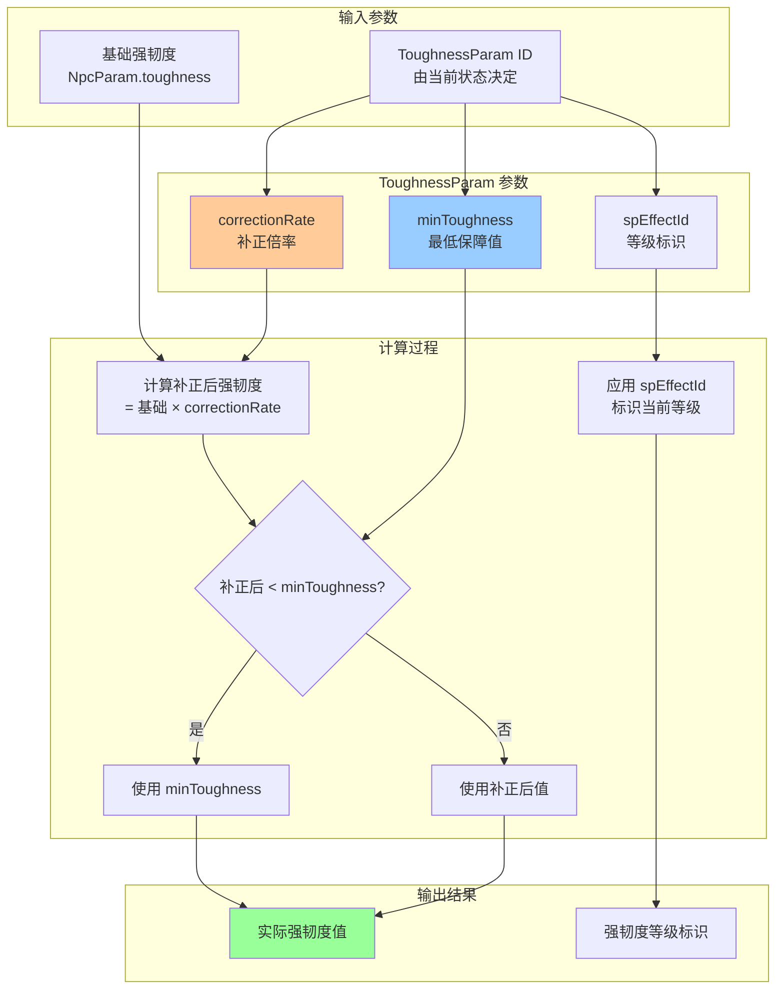
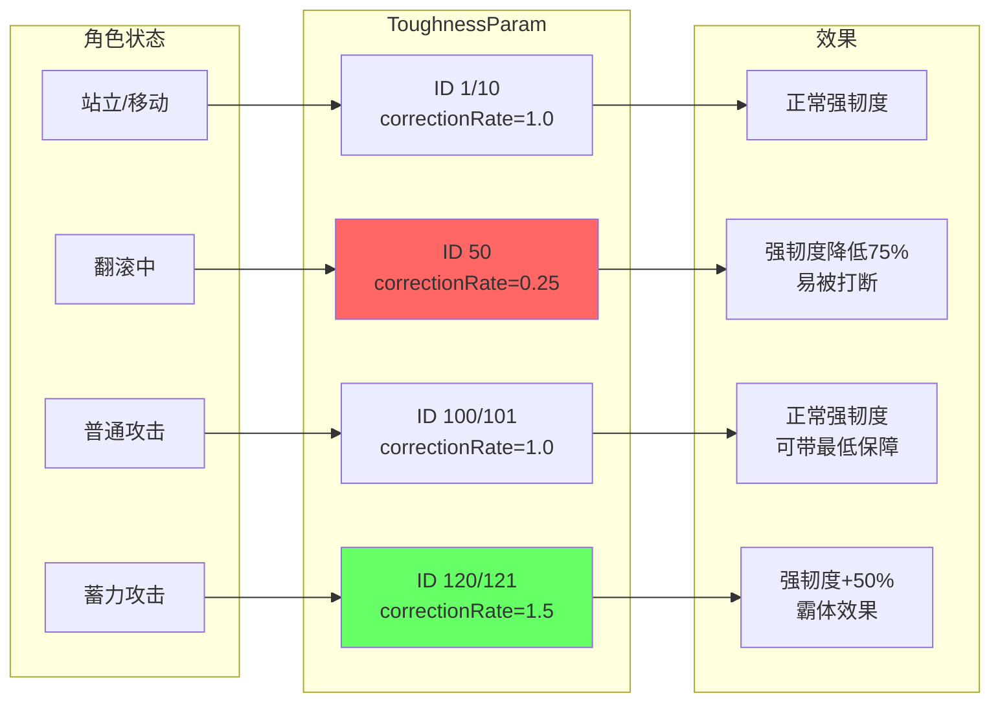
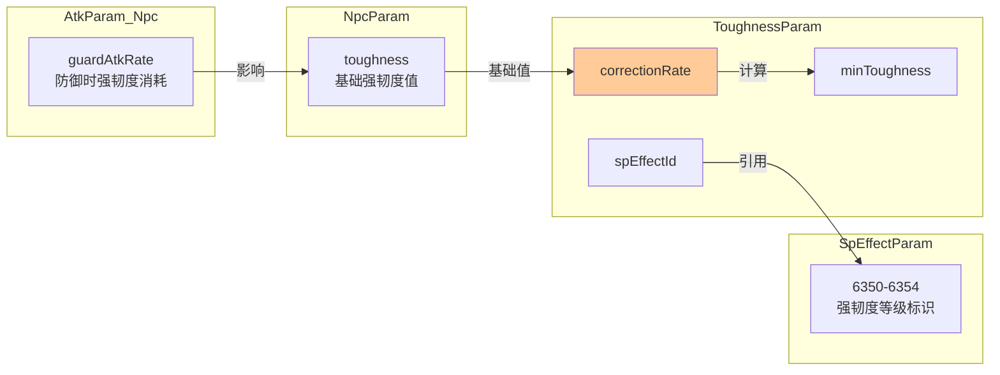

# ToughnessParam 参数含义推测

## 概述

**ToughnessParam**（强韧度参数表）定义了角色在不同状态下的**强韧度（Poise/Toughness）补正参数**。强韧度系统决定了角色是否会被攻击打断/击晕，是只狼战斗系统中的核心机制之一。

该参数表主要用于：
- 定义不同行为状态下的强韧度补正倍率
- 设置最低强韧度保障值
- 关联强韧度等级的SpEffect标识

**文件位置**: `param/param/ToughnessParam.csv`

**数据量**: 14条记录

---

## 字段说明

### 1. ID
| 属性 | 值 |
|------|------|
| 类型 | int |
| 范围 | 1 ~ 121 |
| 说明 | 参数条目的唯一标识符 |

**ID编号规则**：
| ID范围 | 用途 |
|--------|------|
| 1 | 敌人通用基础参数 |
| 10-30 | 通用强韧度倍率（1.0x~3.0x） |
| 50 | 翻滚状态强韧度 |
| 100-121 | 攻击状态强韧度 |

---

### 2. Name
| 属性 | 值 |
|------|------|
| 类型 | string |
| 格式 | `英文名称 -- 日文名称` |
| 说明 | 参数的描述性名称 |

**示例**：
- `General purpose: 1.0 times -- 汎用：1.0倍`
- `Rolling: Toughness -- ローリング中：強靭度`
- `Attack: One hand: Strong: Minimum guarantee -- 攻撃：片手：強：最低保障`

---

### 3. correctionRate
| 属性 | 值 |
|------|------|
| 类型 | float |
| 范围 | 0.25 ~ 3.0 |
| 默认值 | 1.0 |
| 说明 | 强韧度补正倍率 |

**计算公式**：
```
实际强韧度 = 基础强韧度 × correctionRate
```

**典型值**：
| 值 | 含义 | 使用场景 |
|----|------|----------|
| 0.25 | 强韧度降低到1/4 | 翻滚中（ID=50） |
| 1.0 | 无补正 | 通用、普通攻击 |
| 1.5 | 强韧度提升50% | 蓄力攻击 |
| 2.0 | 强韧度翻倍 | 通用：2.0倍 |
| 2.5 | 强韧度提升150% | 通用：2.5倍 |
| 3.0 | 强韧度提升200% | 通用：3.0倍 |

**设计意图**：
- 翻滚时强韧度大幅降低（0.25x），意味着翻滚被打中更容易被打断
- 蓄力攻击时强韧度提升（1.5x），鼓励玩家承受风险换取伤害

---

### 4. minToughness
| 属性 | 值 |
|------|------|
| 类型 | float |
| 范围 | 0 ~ 20 |
| 默认值 | 0 |
| 说明 | 最低强韧度保障值 |

**作用**：
即使 `基础强韧度 × correctionRate < minToughness`，实际强韧度也不会低于此值。

**计算公式**：
```
实际强韧度 = max(基础强韧度 × correctionRate, minToughness)
```

**典型值**：
| 值 | 含义 | 使用场景 |
|----|------|----------|
| 0 | 无最低保障 | 大部分情况 |
| 20 | 保障至少20点强韧度 | 攻击动作带"最低保障"标签的条目 |

**设计意图**：
带最低保障的攻击动作（如ID 101、111、121）确保即使基础强韧度很低，在攻击时也能有一定的抗打断能力。

---

### 5. isNonEffectiveCorrectionForMin
| 属性 | 值 |
|------|------|
| 类型 | bool (0/1) |
| 范围 | 0 或 1 |
| 默认值 | 0 |
| 说明 | 是否对最低保障值不进行补正 |

**含义推测**：
| 值 | 含义 |
|----|------|
| 0 | 正常计算，minToughness参与最终判断 |
| 1 | minToughness不受correctionRate影响 |

**注意**：当前数据中所有条目均为0，该字段可能为预留字段或仅在特殊情况下使用。

---

### 6. pad2
| 属性 | 值 |
|------|------|
| 类型 | byte |
| 值 | 0 |
| 说明 | 填充字节，用于内存对齐 |

**注意**：无实际功能，所有条目均为0。

---

### 7. spEffectId
| 属性 | 值 |
|------|------|
| 类型 | int |
| 范围 | -1, 6350~6360 |
| 说明 | 关联的SpEffect ID，用于标识强韧度等级 |

**值说明**：
| spEffectId | 含义 | 强韧度范围 |
|------------|------|------------|
| -1 | 无关联SpEffect | - |
| 6350 | 強靭度：極小（30以下） | ≤30 |
| 6351 | 強靭度：小（50以下） | ≤50 |
| 6352 | 強靭度：中（70以下） | ≤70 |
| 6353 | 強靭度：大（100以下） | ≤100 |
| 6354 | 強靭度：特大（100より大きい） | >100 |
| 6360 | 翻滚专用（未定义） | - |

**使用场景**：
这些SpEffect主要用于**分类和标识**当前的强韧度等级，可能用于：
- UI显示
- 特定行为触发条件判断
- 数据统计和调试

---

### 8. pad1
| 属性 | 值 |
|------|------|
| 类型 | byte[20] |
| 格式 | `[0|0|0|0|0|0|0|0|0|0|0|0|0|0|0|0|0|0|0|0]` |
| 说明 | 填充字节数组，用于内存对齐 |

**注意**：无实际功能，所有条目均为全0数组。

---

## 完整数据一览

| ID | 名称 | correctionRate | minToughness | spEffectId | 用途 |
|----|------|----------------|--------------|------------|------|
| 1 | 敵用の汎用パラメータ | 1.0 | 0 | -1 | 敌人通用基础 |
| 10 | 汎用：1.0倍 | 1.0 | 0 | 6350 | 通用×1.0 |
| 15 | 汎用：1.5倍 | 1.5 | 0 | 6351 | 通用×1.5 |
| 20 | 汎用：2.0倍 | 2.0 | 0 | 6352 | 通用×2.0 |
| 25 | 汎用：2.5倍 | 2.5 | 0 | 6353 | 通用×2.5 |
| 30 | 汎用：3.0倍 | 3.0 | 0 | 6354 | 通用×3.0 |
| 50 | ローリング中：強靭度 | 0.25 | 0 | 6360 | 翻滚状态 |
| 100 | 攻撃：片手：弱 | 1.0 | 0 | 6352 | 单手弱攻击 |
| 101 | 攻撃：片手：弱：最低保障 | 1.0 | 20 | 6352 | 单手弱攻击（保障） |
| 110 | 攻撃：片手：強 | 1.0 | 0 | 6352 | 单手强攻击 |
| 111 | 攻撃：片手：強：最低保障 | 1.0 | 20 | 6352 | 单手强攻击（保障） |
| 120 | 攻撃：片手：強MAX溜め | 1.5 | 0 | 6353 | 单手蓄力攻击 |
| 121 | 攻撃：片手：強MAX溜め：最低保障 | 1.5 | 20 | 6353 | 单手蓄力攻击（保障） |

---

## 强韧度系统流程图



---

## 状态与ToughnessParam ID对应关系



---

## 设计分析

### 翻滚惩罚机制
- ID 50 的 `correctionRate = 0.25` 意味着翻滚时强韧度降低到原来的1/4
- 这解释了为什么在只狼中翻滚被攻击会更容易被打断
- 与黑魂系列的"翻滚无敌帧"设计理念不同，只狼鼓励弹刀而非翻滚

### 攻击霸体机制
- 蓄力攻击（ID 120/121）有 `correctionRate = 1.5`
- 带"最低保障"版本确保即使基础强韧度低也有20点保底
- 这允许玩家在蓄力攻击时承受部分攻击而不被打断

### 强韧度等级分类
- SpEffect 6350-6354 按强韧度数值划分为5个等级
- 可能用于AI行为决策（例如：对高强韧度敌人采用不同攻击策略）

---

## 与其他参数表的关联



---

## 总结

ToughnessParam 是一个相对简单但重要的参数表，核心功能是：

1. **状态补正**：通过 `correctionRate` 调整不同状态下的强韧度
2. **最低保障**：通过 `minToughness` 确保特定动作有基本的抗打断能力
3. **等级标识**：通过 `spEffectId` 标识当前强韧度等级供其他系统使用

这个系统体现了只狼"惩罚翻滚、鼓励弹刀"的核心设计理念。
