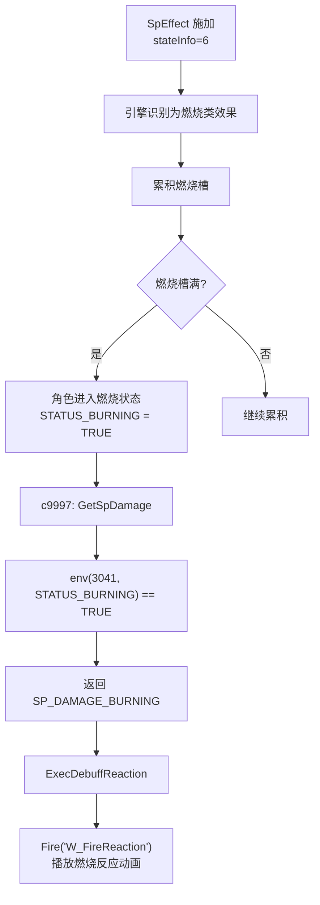

# SpEffectParam.stateInfo 深度分析

> 基于 `Meta/SpEffect.xml` 定义和实际数据分析
> 分析时间：2026-01-21

---

## 一、stateInfo 的本质

### 1.1 官方定义

根据 `param/SDT/Meta/SpEffect.xml` 中的 Wiki 说明：

```xml
<stateInfo AltName="State Info"
    Wiki="Handles various hardcoded actions (not all stateInfos have hardcoded actions).
          Can also be used to apply conditional effects."
    Enum="SP_EFFECT_TYPE" />
```

**翻译**：处理各种硬编码的引擎行为（不是所有 stateInfo 值都有硬编码行为）。也可用于应用条件效果。

### 1.2 核心作用

**stateInfo 是一个引擎层面的"效果分类标识符"**，它告诉引擎如何处理这个 SpEffect：

- **不是**简单的"状态类型"标签
- **而是**引擎行为的**触发开关**

---

## 二、SP_EFFECT_TYPE 枚举值

### 2.1 状态异常类（累积槽系统）

| 值 | 名称 | 引擎硬编码行为 |
|----|------|---------------|
| **2** | Poison | 累积毒槽 → 满后进入中毒状态 |
| **5** | Terror | 累积恐怖槽 → 满后即死 |
| **6** | Burn | 累积燃烧槽 → 满后进入燃烧状态 |
| **116** | Enfeeble | 虚弱状态（只狼特有） |
| **260** | Shock | 雷电异常状态 |

### 2.2 状态清除类

| 值 | 名称 | 说明 |
|----|------|------|
| 10 | Remove Poison | 清除毒状态 |
| 11 | Remove Terror | 清除恐怖状态 |
| 12 | Remove Burn | 清除燃烧状态 |
| 13 | Remove All Status | 清除所有状态异常 |
| 118 | Cure Enfeeble | 治疗虚弱 |
| 276 | Cure Shock | 治疗雷电异常 |

### 2.3 视觉特效类

| 值 | 名称 | 说明 |
|----|------|------|
| 28 | Right-hand Buff VFX | 右手武器 Buff 特效 |
| 29 | Body Buff VFX | 身体 Buff 特效 |
| 60 | Magic Buff VFX | 魔法 Buff 特效 |
| 62 | Fire Weapon Buff VFX | 火焰武器 Buff 特效 |
| 151 | Lightning Weapon Buff VFX | 雷电武器 Buff 特效 |
| 158 | Left-hand Buff VFX | 左手武器 Buff 特效 |

### 2.4 行为修改类

| 值 | 名称 | 说明 |
|----|------|------|
| 120 | Damage Level Change (pre-poise) | 破防前伤害等级变更 |
| 121 | Damage Level Change | 伤害等级变更 |
| 132 | Change Team Type | 改变阵营 |
| **142** | NPC Behavior ID Change | 改变 NPC 的 BehaviorParam |
| **275** | Player Behavior ID Change | 改变玩家的 BehaviorParam |
| 334 | Bullet Behavior ID Change | 改变子弹的 BehaviorParam |

### 2.5 攻击效果类

| 值 | 名称 | 说明 |
|----|------|------|
| **152** | Enable Attack Effect (Enemy) | 启用对敌人的攻击效果 |
| **153** | Enable Attack Effect (Player) | 启用对玩家的攻击效果 |
| 110 | Counter Damage | 反击伤害 |

### 2.6 其他功能类

| 值 | 名称 | 说明 |
|----|------|------|
| 0 | None | 无特殊处理，纯数值效果 |
| 42 | HP Recovery | 触发 HP 回复逻辑 |
| 46 | Modify Target Priority | 修改目标优先度 |
| 47 | Disable Fall Damage | 禁用落下伤害 |
| 154 | Block Estus usage | 禁用药瓶使用 |
| 155 | Modify Poise | 修改姿态值 |

---

## 三、实际数据验证

### 3.1 毒类效果 (stateInfo = 2)

| SpEffect ID | 名称 | stateInfo | poizonAttackPower | effectEndurance |
|-------------|------|-----------|-------------------|-----------------|
| 6500 | 毒_1 | **2** | 30 | 40 |
| 6501 | 毒_2 | **2** | 33 | 40 |
| 1200 | 毒云用的毒 | **2** | 10 | 180 |

### 3.2 燃烧效果 (stateInfo = 6)

| SpEffect ID | 名称 | stateInfo | 说明 |
|-------------|------|-----------|------|
| 9100 | 炎上ダメージ00 | **6** | PC削り25 |
| 9101 | 炎上ダメージ01 | **6** | PC削り33 |

### 3.3 无状态效果 (stateInfo = 0)

| SpEffect ID | 名称 | stateInfo | 说明 |
|-------------|------|-----------|------|
| 6010 | 燃烧反应不播放_瞬间 | **0** | 纯行为控制 |
| 6011 | 燃烧反应不播放_永久 | **0** | 纯行为控制 |

---

## 四、stateInfo 与 c9997.dec.lua 的关系

### 4.1 关键区分

**stateInfo ≠ 直接的状态标志**

| 概念 | 层面 | 说明 |
|------|------|------|
| `stateInfo` | 配置层 | SpEffectParam 中的分类标识，告诉引擎"这个效果属于什么类型" |
| `STATUS_*` | 运行时 | c9997 中的状态查询，表示"角色当前是否处于某状态" |

### 4.2 c9997 中的对应常量

```lua
-- c9997.dec.lua:197-198
STATUS_SPECIAL_POISON = 0  -- 中毒状态（对应 stateInfo=2 的结果）
STATUS_BURNING = 2         -- 燃烧状态（对应 stateInfo=6 的结果）
```

**注意**：`STATUS_*` 的值与 `stateInfo` 的值**不相同**！

- `stateInfo = 2` (Poison) → 累积后产生 → `STATUS_SPECIAL_POISON = 0`
- `stateInfo = 6` (Burn) → 累积后产生 → `STATUS_BURNING = 2`

### 4.3 状态转换流程

```
配置层                    引擎层                      运行时
stateInfo=6        →    累积燃烧槽    →    STATUS_BURNING=TRUE
(Burn类型标识)          (引擎处理)         (env(3041)可查询)
```

---

## 五、stateInfo 如何参与伤害计算

### 5.1 流程图



### 5.2 GetSpDamage() 中的状态检查

```lua
-- c9997.dec.lua:1132-1136
-- 检查的是状态结果，而非 stateInfo 配置值

-- 燃烧状态检查
if env(3041, STATUS_BURNING) == TRUE and
   IsExistAnime(ANIME_ID_FIRE_REACTION) == TRUE and
   env(3036, SP_EFFECT_REF_NO_FIRE_REACTION) == FALSE then
    ret = SP_DAMAGE_BURNING
end

-- 中毒状态检查
if env(3041, STATUS_SPECIAL_POISON) == TRUE and
   env(3036, SP_EFFECT_REF_WOMAN) == TRUE and
   env(3036, SP_EFFECT_REF_WOMAN_POISON) == TRUE then
    ret = SP_DAMAGE_POISON_REACTION
end
```

### 5.3 ExecDamage 处理链

```lua
function ExecDamage(transition_rank)
    local pre_sp_damage = GetSpDamage()  -- 获取特殊伤害类型

    -- 按优先级处理
    if ExecDebuffReaction(damage_level, pre_sp_damage, transition_rank) == TRUE then
        return  -- 处理燃烧/中毒反应
    end
    -- ... 其他处理
end

function ExecDebuffReaction(damage_level, pre_sp_damage, transition_rank)
    -- 燃烧反应
    if pre_sp_damage == SP_DAMAGE_BURNING then
        Fire("W_FireReaction")
        return TRUE
    end

    -- 毒反应
    if pre_sp_damage == SP_DAMAGE_POISON_REACTION then
        Fire("W_SpecialPoisonReaction")
        return TRUE
    end
end
```

---

## 六、stateInfo 的其他用途

### 6.1 条件效果触发

SpEffectParam 中有三个字段可以检查目标的 stateInfo：

```xml
<invocationConditionsStateChange1 AltName="Trigger on State Info [1]" Enum="SP_EFFECT_TYPE" />
<invocationConditionsStateChange2 AltName="Trigger on State Info [2]" Enum="SP_EFFECT_TYPE" />
<invocationConditionsStateChange3 AltName="Trigger on State Info [3]" Enum="SP_EFFECT_TYPE" />
```

这允许创建**效果链**：当目标处于特定状态时，触发后续效果。

### 6.2 效果持续时间修改

```xml
<lifeReductionType AltName="Effect Duration Multiplier - State Info" Enum="SP_EFFECT_TYPE" />
```

可以根据 stateInfo 类型修改效果的持续时间。

---

## 七、总结

| 方面 | 说明 |
|------|------|
| **本质** | 引擎层的效果分类标识符 |
| **作用** | 告诉引擎如何处理这个 SpEffect（累积什么槽、触发什么逻辑） |
| **枚举** | SP_EFFECT_TYPE（约80+个值） |
| **与 c9997 关系** | 间接关系：stateInfo → 引擎状态系统 → env(3041) 查询 |
| **伤害计算** | 不直接参与，通过状态异常系统间接影响 |
| **c9997 对应概念** | `STATUS_*` 常量（运行时状态）而非枚举值 |

### 关键理解

1. **stateInfo 是配置，STATUS_ 是结果**
2. **引擎是中间层**，负责将 stateInfo 的配置转换为运行时状态
3. **c9997 只查询结果**，不直接读取 stateInfo 配置

---

## 参考文件

- `param/SDT/Meta/SpEffect.xml` - stateInfo 字段定义和 Wiki
- `param/SDT/Defs/SpEffect.xml` - SP_EFFECT_TYPE 枚举定义
- `param/param/SpEffectParam.csv` - 实际数据
- `action/c9997.dec.lua` - GetSpDamage()、ExecDebuffReaction() 函数
